

# **在 Power BI Desktop 中准备数据**

**完成本实验室预计需要 45 分钟**

在本实验室中，你将开始为 Adventure Works 公司开发 Power BI Desktop 解决方案。这涉及连接到源数据、预览数据以及使用数据预览技术来了解源数据的特征和质量。

在本实验室中，你将学习如何：

- 打开 Power BI Desktop

- 设置 Power BI Desktop 选项

- 连接到源数据

- 预览源数据

- 使用数据预览技术更好地了解数据

### **实验室故事**

本实验室是一个实验室系列中的诸多实验室之一，设计为从数据准备到作为报表和仪表板发布的完整故事。可以按任意顺序完成这些实验室。但是，如果你打算完成多个实验室，对于前 10 个实验室，建议你按以下顺序完成：

1. **在 Power BI Desktop 中准备数据**

2. 在 Power BI Desktop 中加载数据

3. 在 Power BI Desktop 中对数据建模，第 1 部分

4. 在 Power BI Desktop 中对数据建模，第 2 部分

5. 在 Power BI Desktop 中创建 DAX 计算，第 1 部分

6. 在 Power BI Desktop 中创建 DAX 计算，第 2 部分

7. 在 Power BI Desktop 中设计报表，第 1 部分

8. 在 Power BI Desktop 中设计报表，第 2 部分

9. 创建 Power BI 仪表板

10. 在 Power BI Desktop 中执行数据分析

11. 创建 Power BI 分页报表

## **练习 1：准备数据**

在本练习中，你将创建 8 个 Power BI Desktop 查询。其中 6 个查询将从 SQL Server 中获取数据，另外 2 个查询将从 CSV 文件中获取数据。

### **任务 1：保存 Power BI Desktop 文件**

在此任务中，你将首先保存 Power BI Desktop 文件。

12. 要打开 Power BI Desktop，请在任务栏上单击 Microsoft Power BI Desktop 快捷方式。

	

13. 要关闭开始窗口，请单击窗口左上角的 **“X”**。

	

14. 要保存文件，请单击 **“文件”** 功能区选项卡以打开 backstage 视图。

15. 选择 **“保存”**。

	

16. 在 **“另存为”** 窗口中，导航到 **“D:\DA100\MySolution”** 文件夹。

17. 在里面 **“文档名”** 框，输入 **“Sales Analysis”**。

	

18. 单击 **“保存”**。

	

	提示：还可以通过单击右上角的 **“保存”** 图标来保存文件。

	

### **任务 2：设置 Power BI Desktop 选项**

在此任务中，你将设置 Power BI Desktop 选项。

1. 在 Power BI Desktop 中，单击 **“文件”** 功能区选项卡以打开 backstage 视图。

2. 选择左侧的 **“选项和设置”** ，然后选择 **“选项”**。

	

3. 在 **“选项”** 窗口左侧的 **“当前文件”** 组中选择 **“数据加载”**。

	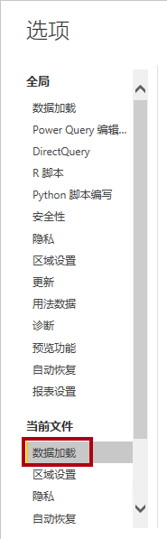

通过当前文件的 **“数据加载”** 设置，可以设置选项来确定建模时的默认行为。

4. 在 **“关系”** 组中，取消选中已选中的两个选项。

	

虽然这两个选项在开发数据模型时可能会有所帮助，但它们处于已禁用状态，以支持实验室体验。在 **“在 Power BI Desktop 中加载数据”** 实验室中创建关系时，你将了解为什么要添加每个关系。

5. 单击 **“确定”**。

	

6. 保存 Power BI Desktop 文件。

### **任务 3：从 SQL Server 获取数据**

在此任务中，你将基于 SQL Server 表创建查询。

1. 在 **“主页”** 功能区选项卡上的 **“数据”** 组中，单击 **“SQL Server”**。

	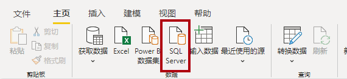

2. 在 **“SQL Server 数据库”** 窗口的 **“服务器”** 框中，输入 **“localhost”**。

	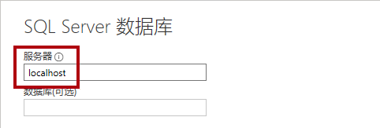

	在本实验室中，你将使用 **“localhost”** 连接到 SQL Server 数据库。但在创建自己的解决方案时，不建议这样做。这是因为网关数据源无法解析 **localhost**。

3. 单击 **“确定”**。

	

4. 请注意，默认身份验证为 **“使用我当前的凭据”**。

	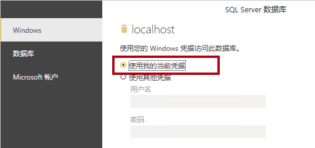

	Power BI Desktop 将使用你的标识连接到 SQL Server 实例。你拥有对要连接的数据源的读取权限。

5. 单击 **“连接”**。

	

6. 当提示有关加密支持时，请单击 **“确定”**。

	

7. 在 **“导航器”** 窗口左侧，展开 **“AdventureWorksDW2020”** 数据库。

	**AdventureWorksDW2020** 数据库基于 **AdventureWorksDW201** 示例数据库。已对其进行修改，以支持课程实验室的学习目标。

	

8. 选择 **“DimEmployee”** 表，但不选中它。

	

9. 请注意右侧窗格中表数据的预览。

	可以通过预览数据来确定列和行示例。

10. 要创建查询，请选中以下六个表：

	- DimEmployee

	- DimEmployeeSalesTerritory

	- DimProduct

	- DimReseller

	- DimSalesTerritory

	- FactResellerSales

11. 要将转换应用于所选表的数据，请单击 **“转换数据”**。

	在本实验室中，你将不会转换数据。本实验室的目标是在 **“Power Query 编辑器”** 窗口探索和分析数据。

	

### **任务 4：预览 SQL Server 查询**

在此任务中，你将预览 SQL Server 查询的数据。首先，你将了解数据的相关信息。你还将使用列质量、列分布和列分析工具来了解数据并评估数据质量。

1. 在 **“Power Query 编辑器”** 窗口左侧，请注意 **“查询”** 窗格。

	

	**“查询”** 窗格包含一个针对每个所选表的查询。

2. 选择第一个查询 **“DimEmployee”**。

	

	在 SQL Server 数据库中的 **“DimEmployee”** 表中，每个员工占用一行。行的子集表示销售人员，这与你将开发的模型相关。

3. 注意左下角状态栏的表统计信息 - 该表有 33 列和 296 行。

	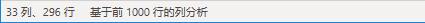

4. 在“数据预览”窗格中，水平滚动以查看所有列。

5. 请注意，最后五列包含**表**或**值**链接。

	这五个列表示与数据库中其他表之间的关系。它们可用于将表联接在一起。你将在 **“在 Power BI Desktop 中加载数据”** 实验室中联接表。

6. 要评估列质量，请在 **“视图”** 功能区选项卡的 **“数据预览”** 组中，勾选 **“列质量”**。

	

	通过列质量功能，可以轻松确定列中的有效值、错误值或空值的百分比。

7. 对于 **“位置”** 列（倒数第六列），请注意 94% 的行为空 (NULL)。

	

8. 要评估列分布情况，请在 **“视图”** 功能区选项卡的 **“数据预览”** 组中，勾选 **“列分布”**。

	

9. 再次查看 **“位置”** 列，请注意有四个非重复值和一个唯一值。

10. 在 **“EmployeeKey”** （第一）列查看列分布 - 有 296 个不同的值和 296 个唯一值。

	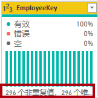

	当非重复值和唯一值的计数相同时，这表示列包含唯一值。在建模时，某些表必须具有唯一的列。这些唯一的列可用于创建一对多关系，你将在 **“在 Power BI Desktop 中对数据建模，第 1 部分”** 实验室中进行此操作。

11. 在 **“查询”** 窗格中，选择 **“DimEmployeeSalesTerritory”** 查询。

	

	**“DimEmployeeSalesTerritory”** 表中每个员工及其管理的销售区域分别占用一行。该表支持将多个区域与单个员工相关联。一些员工管理一个、两个或可能更多的区域。对数据建模时，需要定义多对多关系，你将在 **“在 Power BI Desktop 中对数据建模，第 2 部分”** 实验室中进行此操作。

12. 在 **“查询”** 窗格中，选择 **“DimProduct”** 查询。

	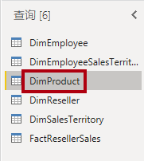

	**“DimProduct”** 表中公司已销售的每种产品各占一行。

13. 水平滚动以显示最后几列。

14. 注意 **“DimProductSubcategory”** 列。

	在“在 Power BI Desktop 中加载数据”实验室中向此查询添加转换时，将使用 **“DimProductSubcategory”列来联接表**。

15. 在 **“查询”** 窗格中，选择 **“DimReseller”** 查询。

	

	在 **“DimReseller”** 表中，每个经销商对应一行。经销商对 Adventure Works 的产品进行销售、分销或增值。

16. 要查看列值，请在 **“视图”** 功能区选项卡的 **“数据预览”** 组中，勾选 **“列分析”**。

	

17. 选择 **“BusinessType”** 列标题。

18. 注意“数据预览”窗格下面的新窗格。

19. 在“数据预览”窗格中查看列统计信息和值分布情况。

20. 请注意数据质量问题：仓库有两个标签（ **“Warehouse”** 以及拼写错误的 **“Ware House”**）。

	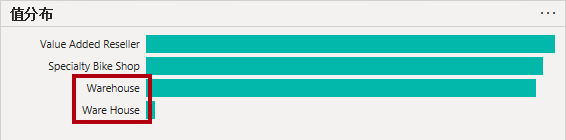

21. 将光标悬停在 **“Ware House”** 栏，请注意，有五个行包含此值。

在 **“在 Power BI Desktop 中加载数据”** 实验室中，你将应用转换以重新标记这五行。

22. 在 **“查询”** 窗格中，选择 **“DimSalesTerritory”** 查询。

	

	在 **“DimSalesTerritory”** 表中，每个销售区域占一行，包括 **“Corporate HQ”** （总部）。区域分配给国家/地区，国家/地区分配给组。在 **“在 Power BI Desktop 中对数据建模，第 1 部分”** 实验室中，你将创建一个层次结构以支持区域、国家/地区或组级别的分析。

23. 在 **“查询”** 窗格中，选择 **“FactResellerSales”** 查询。

	

	**“FactResellerSales”** 表中每个销售订单行包含一行 - 一个销售订单包含一个或多个行项。

24. 查看 **“TotalProductCost”** 列的列质量，请注意 8％ 的行为空。

	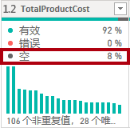

	缺少 **“TotalProductCost”** 列值是数据质量问题。为解决该问题，在 **“在 Power BI Desktop 中加载数据”** 实验室中，你将通过使用产品标准成本（存储在相关的 **“DimProduct”** 表中）来应用转换以填充缺少的值。

### **任务 5：从 CSV 文件获取数据**

在此任务中，你将基于 CSV 文件创建查询。

1. 要添加新查询，请在 **“Power Query 编辑器”** 窗口的 **“主页”** 功能区选项卡上，在 **“新查询”** 组中，单击 **“新源”** 向下箭头，然后选择 **“文本/CSV”**。

	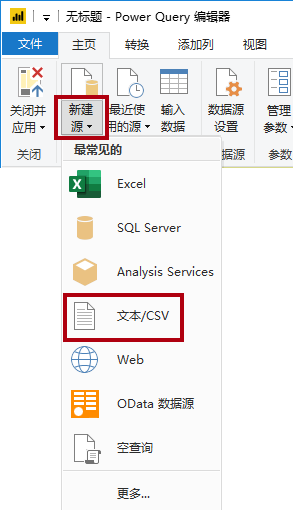

2. 在 **“打开”** 窗口中，导航到 **“D:\DA100\Resources”** 文件夹，然后选择 **“ResellerSalesTargets.csv”** 文件。

3. 单击 **“打开”**。

4. 在 **“ResellerSalesTargets.csv”** 窗口中，查看预览数据。

5. 单击 **“确定”**。

	

  
‎ 

6. 在 **“查询”** 窗格中，注意添加了 **“ResellerSalesTargets”** 查询。

	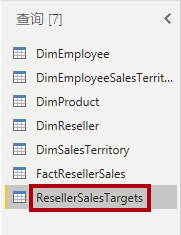

	在 **“ResellerSalesTargets”** CSV 文件中，每年的每个销售员占一行。每行记录 12 个月度销售目标（以千为单位表示）。请注意，Adventure Works 公司的营业年度从 7 月 1 日开始。

7. 请注意，没有列包含空值。

	如果没有月度销售目标，则改为存储一个连字符。

8. 查看列名左侧每个列标题中的图标。

	

	这些图标代表列数据类型。**“123”** 代表整数，**“ABC”** 代表文本。

	你将应用许多转换以实现仅由三列组成的不同形状的结果： **“在 Power BI Desktop 中加载数据”** 实验室中的 **“Date”**、**“EmployeeKey”** 和 **“TargetAmount”**。

### **任务 6：从 CSV 文件中获取其他数据**

在此任务中，你将基于其他 CSV 文件创建其他查询。

1. 使用上一个任务中的步骤基于 **“D:\DA100\Resources**\**ColorFormats.csv”** 文件创建查询。

	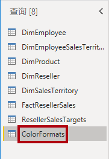

	在 **“ColorFormats”** CSV 文件中，一行对应一种产品颜色。每行记录十六进制代码以格式化背景和字体颜色。在 **“在 Power BI Desktop 中加载数据”** 实验室中，你将此数据与 **DimProduct** 查询数据集成在一起。

### **任务 7：完成**

在此任务中，你将完成实验室。

1. 在 **“视图”** 功能区选项卡上，从 **“数据预览”** 组中，取消选中此实验室中先前启用的三个数据预览选项：

	- 列质量

	- 列分布

	- 列分析

	

2. 要保存 Power BI Desktop 文件，请在 **“Power Query 编辑器”** 窗口的 **“文件”** backstage 视图中，选择 **“保存”**。

	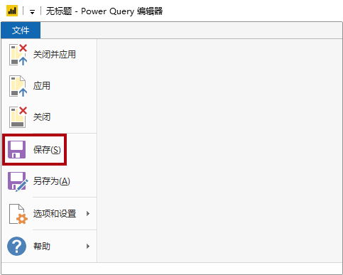

3. 当系统提示应用查询时，单击 **“稍后应用”**。

	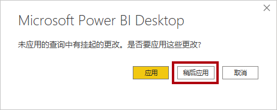

	应用查询会将其数据加载到数据模型。你尚未准备好执行该操作，因为必须先应用许多转换。

4. 如果你打算开始下一个实验室，请让 Power BI Desktop 保持打开状态。

	在 **“在 Power BI Desktop 中加载数据”** 实验室中，你将对查询应用各种转换，然后应用查询将其加载到数据模型。
