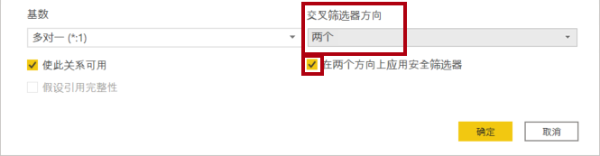

---
lab:
    title: '在 Power BI Desktop 中对数据建模，第 2 部分'
    module: '模块 4: 在 Power BI 中设计数据模型'
---

# **在 Power BI Desktop 中对数据建模，第 2 部分**

**完成本实验室预计需要 45 分钟**

在本实验室中，你将在 **“销售员”** 表和 **“销售额”** 表之间创建多对多关系。你还将强制执行行级别安全性，以确保销售人员只能分析向其分配的区域的销售数据。

在本实验室中，你将学习如何：

- 配置多对多关系

### **实验室故事**

本实验室是一个实验室系列中的诸多实验室之一，设计为从数据准备到作为报表和仪表板发布的完整故事。可以按任意顺序完成这些实验室。但是，如果你打算完成多个实验室，对于前 10 个实验室，建议你按以下顺序完成：

1. 在 Power BI Desktop 中准备数据

2. 在 Power BI Desktop 中加载数据

3. 在 Power BI Desktop 中对数据建模，第 1 部分

4. **在 Power BI Desktop 中对数据建模，第 2 部分**

5. 在 Power BI Desktop 中创建 DAX 计算，第 1 部分

6. 在 Power BI Desktop 中创建 DAX 计算，第 2 部分

7. 在 Power BI Desktop 中设计报表，第 1 部分

8. 在 Power BI Desktop 中设计报表，第 2 部分

9. 创建 Power BI 仪表板

11. 创建 Power BI 分页报表

10. 在 Power BI Desktop 中执行数据分析

## **练习 1：创建多对多关系**

在此练习中，你将在 **“销售员”** 表和 **“销售额”** 表之间创建多对多关系。

### **任务 1：入门**

在此任务中，你将设置实验室环境。

*重要说明：如果你从上一个实验室继续操作（并且已成功完成该实验室），则无需完成此任务；而是继续执行下一个任务。*

1. 要打开 Power BI Desktop，请在任务栏上单击 Microsoft Power BI Desktop 快捷方式。

 	

1. 要关闭开始窗口，请单击窗口左上角的 **“X”**。

 	

1. 要打开入门 Power BI Desktop 文件，请单击 **“文件”** 功能区选项卡以打开 Backstage 视图。

1. 选择 **“打开报表”**。

 	

1. 单击 **“浏览报表”**。

 	

1. 在“打开”窗口，导航到 **“D:\DA100\Labs\04-configure-data-model-in-power-bi-desktop-advanced\Starter”** 文件夹。

1. 选择 **“Sales Analysis”** 文件。

1. 单击 **“打开”**。

 	

1. 关闭可能打开的所有信息窗口。

1. 要创建该文件的副本，请单击 **“文件”** 功能区选项卡以打开 Backstage 视图。

1. 选择 **“另存为”**。

 	

1. 如果系统提示应用更改，请单击 **“应用”**。

 	

1. 在 **“另存为”** 窗口中，导航到 **“D:\DA100\MySolution”** 文件夹。

1. 单击 **“保存”**。

 	

### **任务 2：创建多对多关系**

在此任务中，你将在 **“销售员”** 表和 **“销售额”** 表之间创建多对多关系。

1. 在 Power BI Desktop“报表”视图的 **“字段”** 窗格中，检查以下两个字段以创建表视觉对象：

	- Salesperson | Salesperson

	- Sales | Sales

	*实验室将使用速记表示法来引用字段。如下所示： **Salesperson | Salesperson** 在此示例中， **“Salesperson”** 是表名， **“Salesperson”** 是字段名。*

	

	*该表显示每个销售员的销售额。但是，销售员与销售额之间存在另一种关系。有些销售员分属一个、两个或可能更多的销售区域。此外，可以对销售区域分配多个销售人员。*

	*从绩效管理的角度来看，需要分析销售员的销售额（基于为其分配的区域）并将其与销售目标进行比较。在下一个练习中，你将创建关系来支持此分析。*

2. 请注意，Michael Blythe 的销售额接近 900 万美元。

3. 切换到“模型”视图。

	

4. 将 **“SalespersonRegion”** 表拖放到 **“Region”** 和 **“Salesperson”** 表之间。

5. 通过拖放操作创建以下两个模型关系：

	- **Salesperson | EmployeeKey** 到 **SalespersonRegion | EmployeeKey**

	- **Region | SalesTerritoryKey** 到 **SalespersonRegion | SalesTerritoryKey**

	*可以将 **“SalespersonRegion”** 表视为桥接表。*

6. 切换到“报表”视图，可看到视觉对象尚未更新 - Michael Blythe 的销售额结果未更改。

7. 切换回“模型”视图，然后按照 **“Salesperson”** 表中的关系筛选方向（箭头）进行操作。

	*设想一下 **“Salesperson”** 表筛选 **“Sales”** 表。还可以筛选 **“SalespersonRegion”** 表，但不会继续将筛选器传播到 **“Region”** 表（箭头指向错误方向）。*

	

8. 要编辑 **“Region”** 和 **“SalespersonRegion”** 表之间的关系，请双击该关系。

9. 在 **“编辑关系”** 窗口的 **“交叉筛选方向”** 下拉列表中，选择 **“双向”**。

10. 选中 **“应用双向安全筛选”** 复选框。

	*此设置可确保在强制执行行级别安全性时应用双向筛选。你将在下一个练习中配置安全角色。*

	

11. 单击 **“确定”**。

	

12. 请注意，该关系具有双箭头。

	

13. 切换到“报表”视图，然后注意到销售额仍未更改。

	*现在，这个问题与以下事实有关： **“Salesperson”** 表和 **“Sales”** 表之间具有两种可能的筛选传播路径。基于“最少表数”评估，这种歧义在内部得以解决。需要明确的是，不应设计具有此类歧义的模型，该问题将在本实验室的后面部分通过完成 **“在 Power BI Desktop 中创建 DAX 计算，第 1 部分”** 实验室解决。*

14. 切换到“模型”视图。

15. 要通过桥接表强制实施筛选传播，请编辑（双击） **“Salesperson”** 表和 **“Sales”** 表之间的关系。

16. 在 **“编辑关系”** 窗口中，取消选中 **“将此关系标记为可用”** 复选框。

	

17. 单击 **“确定”**。

	

	*筛选器传播现在将遵循唯一的可用路径。*

18. 在该关系图中，请注意，停用关系由虚线表示。

	

19. 切换到“报表”视图，注意 Michael Blythe 的销售额现已接近 2200 万美元。

	

20. 还要注意，每个销售员的销售额（如果相加）将超过表中的总额。

	*由于对区域销售额结果进行了两倍、三倍等计数，因此通常会发现存在多对多关系。以列出的第二位销售员 Brian Welcker 为例。他的销售额等于总销售额。这是正确的结果，原因仅在于他是销售总监；他的销售额按所有区域的销售额来度量。*

	*虽然多对多关系现在有效，但现在无法分析销售员的销售额（因为该关系处于停用状态）。在 **“在 Power BI Desktop 中创建 DAX 计算，第 1 部分”** 实验室中引入一个代表销售员进行绩效分析（针对其区域）的计算表时，可以重新启用该关系。*

21. 切换到“建模”视图，然后在关系图中选择 **“Salesperson”** 表。

22. 在 **“属性”** 窗格中，将 **“名称”** 框中的文本替换为 **“Salesperson (Performance)”**。

	*已重命名的表现在反映了它的用途：用于根据对销售人员分配的销售区域的销售额来报告和分析销售人员的绩效。*

### **任务 3：关联目标表**

在此任务中，你将创建与 **“Targets”** 表的关系

1. 基于 **“Salesperson (Performance) | EmployeeID”** 列和 **“Targets | EmployeeID”** 列创建关系。

2. 在报表视图中，添加 **“Targets”** | 表可视范围的 **“Target”** 字段。

3. 重设表视觉对象的大小，使所有列均可见。

	

	*现在可以将销售额和目标可视化，但是请注意两个原因。首先，没有对时间段应用筛选，因此目标还包括将来的目标金额。其次，目标不是可累加的，因此不应显示总额。可以通过设置视觉对象的格式来禁用它们，也可以使用计算逻辑将其删除。你将采用第二种方法，在 **“在 Power BI Desktop 中创建 DAX 计算，第 2 部分”** 实验室中创建目标度量值，该目标度量值将在筛选出多个销售员时返回空白。*

### **任务 4：完成**

在此任务中，你将完成实验室。

1. 保存 Power BI Desktop 文件。

2. 如果系统提示应用查询，请单击 **“稍后应用”**。

3. 如果你打算开始下一个实验室，请让 Power BI Desktop 保持打开状态。

	*在 **“在 Power BI Desktop 中创建 DAX 计算，第 2 部分”** 实验室中，你将使用 DAX 通过计算来增强数据模型。*
