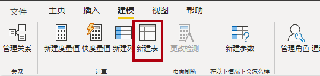
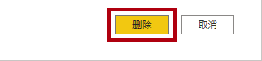
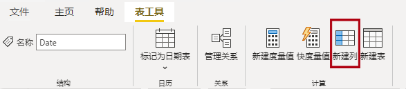
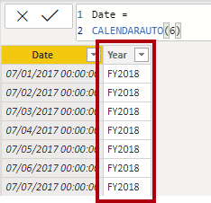
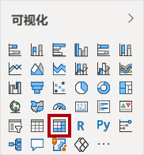
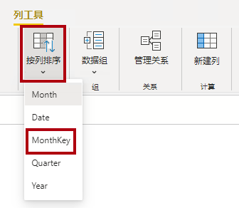
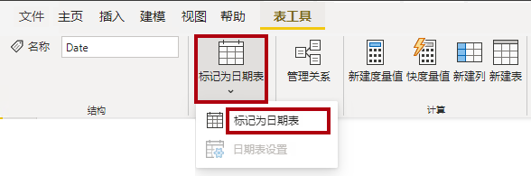
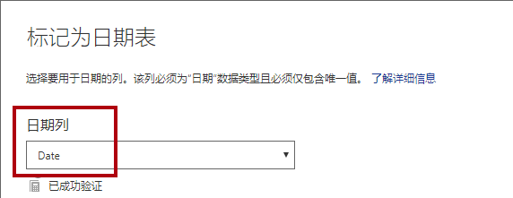
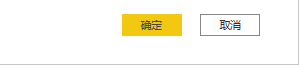

# **在 Power BI Desktop 中创建 DAX 计算，第 1 部分**

**完成本实验室预计需要 45 分钟**

在本实验室中，你将使用数据分析表达式 (DAX) 创建计算表、计算列和简单的度量值。

在本实验室中，你将学习如何：

- 创建计算表

- 创建计算列

- 创建度量

### **实验室故事**

本实验室是一个实验室系列中的诸多实验室之一，设计为从数据准备到作为报表和仪表板发布的完整故事。可以按任意顺序完成这些实验室。但是，如果你打算完成多个实验室，对于前 10 个实验室，建议你按以下顺序完成：

1. 在 Power BI Desktop 中准备数据

2. 在 Power BI Desktop 中加载数据

3. 在 Power BI Desktop 中对数据建模，第 1 部分

4. 在 Power BI Desktop 中对数据建模，第 2 部分

5. **在 Power BI Desktop 中创建 DAX 计算，第 1 部分**

6. 在 Power BI Desktop 中创建 DAX 计算，第 2 部分

7. 在 Power BI Desktop 中设计报表，第 1 部分

8. 在 Power BI Desktop 中设计报表，第 2 部分

9. 创建 Power BI 仪表板

10. 创建 Power BI 分页报表

11. 在 Power BI Desktop 中执行数据分析

## **练习 1：创建计算表**

在此练习中，你将创建两个计算表。首先是 **“Salesperson”** 表，使其与 **“Sales”** 表直接关联。第二个是 **“Date”** 表。

### **任务 1：入门**

在此任务中，你将设置实验室环境。

*重要说明：如果你从上一个实验室继续操作（并且已成功完成该实验室），则无需完成此任务；而是继续执行下一个任务。*

1. 要打开 Power BI Desktop，请在任务栏上单击 Microsoft Power BI Desktop 快捷方式。

 	

1. 要关闭开始窗口，请单击窗口左上角的 **“X”**。

 	

1. 要打开入门 Power BI Desktop 文件，请单击 **“文件”** 功能区选项卡以打开 Backstage 视图。

1. 选择 **“打开报表”**。

 	

1. 单击 **“浏览报表”**。

 	

1. 在 **“打开”** 窗口，导航到 **“D:\DA100\Labs\05-create-dax-calculations-in-power-bi-desktop\Starter”** 文件夹*。

1. 选择 **“Sales Analysis”** 文件。

1. 单击 **“打开”**。

 	

1. 关闭可能打开的所有信息窗口。

1. 要创建该文件的副本，请单击 **“文件”** 功能区选项卡以打开 Backstage 视图。

1. 选择 **“另存为”**。

 	

1. 如果系统提示应用更改，请单击 **“应用”**。

 	

1. 在 **“另存为”** 窗口中，导航到 **“D:\DA100\MySolution”** 文件夹。

1. 单击 **“保存”**。

	

### **任务 2：创建 Salesperson 表**

在此任务中，你将创建 **“Salesperson”** 表（与 **“Sales”** 有直接关系）。

1. 在 Power BI Desktop 中，在“报表”视图中 **“建模”** 功能区的 **“计算”** 组内，单击 **“新建表”**。

	

2. 在公式栏中（在创建或编辑计算时会在功能区的正下方打开）中键入 **“Salesperson =”**，按 **Shift+Enter**，输入 **“Salesperson (Performance)”**，然后按 **Enter**。

	

	*为了方便起见，可以从 **D:\DA100\Labs\05-create-dax-calculations-in-power-bi-desktop\Assets\Snippets.txt** 文件复制本实验室中的所有 DAX 定义。*

	*创建计算表的方法是：先输入表名，后面依次输入等号 (=) 和返回表的 DAX 公式。请注意，表名不能是数据模型中已有的名称。*

	*公式栏支持输入有效的 DAX 公式。其中包括自动完成、Intellisense 和颜色编码等功能，可使你快速而准确地输入公式。*

	*该表定义创建了 **Salesperson (Performance)** 表的副本。它仅复制数据，但是不复制模型属性（如可见性、格式设置等）。*

	*提示：建议输入“空格”（即回车和制表符）来以直观且易于阅读的格式布局公式，尤其在公式又长又复杂的情况下。要输入回车，请按 **Shift+Enter**。可选择“空格”。*

3. 在 **“字段”** 窗格中，请注意表格图标是蓝色阴影（表示已计算的表格）。

	

	*计算表是使用返回表的 DAX 公式来定义的。请务必了解，计算表会增加数据模型的大小，因为它们会具体化和存储值。每当刷新公式依赖项时，都会对其进行重新计算，就像在此数据模型中将新（未来）日期值加载到表中时一样。*

	*与基于 Power Query 的表不同，计算表不能用于从外部数据源加载数据。它们只能根据已加载到数据模型中的内容来转换数据。*

4. 切换到“模型”视图。

5. 请注意 **“Salesperson”** 表可用（注意，它可能在视图中处于隐藏状态，可通过水平滚动来找到它）。

6. 创建从 **“Salesperson”** | **“EmployeeKey”** 列到 **“Sales”** | **“EmployeeKey”** 列的关系。

7. 右键单击 **“Salesperson (Performance)”** 和 **“Sales”** 表之间的非活动关系，然后选择 **“删除”**。

	

8. 当系统提示确认删除时，请单击 **“删除”**。

	

9. 在 **“Salesperson”** 表中，选择以下列，然后将其隐藏（将 **“隐藏”** 属性设置为 **“是”**）：

	- EmployeeID

	- EmployeeKey

	- UPN

10. 在模型图中，选择 **“Salesperson”** 表。

11. 在 **“属性”** 窗格中的 **“描述”** 框内输入： **与销售额相关的销售员**

	*回想一下，当用户将光标悬停在表或字段上时，描述将显示为 **“字段”** 窗格中的工具提示。*

12. 对于 **“Salesperson (Performance)”** 表，将说明设置为： **与区域相关的销售员**

	*现在，数据模型为分析销售员提供了两种选择。 **“Salesperson”** 表支持分析销售员的销售额，而 **“Salesperson (Performance)”** 表支持分析在分配给销售员的销售区域中产生的销售额。*

### **任务 3：创建 Date 表**

在此任务中，你将创建 **“Date”** 表。

1. 切换到“数据”视图。

	

2. 在 **“开始”** 功能区选项卡的 **“计算”** 组内，单击 **“新建表”**。

	

3. 在公式栏中，输入以下内容：


	**DAX**


	```
	Date =  
	‎CALENDARAUTO(6)
	```


	

	*CALENDARAUTO() 函数返回一个由日期值组成的单列表。“自动”行为会扫描所有数据模型日期列，以确定存储在数据模型中最早和最晚的日期值。然后，它为该范围内的每个日期创建一行，并向任一方向扩展该范围，以确保存储全年的数据。*

	*此函数可以采用一个可选参数，该参数表示一年的最后一个月。省略时，值为 12，表示 12 月是一年中的最后一个月。在此示例中，输入“6”，表示 6 月是一年的最后一个月。*

4. 注意日期值列。

	

	*显示的日期使用美国区域设置（即 mm/dd/yyyy）进行格式设置。*

5. 注意位于状态栏左下角的表统计信息，确认已生成 1826 行数据，这代表五个全年的数据。

	

### **任务 4： 创建计算列**

在此任务中，你将添加其他列，以支持按不同时间段进行筛选和分组。你还将创建一个计算列来控制其他列的排序顺序。

1. 在 **“表工具”** 上下文功能区的 **“计算”** 组内，单击 **“新建列”**。

	

2. 在公式栏中键入以下内容（或从代码片段文件中复制），然后按 **Enter**：


	**DAX**


	```
	Year =
	"FY" & YEAR('Date'[Date]) + IF(MONTH('Date'[Date]) > 6, 1)
	```


	*创建计算列的方法是：先输入列名，后面依次输入等号 (=) 和返回单值结果的 DAX 公式。列名不能已经存在于表中。*

	*该公式使用日期的年份值，但当月份在 6 月之后时，将在年份值上加一个。这就是 Adventure Works 会计年度的计算方式。*

3. 验证新列是否已添加。

	

4. 使用代码片段文件定义为 **“Date”** 表创建以下两个计算列：

	- Quarter

	- Month

	

5. 要验证计算，请切换到“报表”视图。

6. 要创建新的报表页面，请单击左下角的“加号”图标。

	

7. 要将矩阵视觉对象添加到新的报表页，请在 **“可视化效果”** 窗格中选择矩阵视觉对象类型。

	*提示：可以将光标悬停在每个图标上，以查看描述视觉对象类型的工具提示。*

	

8. 在 **“字段”** 窗格中，从 **“Date”** 表内，将 **“Year”** 字段拖入 **“行”** 井/区域中。

	

9. 将 **“Month”** 字段拖入 **“Year”** 字段正下方的 **“行”** 井/区域。

	

10. 在矩阵视觉对象的右上角（或底部，取决于视觉对象的位置），单击“叉状双箭头”图标（它将全年向下扩展一级）。

	

11. 请注意，年份展开到月份，而月份是按字母顺序而不是按时间顺序排序的。

	

	*默认情况下，文本值按字母顺序排序，数字按从小到大的顺序排序，日期按从早到晚的顺序排序。*

12. 要自定义 **“Month”** 字段排序顺序，请切换到数据视图。

13. 将 **“MonthKey”** 列添加到 **“Date”** 表。


	**DAX**


	```
	MonthKey =
	(YEAR('Date'[Date]) * 100) + MONTH('Date'[Date])
	```


	*此公式会为每个年份/月份组合计算一个数值。*

14. 在“数据”视图中，验证新列是否包含数值（例如，2017 年 7 月为“201707”等）。

	

15. 切换回“报表”视图。

16. 在 **“字段”** 窗格中，确保已选中 **“Month”** 字段（选中时将显示深灰色背景）。

17. 在 **“列工具”** 上下文功能区的 **“排序”** 组内，单击 **“按列排序”**，然后选择 **“月键”**。

	

18. 在矩阵视觉对象中，请注意，现在已按时间顺序对月份进行了排序。

	

### **任务 5：** **完成“Date”表**

在此任务中，你将通过隐藏列和创建层次结构来完成 **“Date”** 表的设计。然后，你将创建 **“Sales”** 表和 **“Targets”** 表的关系。

1. 切换到“模型”视图。

2. 在 **“Date”** 表中，隐藏 **“MonthKey”** 列（将 **“隐藏”** 设置为 **“是”**）。

3. 在 **“Date”** 表中，创建一个名为 **“Fiscal”** 的层次结构，该层次结构具有以下三个级别：

	- Year

	- Quarter

	- Month

	

4. 创建以下两个模型关系：

	- **“Date | Date”** 到 **“Sales | OrderDate”**

	- **“Date | Date”** 到 **“Targets | TargetMonth”**

5. 隐藏以下两列：

	- Sales | OrderDate

	- Targets | TargetMonth

### **任务 6：标记“Date”表**

在此任务中，你会将 **“Date”** 表标记为日期表。

1. 切换到“报表”视图。

2. 在 **“字段”** 窗格中，选择 **“Date”** 表（非 **“Date”** 字段）。

3. 在 **“表工具”** 上下文功能区中的 **“日历”** 组内，单击 **“标记为日期表”**，然后选择 **“标记为日期表”**。

	

4. 在 **“标记为日期表”** 窗口的 **“日期列”** 下拉列表中，选择 **“日期”**。

	

5. 单击 **“确定”**。

	

6. 保存 Power BI Desktop 文件。

	*Power BI Desktop 现在知道该表定义了日期（时间）。依靠时间智能计算时，这一点很重要。在 **“在 Power BI Desktop 中创建 DAX 计算，第 2 部分”** 实验室中，你将进行时间智能计算。*

	*请注意，当数据源中没有日期表时，这种用于日期表的设计方法是合适的。如果你有数据仓库，则应该从其日期维度表（而不是数据模型中的“重新定义”日期逻辑）中加载日期数据。*

## **练习2：创建度量**

在此练习中，你将创建几个度量值并对其进行格式设置。

### **任务 1：创建简单的度量**

在此任务中，你将创建简单的度量值。简单的度量值聚合单个列中的值或对表中的行进行计数。

1. 在 **“报表”** 视图的第 **2 页**的 **“字段”** 窗格中，将 **“Sales | Unit Price”** 字段拖动到矩阵视觉对象内。

	*实验室将使用速记表示法来引用字段。如下所示： **Sales | Unit Price**.在此示例中， **“Sales”** 是表名， **“Unit Price”** 是字段名。*

	

	*回想一下，在 **“在 Power BI Desktop 中对数据建模，第 2 部分”** 实验室中，你将 **“Unit Price”** 列设置为按 **“平均值”** 汇总。矩阵视觉对象中显示的结果是每月平均单价（单价值的总和除以单价计数）。*

2. 在视觉对象“字段”窗格（位于 **“可视化效果”** 窗格之下）的 **“值”** 字段井/区域，注意 **“Unit Price”** 已列出。

	

3. 单击 **“Unit Price”** 的向下箭头，然后注意可用的菜单选项。

	

	*借助可见的数值列，报表作者可以在设计报表时确定汇总（或不汇总）列值的方式。这可能会生成不当的报表。但是某些数据建模人员不喜欢碰运气，他们选择隐藏这些列，而不是公开度量值中定义的聚合逻辑。这就是你将在本实验室中采用的方法。*

4. 要创建度量值，请在 **“字段”** 窗格中，右键单击 **“Sales”** 表，然后选择 **“新建度量值”**。

	

5. 在公式栏中，添加以下度量值定义：


	**DAX**


	```
	Avg Price =  
	‎AVERAGE(Sales[Unit Price])
	```


6. 将 **“Avg Price”** 度量值添加到矩阵视觉对象。

7. 请注意，它生成与 **“Unit Price”** 列相同的结果（但格式不同）。

8. 在 **“值”** 井中，打开 **“平均价格”** 字段的上下文菜单 ，请注意，无法更改聚合技术。

	

	*无法修改度量值的聚合行为。*

9. 使用代码片段文件定义为 **“Sales”** 表创建以下五个度量：

	- Median Price

	- Min Price

	- Max Price

	- Orders

	- Order Lines

	* **“Orders”** 度量值中使用的 DISTINCTCOUNT() 函数只会对订单进行一次计数（忽略重复项）。用于**订单行**度量值的 COUNTROWS() 函数对表进行操作。*

	*在这种情况下，订单数量是通过对 **“SalesOrderNumber”** 列的不同值进行计数得出的，而订单行数其实就是表行数（每行为一个订单行）。*

10. 切换到“模型”视图，然后选择四个价格度量值： **“Avg Price”**、 **“Max Price”**、 **“Median Price”** 和 **“Min Price”**。

11. 要选择多个度量值，请配置以下要求：

	- 将格式设置为两位小数

	- 分配给名为 **“Pricing”** 的显示文件夹

	

12. 隐藏 **“Unit Price”** 列。

	* ***Unit Price** 列现在对所有报表作者不可用。他们必须使用你添加到模型中的定价度量值。这种设计方法可确保报表作者不会以不当的方式对价格进行聚合（例如，通过对价格进行求和）。*

13. 同时选择 **“Order Lines”** 和 **“Orders”** 度量值并配置以下要求：

	- 使用千位分隔符设置格式

	- 分配给名为 **“Counts”** 的显示文件夹

	

14. 在“报表”视图中，在矩阵视觉对象的 **“值”** 井/区域中，对于 **“Unit Price”** 字段，单击 **“X”** 将其删除。

	

15. 增加矩阵视觉对象的大小，以占满页面的宽度和高度。

16. 在“矩阵”视觉对象中添加以下五个新度量值：

	- Median Price

	- Min Price

	- Max Price

	- Orders

	- Order Lines

17. 验证结果是否合理以及格式是否正确。

	

### **任务 2：创建其他度量**

在此任务中，你将创建使用更复杂表达式的其他度量值。

1. 在“报表”视图中，选择 **“第 1 页”**。

	

2. 查看表视觉对象，注意 **“Target”** 列的总计。

	

	*回想一下，以前的实验室中，销售员与区域之间存在多对多关系。这意味着将目标值相加没有意义，因为销售员的目标是根据为每个销售员分配的销售区域来设定的。只有在筛选出单个销售员时，才应显示目标值。现在，你将实现一个度量值来做到这一点。*

3. 选择表视觉对象，然后在 **“可视化效果”** 窗格中，删除 **“Target”** 字段。

	

4. 将 **“Targets | Target”** 列重命名为 **“Targets | TargetAmount”**。

	*提示：可以通过几种方法在“报表”视图中重命名该列：在 **“字段”** 窗格中，可以右键单击该列，然后选择 **“重命名”** - 或者双击该列，或按 **F2**。*

	*你即将创建名为 **“目标”** 的度量值。同一个表中不能有同名的列和度量值。*

5. 在 **“Targets”** 表中创建以下度量值：


	**DAX**


	```
	Target =

	IF(

	HASONEVALUE('Salesperson (Performance)'[Salesperson]),

	SUM(Targets[TargetAmount])

	)
	```


	*HASONEVALUE() 函数测试是否在 **“Salesperson”** 列中筛选了单个值。如果为 true，则表达式返回目标金额的总和（仅针对该销售人员）。如果为 false，则返回 BLANK。*

6. 将**目标**度量值的格式设置为小数点后零位。

	*提示：可以使用 **“度量值工具”** 上下文功能区。*

7. 隐藏 **TargetAmount** 列。

	*提示：可以右键单击 **“字段”** 窗格中的列，然后选择 **“隐藏”**。*

8. 将 **“Target”** 度量值添加到表视觉对象。

9. 请注意，**Target** 列总计现在为 BLANK。

	

10. 使用代码片段文件定义为 **“Targets”** 表创建以下两个度量值：

	- Variance

	- Variance Margin

11. 将 **“Variance”** 度量值的格式设置为整数。

12. 将 **“差异率”** 度量值的格式设置为保留小数点后两位的百分比。

13. 将 **“差异”** 和 **“差异率”** 度量添加到表视觉对象。

14. 重设表视觉对象的大小，以便查看所有列和行。

	

	*虽然看上去所有销售员都未达到目标，但请记住，尚未按特定时间段对表视觉对象进行筛选。在 **“在 Power BI Desktop 中设计报表，第 1 部分”** 实验室中，你将生成按用户选择的时间段筛选的销售额业绩报表。*

15. 在 **“字段”** 窗格的右上角，折叠然后展开以打开窗格。

	

	*折叠并重新打开窗格会重置内容。*

16. 请注意，**Targets** 表现在显示在列表的顶部。

	

	*仅包含可见度量值的表会自动列在列表顶部。*

### **任务 3：完成**

在此任务中，你将完成实验室。

1. 保存 Power BI Desktop 文件。

2. 如果你打算开始下一个实验室，请让 Power BI Desktop 保持打开状态。

	*在 **“在 Power BI Desktop 中创建 DAX 计算，第 2 部分”** 实验室中，你将使用 DAX 通过更高级的计算来增强数据模型。*
