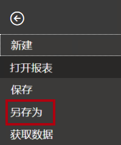
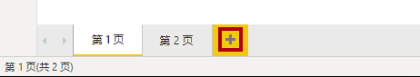
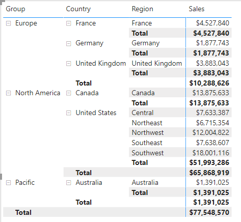
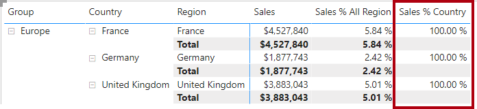

---
lab:
    title: '在 Power BI Desktop 中创建 DAX 计算，第 2 部分'
    module: '模块 5: 在 Power BI 中使用 DAX 创建模型计算'
---

# **在 Power BI Desktop 中创建 DAX 计算，第 2 部分**

**完成本实验室预计需要 45 分钟**

在本实验室中，你将使用涉及筛选器上下文操作的 DAX 表达式来创建度量值。

在本实验室中，你将学习如何：

- 使用 CALCULATE() 函数操作筛选器上下文

- 使用时间智能函数

### **实验室故事**

本实验室是一个实验室系列中的诸多实验室之一，设计为从数据准备到作为报表和仪表板发布的完整故事。可以按任意顺序完成这些实验室。但是，如果你打算完成多个实验室，对于前 10 个实验室，建议你按以下顺序完成：

1. 在 Power BI Desktop 中准备数据

2. 在 Power BI Desktop 中加载数据

3. 在 Power BI Desktop 中对数据建模，第 1 部分

4. 在 Power BI Desktop 中对数据建模，第 2 部分

5. 在 Power BI Desktop 中创建 DAX 计算，第 1 部分

6. **在 Power BI Desktop 中创建 DAX 计算，第 2 部分**

7. 在 Power BI Desktop 中设计报表，第 1 部分

8. 在 Power BI Desktop 中设计报表，第 2 部分

9. 创建 Power BI 仪表板

10. 创建 Power BI 分页报表

11. 在 Power BI Desktop 中执行数据分析

## **练习 1：使用筛选器上下文**

在此练习中，你将使用涉及筛选器上下文操作的 DAX 表达式来创建度量值。

### **任务 1：入门**

在此任务中，你将设置实验室环境。

*重要说明：如果你从上一个实验室继续操作（并且已成功完成该实验室），则无需完成此任务；而是继续执行下一个任务。*

1. 要打开 Power BI Desktop，请在任务栏上单击 Microsoft Power BI Desktop 快捷方式。

    

1. 要关闭开始窗口，请单击窗口左上角的 **“X”**。

    

1. 要打开入门 Power BI Desktop 文件，请单击 **“文件”** 功能区选项卡以打开 Backstage 视图。

1. 选择 **“打开报表”**。

    

1. 单击 **“浏览报表”**。

    

1. 在 **“打开”** 窗口，导航到 **“D:\DA100\Labs\06-create-dax-calculations-in-power-bi-desktop-advanced\Starter”** 文件夹。

1. 选择 **“Sales Analysis”** 文件。

1. 单击 **“打开”**。

    

1. 关闭可能打开的所有信息窗口。

1. 要创建该文件的副本，请单击 **“文件”** 功能区选项卡以打开 Backstage 视图。

1. 选择 **“另存为”**。

    

1. 如果系统提示应用更改，请单击 **“应用”**。

    

1. 在 **“另存为”** 窗口中，导航到 **“D:\DA100\MySolution”** 文件夹。

1. 单击 **“保存”**。

    

### **任务 2：创建矩阵视觉对象**

在此任务中，你将创建一个矩阵视觉对象来支持测试新的度量值。

1. 在 Power BI Desktop 的“报表”视图中，新建一个报表页。

    

2. 在第 **3 页上**，添加一个矩阵视觉对象。

    

3. 重设矩阵视觉对象的大小，使其填满整个页面。

4. 若要配置矩阵视觉对象的字段，请将**字段**窗格中的 **“区域 | 区域”** 层次结构拖放到视觉对象内。

    *实验室将使用速记表示法来引用字段或层次结构。如下所示： **Region | Regions**。在此示例中， **“Region”** 是表名， **“Regions”** 是层次结构名称。*

5. 还要添加 **“Sales | Sales”** 字段。

6. 若要展开整个层次结构，请单击矩阵视觉对象右上方的分叉箭头图标两次。

    

    *回想一下， **“Regions”** 层次结构包含 **“组”**、 **“国家/地区”** 和 **“区域”** 级别。*

7. 要设置视觉对象的格式，请选择 **“可视化效果”** 窗格下方的 **“格式”** 窗格。

    

8. 在 **“搜索”** 框中，输入 **“渐变”**。

    

9. 将 **“渐变布局”** 属性设置为 **“关”**。

    

10. 验证矩阵视觉对象是否有四个列标题。

    

    *在 Adventure Works 中，销售区域分为组、国家/地区和区域。除美国外，所有国家/地区都只有一个区域以该国家/地区命名。由于美国的销售区域非常大，该国分为五个销售区域。*

    *在此练习中，你将创建几个度量值，然后将它们添加到矩阵视觉对象中进行测试。*

### **任务 3：处理筛选器上下文**

在此任务中，你将使用 DAX 表达式创建几个度量值，这些度量值使用 CALCULATE() 函数来处理筛选器上下文。

1. 基于以下表达式向 **“Sales”** 表添加一个度量值：

    *为了方便起见，可以从 **D:\DA100\Labs\06-create-dax-calculations-in-power-bi-desktop-advanced\Assets\Snippets.txt** 文件复制本实验室中的所有 DAX 定义。*


    **DAX**


    ```
    Sales All Region =

    CALCULATE(SUM(Sales[Sales]), REMOVEFILTERS(Region))
    ```


    *CALCULATE() 函数是一个功能强大的函数，用于处理筛选器上下文。第一个参数接收表达式或度量（度量只是一个命名表达式）。后续参数允许修改筛选上下文。*

    *REMOVEFILTERS() 函数删除活动的筛选器。它可以不使用任何参数、表、一列或多列作为其参数。*

    *在此公式中，度量值计算修改后的筛选器上下文中 **“Sales”** 列的总和，这将删除应用到 **“Region”** 表的任何筛选器。*

2. 将 **“Sales All Region”** 度量值添加到矩阵视觉对象。

    

3. 请注意 **“Sales All Region”** 度量值计算每个区域、国家/地区（小计）和组（小计）的所有区域销售总额。

    *此新度量值尚未生成有用的结果。将某个组、国家/地区或区域的销售额除以该值，便会得出一个有用的比率，称为“占总计的百分比”。*

4. 务必选中 **“字段”** 窗格中的 **“Sales All Region”** 度量值（选中后呈现深灰色背景），然后将公式栏中的度量值名称和公式替换为以下公式：

    *提示：若要替换现有公式，请先复制代码片段。然后，单击公式栏内部并按 **Ctrl+A** 选择所有文本。然后，按 **Ctrl+V** 粘贴该片段以覆盖所选文本。然后按 **Enter**。*


    **DAX**


    ```
    Sales % All Region =  
    ‎DIVIDE(  
    ‎ SUM(Sales[Sales]),  
    ‎ CALCULATE(  
    ‎ SUM(Sales[Sales]),  
    ‎ REMOVEFILTERS(Region)  
    ‎ )  
    ‎)
    ```


    *此度量值已重命名，以准确反映更新后的公式。DIVIDE()函数将 **Sales** 度量值（未被筛选器上下文修改）除以修改后的上下文中的 **Sales** 度量值，该度量值删除应用于**区域**表的所有筛选器。*

5. 请注意，矩阵视觉对象中的度量值已被重命名，并且每个组、国家/地区和区域现在都对应了不同的值。

6. 将 **“Sales % All Region”** 度量值的格式设置为一个百分比，保留两位小数。

7. 在矩阵视觉对象中，查看 **“Sales % All Region”** 度量值。

    

8. 基于以下表达式将另一个度量值添加到 **“Sales”** 表，并将其格式设置为百分比：


    **DAX**

    ```
    Sales % Country =  
    ‎DIVIDE(  
    ‎ SUM(Sales[Sales]),  
    ‎ CALCULATE(  
    ‎ SUM(Sales[Sales]),  
    ‎ REMOVEFILTERS(Region[Region])  
    ‎ )  
    ‎)
    ```


9. 请注意， **“Sales % Country”** 度量值公式与 **“Sales % All Region”** 度量值公式略有不同。

    *不同之处在于，分母在修改筛选器上下文时删除的是 **“Region”** 表中 **“Region”** 列上的筛选器，而不是删除 **“Region”** 表中所有列上的筛选器。这意味着将保留应用于 Group 或 Country 列的所有筛选器。它将得到代表一个国家/地区销售额百分比的结果。*

10. 将 **“Sales % Country”** 度量值添加到矩阵视觉对象。

11. 请注意，仅 United States 区域得出的值不是 100%。

    

    *回想一下，只有美国有多个区域。所有其他国家/地区都只有一个区域，这就解释了为什么它们对应的值都是 100%。*

12. 为了提高该度量值在视觉对象中的可读性，可以用如下改进版公式覆盖 **“Sales % Country”** 度量值。


    **DAX**


    ```
    Sales % Country =  
    ‎IF(  
    ‎ ISINSCOPE(Region[Region]),  
    ‎ DIVIDE(  
    ‎ SUM(Sales[Sales]),  
    ‎ CALCULATE(  
    ‎ SUM(Sales[Sales]),  
    ‎ REMOVEFILTERS(Region[Region])  
    ‎ )  
    ‎ )  
    ‎)
    ```


    *ISINSCOPE() 函数嵌入 IF() 函数中，用于测试“region”列所在的层次是否属于一个由多个层次组成的层次结构。当其结果为 true 时，将对 DIVIDE() 函数进行求值。没有错误的部分意味着当区域列不在范围内时返回空白。*

13. 注意， **“Sales % Country”** 度量现在只会在某一区域在范围内时才返回值。

    

14. 基于以下表达式将另一个度量值添加到 **“Sales”** 表，并将其格式设置为百分比：


    **DAX**


    ```
    Sales % Group =  
    ‎DIVIDE(  
    ‎ SUM(Sales[Sales]),  
    ‎ CALCULATE(  
    ‎ SUM(Sales[Sales]),  
    ‎ REMOVEFILTERS(  
    ‎ Region[Region],  
    ‎ Region[Country]  
    ‎ )  
    ‎ )  
    ‎)
    ```


    *为了得出销售额占组的百分比，可以应用两个筛选器以有效地删除两列上的筛选器。*

15. 将 **“Sales % Group”** 度量添加到矩阵视觉对象。

16. 为了提高该度量在视觉对象中的可读性，可以用如下改进版公式覆盖 **“Sales % Group”** 度量。


    **DAX**


    ```
    Sales % Group =  
    ‎IF(  
    ‎ ISINSCOPE(Region[Region])  
    ‎ || ISINSCOPE(Region[Country]),  
    ‎ DIVIDE(  
    ‎ SUM(Sales[Sales]),  
    ‎ CALCULATE(  
    ‎ SUM(Sales[Sales]),  
    ‎ REMOVEFILTERS(  
    ‎ Region[Region],  
    ‎ Region[Country]  
    ‎ )  
    ‎ )  
    ‎ )  
    ‎)
    ```


17. 注意， **“Sales % Group”** 度量值现在只在区域或国家/地区在范围内时才返回值。

18. 在“模型”视图中，将三个新的度量值放入名为 **“比率”** 的显示文件夹中。

    

19. 保存 Power BI Desktop 文件。

    *添加到 **Sales** 表中的度量值修改了筛选上下文，以实现分层导航。注意，要得到小计的计算，其模式需要从筛选上下文中删除一些列，而要得到总计，必须删除所有列。*

## **练习2：使用时间智能**

在此练习中，你将创建年初至今 (YTD) 销售额度量值和年度同比 (YoY) 销售额增长率度量值。

### **任务 1：创建 YTD 度量值**

在此任务中，你将创建一个 Sales YTD 额度量值。

1. 在“报表”视图中的 **“第 2 页”** 上，注意矩阵视觉对象显示了多个度量值，并在行上对年份和月份进行了分组。

2. 根据以下表达式，向 **“Sales”** 表添加一个度量值，并将格式设置为没有小数位：


    **DAX**


    ```
    Sales YTD =  
    ‎TOTALYTD(SUM(Sales[Sales]), 'Date'[Date], "6-30")
    ```


    *TOTALYTD() 函数会对给定的日期列进行表达式求值，本例中是对 **“Sales”** 列求和。日期列必须属于标记为日期表的日期表，就像在 **“在 Power BI Desktop 中创建 DAX 计算，第 1 部分”** 实验室中所做的那样。*

    *该函数还可以采用第三个可选参数，该参数表示一年中的最后一天。如果没有此日期，则表示 12 月 31 日是该年的最后一个日期。对于 Adventure Works 而言，6 月是其年份的最后一个月，因此使用“6-30”。*

3. 将 **“销售额”** 字段和 **“本年累计销售额”** 度量添加到矩阵视觉对象。

4. 注意当年销售额值的累积。

    

    *TOTALYTD() 函数执行筛选操作，特别是时间筛选操作。例如，为了计算 2017 年 9 月（会计年度的第三个月）的本年迄今为止的销售额，已删除 **Date** 表中的所有筛选器，并替换为新的日期筛选器，该筛选器从年初（2017 年 7 月 1 日）开始，一直延伸到关联日期期间的最后一个日期（2017 年 9 月 30 日）。*

    *请注意，DAX 中提供了许多时间智能函数，以支持常用的时间筛选操作。*

### **任务 2：创建同比增长度量**

在此任务中，你将创建一个 Sales YoY Growth 度量值。

1. 根据以下表达式，向 **“Sales”** 表再添加一个度量值：


    **DAX**


    ```
    Sales YoY Growth =  
    ‎VAR SalesPriorYear =  
    ‎ CALCULATE(  
    ‎ SUM(Sales[Sales]),  
    ‎ PARALLELPERIOD(  
    ‎ 'Date'[Date],  
    ‎ -12,  
    ‎ MONTH  
    ‎ )  
    ‎ )  
    ‎RETURN  
    ‎ SalesPriorYear
    ```


    ***“Sales YoY Growth”** 度量值公式声明了一个变量。变量可用于简化公式逻辑，当需要在公式中多次对表达式求值时（同比增长逻辑就是这种情况），变量将更有效。变量由唯一的名称声明，然后必须在 **RETURN** 关键字之后输出度量值表达式。*

    *向 **SalesPriorYear** 变量分配一个表达式，用于计算修改后的上下文中 **“Sales”** 列的总和，该上下文使用 PARALLELPERIOD() 函数将筛选上下文中的每个日期向后移 12 个月。*

2. 将 **“Sales YoY Growth”** 度量值添加到“矩阵”视觉对象。

3. 请注意，新的度量值对前 12 个月返回 BLANK（2017 会计年度之前没有任何销售额记录）。

4. 请注意，**2017 年 7 月** 的 **“Sales YoY Growth”** 度量值的值是 **2016 年 1 月** 的 **“Sales”** 值。

    

    *至此，公式的“困难部分”已经过测试，现在可以使用计算增长结果的最终公式覆盖度量值。*

5. 若要完成度量值，请使用此公式覆盖 **“销售额同比增长”** 度量值，将其格式化为百分比，并保留两位小数：


    **DAX**


    ```
    Sales YoY Growth =  
    ‎VAR SalesPriorYear =  
    ‎ CALCULATE(  
    ‎ SUM(Sales[Sales]),  
    ‎ PARALLELPERIOD(  
    ‎ 'Date'[Date],  
    ‎ -12,  
    ‎ MONTH  
    ‎ )  
    ‎ )  
    ‎RETURN  
    ‎ DIVIDE(  
    ‎ (SUM(Sales[Sales]) - SalesPriorYear),  
    ‎ SalesPriorYear  
    ‎ )
    ```


6. 在公式中的 **RETURN** 子句中，请注意变量被引用了两次。

7. 验证并确认 **2018 年 7** 月的同比增长是 **392.83%**。

    

    *也就是说，2018 年 7 月的销售额（2,411,559 美元）比去年同期的销售额（489,328 美元）增长了近 400%（约 4 倍）。*

8. 在“模型”视图中，将两个新度量值放入名为 **“Time Intelligence”** 的显示文件夹。

    

### **任务 3：完成**

在此任务中，你将完成实验室。

1. 要清理可用于开发报表的解决方案，请在左下角右键单击 **“第 2 页”** 选项卡，然后选择 **“删除”** 页面。

    

2. 当系统提示删除页面时，单击 **“删除”**。

    

3. 还要删除 **“第 3 页”**。

4. 在其余页面上，要清除页面，请选择表视觉对象，然后按 **Delete** 键。

5. 保存 Power BI Desktop 文件。

6. 如果你打算开始下一个实验室，请让 Power BI Desktop 保持打开状态。

    *你将在 **“在 Power BI Desktop 中设计报表，第 1 部分”** 实验室中根据数据模型创建报表。*
