# **在 Power BI Desktop 中设计报表，第 1 部分**

**完成本实验室预计需要 45 分钟**

在本实验室中，你将创建一个三页的报表。然后，你需要将该报表发布到 Power BI，随后打开并与之交互。

在本实验室中，你将学习如何：

- 设计报表

- 配置视觉对象字段和格式属性

### **实验室故事**

本实验室是一个实验室系列中的诸多实验室之一，设计为从数据准备到作为报表和仪表板发布的完整故事。可以按任意顺序完成这些实验室。但是，如果你打算完成多个实验室，对于前 10 个实验室，建议你按以下顺序完成：

1. 在 Power BI Desktop 中准备数据

2. 在 Power BI Desktop 中加载数据

3. 在 Power BI Desktop 中对数据建模，第 1 部分

4. 在 Power BI Desktop 中对数据建模，第 2 部分

5. 在 Power BI Desktop 中创建 DAX 计算，第 1 部分

6. 在 Power BI Desktop 中创建 DAX 计算，第 2 部分

7. **在 Power BI Desktop 中设计报表，第 1 部分**

8. 在 Power BI Desktop 中设计报表，第 2 部分

9. 创建 Power BI 仪表板

10. 创建 Power BI 分页报表

11. 在 Power BI Desktop 中执行数据分析

## **练习 1：创建报表**

在本练习中，你将创建一个三页的报表，名为 **“销售报表”**。

### **任务 1：开始 - 登录**

在此任务中，你将通过登录到 Power BI 来设置实验室环境。

*重要说明：如果已登录到 Power BI，请继续完成下一个任务。*

1. 要打开 Microsoft Edge，请在任务栏上单击 Microsoft Edge 程序快捷方式。

 	

1. 在 Microsoft Edge 浏览器窗口中，导航到 **https://powerbi.com**

 	*提示：还可以使用“Microsoft Edge 收藏夹”栏上的 Power BI 服务收藏夹。*

1. 单击 **“登录”** （位于右上角）。

 	

1. 输入提供给您的帐户详细信息（查看 **“资源”**）。

1. 如果系统提示更新密码，请重新输入提供的密码，然后输入并确认新密码。

 	*重要说明：请确保记录新密码。*

1. 完成登录过程。

1. 如果 Microsoft Edge 提示你选择是否保持登录状态，请单击 **“是”**。

1. 让 Microsoft Edge 浏览器窗口保持打开状态。

### **任务 2：开始 - 打开报表**

在此任务中，你将通过打开入门报表来设置实验室环境。

*重要说明：如果你从上一个实验室继续操作（并且已成功完成该实验室），则无需完成此任务；而是继续执行下一个任务。*

1. 要打开 Power BI Desktop，请在任务栏上单击 Microsoft Power BI Desktop 快捷方式。

	

2. 要关闭开始窗口，请单击窗口左上角的 **“X”**。

	

3. 要登录到 Power BI 服务，请单击右上角的 **“登录”**。

	

4. 使用用于登录 Power BI 服务的同一帐户完成登录过程。

5. 要打开入门 Power BI Desktop 文件，请单击 **“文件”** 功能区选项卡以打开 Backstage 视图。

6. 选择 **“打开报表”**。

	

7. 单击 **“浏览报表”**。

	

8. 在 **“打开”** 窗口中，导航到 **“D:\DA100\Labs\07-design-report-in-power-bi-desktop\Starter”** 文件夹。

9. 选择 **“Sales Analysis”** 文件。

10. 单击 **“打开”**。

	

11. 关闭可能打开的所有信息窗口。

12. 要创建该文件的副本，请单击 **“文件”** 功能区选项卡以打开 Backstage 视图。

13. 选择 **“另存为”**。

	

14. 如果系统提示应用更改，请单击 **“应用”**。

	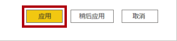

15. 在 **“另存为”** 窗口中，导航到 **“D:\DA100\MySolution”** 文件夹。

16. 单击 **“保存”**。

	

### **任务 3：设计第 1 页**

在此任务中，你将设计报表的第 1 页。完成设计后，该页面将如下所示：

1. 在 Power BI Desktop 中，要重命名页面，请在左下角右键单击 **“第 1 页”**，然后选择 **“重命名”**。

	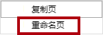

	*提示：还可以双击页面名称以进行重命名。*

2. 将该页面重命名为 **“概述”**，然后按 **Enter**。

	

3. 要添加图像，请在 **“插入”** 功能区选项卡的 **“元素”** 组中，单击 **“图像”**。

	

4. 在 **“打开”** 窗口中，导航到 **“D:\DA100\Resources”** 文件夹。

5. 选择 **“AdventureWorksLogo.jpg”** 文件，然后单击 **“打开”**。

	

6. 将图像拖放到左上角，并拖动参考线标记以调整其大小。

	

7. 要添加切片器，请先通过单击报表页面的空白区域来取消选择图像。

8. 在 **“字段”** 窗格中，选择 **“日期” | “年”** 字段（不是 **“年”** 层次级别）。

	*实验室将使用速记表示法来引用字段。如下所示： **Date | Year**。在此示例中，**“Date”** 是表名， **“Year”** 是字段名。*

9. 可以看到已将年份值表添加到报表页面。

10. 要将视觉对象从表格转换为切片器，请在 **“可视化”** 窗格中，选择 **“切片器”**。

	

11. 要将切片器从列表转换为下拉列表，请在切片器的右上角单击向下箭头，然后选择 **“下拉列表”**。

	

12. 调整切片器的大小和放置，使其位于图像下方，并且宽度与图像相同。

	

13. 在 **“年份”** 切片器中，打开下拉列表，选择 **“2020 财年”**，然后折叠下拉列表。

	

	*现在，报表页面已按年份 **“2020 财年”** 筛选。*

14. 通过单击报表页面的空白区域来取消选择切片器。

15. 基于 **“区域”** 创建第二个切片器 **|** **“区域”** 字段（不是**区域**层级）。

16. 将切片器保留为列表，然后调整切片器的大小，并将其放置在 **“年份”** 切片器下。

	

17. 要设置切片器的格式，请在 **“可视化效果”** 窗格下打开 **“格式”** 窗格。

	

18. 展开 **“选择控件”** 组。

	

19. 将 **“显示‘全选’选项”** 设置为 **“启用”**。

	

20. 请注意，在 **“区域”** 切片器中，第一个项现在是 **“全选”**。

	*通过选中此项，可全选或取消选择所有项。通过该项，报表用户可更轻松地设置所需切片器项。*

21. 通过单击报表页面的空白区域来取消选择切片器。

22. 要向页面添加图表，请在 **“可视化”** 窗格中，单击 **“折线图和堆积柱形图”** 视觉对象类型。

	

23. 调整视觉对象的大小和位置，使其位于徽标右侧，填充与报表页面相同的宽度。

	

24. 将以下字段拖放到视觉对象中：

	- Date | Month

	- Sales | Sales

25. 请注意，在视觉对象字段窗格（不是 **“字段”** 窗格 - 视觉对象字段窗格位于 **“可视化效果”** 窗格下方）中，这些字段已分配给 **“共享轴”** 和 **“列值”** 井/区域。

	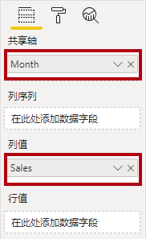

	*通过将字段拖到视觉对象中即可将其添加到默认井/区域中。为了精确起见，可直接将字段拖到井/区域中，接下来你将执行此操作。*

26. 从 **“字段”** 窗格中，将 **“Sales | Profit Margin”** 字段拖动到 **“行值”** 井/区域中。

	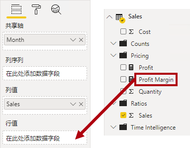

27. 请注意，该视觉对象中只有 11 个月份。

	*尚未提供上月（即 2020 年 6 月）的任何销售数据。默认情况下，视觉对象已删除销售额为“空白”的月份。现在可将该视觉对象配置为显示所有月份。*

28. 在视觉对象字段窗格中的 **“共享轴”** 井/区域中，对于 **“Month”** 字段，单击向下箭头，然后选择 **“显示没有数据的项”**。

	

29. 请注意，现在显示了月份 **“2020 年 6 月”**。

30. 通过单击报表页面的空白区域来取消选择图表。

31. 要向页面添加图表，请在 **“可视化”** 窗格中，单击 **“地图”** 视觉对象类型。

	

32. 调整该视觉对象的大小和位置，使其位于柱形图/折线图的下方，填充上方图表一半的宽度。

	

33. 将以下字段添加到视觉对象井/区域中：

	- 位置： **Region | Country**

	- 图例： **Product | Category**

	- 大小： **Sales | Sales**

34. 通过单击报表页面的空白区域来取消选择图表。

35. 要向页面添加图表，请在 **“可视化”** 窗格中，单击 **“堆积条形图”** 视觉对象类型。

	

36. 调整该视觉对象的大小和位置，使其填充剩余的报表页面空间。

	

37. 将以下字段添加到视觉对象井/区域中：

	- 轴： **Product | Category**

	- 值： **Sales | Quantity**

38. 要设置视觉对象的格式，请打开 **“格式”** 窗格。

	

39. 展开 **“数据颜色”** 组，然后将 **“默认颜色”** 属性设置为合适的颜色（以补充柱形图/折线图）。

40. 将 **“数据标签”** 属性设置为 **“启用”**。

	

41. 保存 Power BI Desktop 文件。

	*第一页的设计现已完成。*

### **任务 4：设计第 2 页**

在此任务中，你将设计报表的第 2 页。完成设计后，该页面将如下所示：

*重要说明：由于实验室中已提供了详细说明，因此，实验室步骤将提供更简洁的说明。如果需要详细说明，可以参考本实验室中的其他任务。*

1. 要创建新页面，请单击左下角的加号图标。

	

2. 将该页面重命名为 **“利润”**。

	

  
‎ 

3. 基于 **“Region | Region”** 字段添加切片器。

4. 使用 **“格式”** 窗格启用“全选”选项（在 **“选择控件”** 组中）。

5. 调整该切片器的大小和位置，使其位于报表页面左侧，高度约为页面高度的一半。

	

6. 添加矩阵视觉对象，并调整其大小和位置，使其填充剩余的报表页面空间

	

7. 将 **“Date | Fiscal”** 层次结构添加到矩阵的 **“行”** 井/区域。

	

8. 将以下五个 **“Sales”** 表字段添加到 **“值”** 井/区域：

	- Orders（来自 **“计数”** 文件夹）

	- Sales

	- Cost

	- Profit

	- Profit Margin

	

9. 在 **“筛选器”** 窗格（位于 **“可视化效果”** 窗格左侧）中，请注意 **“此页面上的筛选器”** 井/区域（可能需要向下滚动才可看到）。

	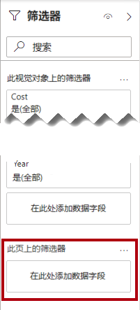

10. 从 **“字段”** 窗格中，将 **“Product | Category”** 字段拖动到 **“此页面上的筛选器”** 井/区域中。

11. 在筛选器卡片的右上角，单击箭头以折叠此卡片。

	

	*已添加到 **“筛选器”** 窗格的字段可以实现与切片器相同的结果。区别之一是它们不占用报告页面上的空间。另一个区别是可对这些字段进行配置以满足更复杂的筛选要求。*

12. 将以下每个 **“Product”** 表字段添加到 **“此页面上的筛选器”** 井/区域，并将其直接折叠在 **“类别”** 卡片下：

	- Subcategory

	- Product

	- Color

	

13. 保存 Power BI Desktop 文件。

	*第二页的设计现已完成。*

### **任务 5：设计第 3 页**

在此任务中，你将设计报表的第 3 页，也是最后一页。完成设计后，该页面将如下所示：

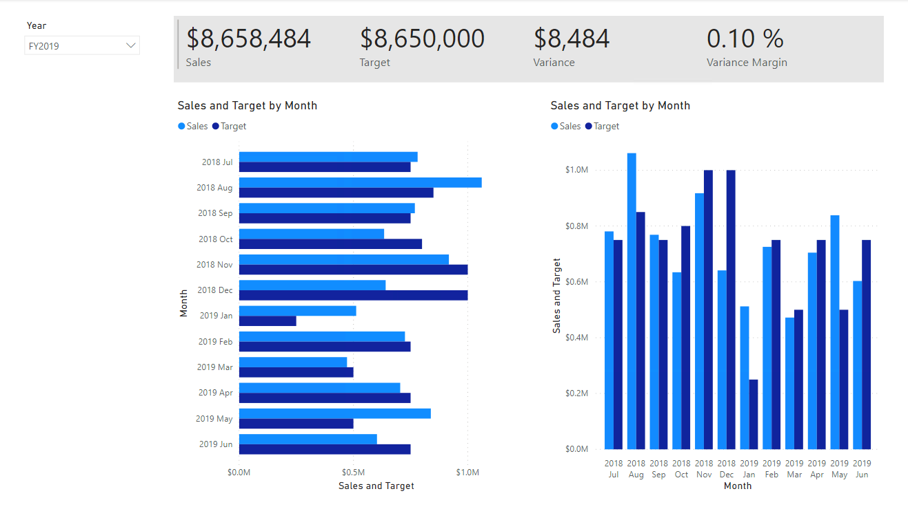

1. 创建一个新页面，然后将其重命名为 **“我的业绩”**。

	*回想一下，行级别安全性已配置为确保用户只能查看其销售区域和目标的数据。将此报表分发给销售人员时，他们只能看到自己的销售业绩结果。*

2. 要在报表设计和测试过程中模拟行级别安全性筛选器，请将 **“Salesperson (Performance) | Salesperson”** 字段添加到 **“筛选器”** 窗格上的 **“此页面上的筛选器”** 井/区域。

3. 在筛选器卡片中，向下滚动销售人员列表，然后选中 **“Michael Blythe”**。

	

	*系统会指示你先删除此筛选器，再将报表发布到 Power BI。*

4. 基于 **“Date | Year”** 字段添加下拉切片器，然后调整大小和位置，使其位于页面的左上角。

	

5. 在切片器中，将页面设置为按 **“2019 财年”** 进行筛选。

	

6. 添加一个 **“多行卡片”** 视觉对象，然后调整其大小和位置，使其位于切片器右侧并填充剩余的页面宽度。

	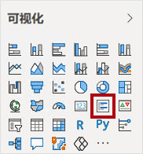

	

7. 将以下四个字段添加到该视觉对象：

	- Sales | Sales

	- Targets | Target

	- Targets | Variance

	- Targets | Variance Margin

8. 设置视觉对象的格式：

	- 在 **“数据标签”** 组中，将 **“文本大小”** 属性增加至 **“28pt”**

	- 在 **“背景”** 组中，将 **“颜色”** 设置为浅灰色

	

9. 添加一个 **“簇状条形图”** 视觉对象，然后调整其大小和位置，使其位于多行卡片视觉对象的下方，填充剩余的页面高度，并且宽度为多行卡片视觉对象宽度的一半。

	

	

10. 将以下字段添加到视觉对象井/区域中：

	- 轴： **Date | Month**

	- 值： **Sales | Sales** 和 **Targets | Target**

	

11. 要创建视觉对象的副本，请按 **Ctrl+C**，然后按 **Ctrl+V**。

12. 将新的视觉对象放置在原始视觉对象的右侧。

	

13. 要修改可视化效果类型，请在 **“可视化效果”** 窗格中，选择 **“簇状柱形图”**。

	

	*现在可以看到使用两种不同的可视化效果类型表示的相同数据。这并没有充分利用页面布局，但是你将在 **“在 Power BI Desktop 中设计报表，第 2 部分”** 实验室中通过叠加视觉对象来对其进行改进。通过向页面添加按钮，你可允许报表用户来确定这两个视觉对象中的哪一个可见。*

	*第三页（也是最后一页）的设计现已完成。*

### **任务 6：发布报表**

在此任务中，你将发布报表。

1. 选择 **“概述”** 页面。

2. 保存 Power BI Desktop 文件。

3. 在 **“开始”** 功能区选项卡上的 **“共享”** 组中，单击 **“发布”**。

	

4. 请注意，在 **“发布到 Power BI”** 窗口中，已选择 **“我的工作区”**。

5. 要发布报表，请单击 **“选择”**。

	

6. 成功发布报表后，单击 **“知道了”**。

	

7. 使 Power BI Desktop 保持打开状态。

	*在下一个练习中，你将在 Power BI 服务中浏览报表。*

## **练习2：浏览报表**

在此练习中，你将浏览已发布到 Power BI 的报表。

### **任务 1：浏览报表**

在此任务中，你将浏览已发布到 Power BI 的报表。

1. 在 Microsoft Edge 浏览器窗口，在 Power BI 服务的 **“导航”** 窗格（位于左侧，可能处于折叠状态）中，展开 **“我的工作区”**。

	

2. 查看工作区的内容，注意 **“销售额分析”** 报表和数据集。

	*发布 Power BI Desktop 文件后，数据模型已作为数据集发布。*

	*如果看不到该内容，请按 **F5** 重新加载浏览器，然后再次展开该工作区。*

	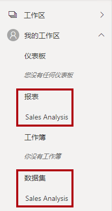

3. 单击 **“销售分析”** 报表以将其打开。

4. 在左侧的 **“页面”** 窗格中，选择 **“概述”** 页面。 

5. 在 **“区域”** 切片器中，在按下 **Ctrl** 键的同时选择多个区域。

6. 在柱形图/折线图中，选择任何月份对应的柱形以对页面进行交叉筛选。

7. 按下 **Ctrl** 键的同时再选择一个月份。

	*默认情况下，交叉筛选会筛选页面上的其他所有视觉对象。*

8. 请注意，已筛选并突出显示条形图，条形的粗体部分代表筛选出的月份。

9. 将光标悬停在条形图视觉对象上，然后将光标悬停在右上角的筛选器图标上。

	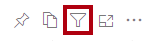

	*通过筛选器图标，你可以了解应用于视觉对象的所有筛选器，包括其他视觉对象中的切片器和交叉筛选器。*

10. 将光标悬停在条形上，然后注意工具提示信息。

11. 要撤消交叉筛选器，请在柱形图/折线图中单击视觉对象的空白区域。

12. 将光标指针悬停在映射视觉对象上方，然后单击 **“焦点模式”** 图标。

	

	*“焦点模式”将视觉对象放大至整个页面大小。*

13. 将光标悬停在饼图的不同部分上以显示工具提示。

14. 要返回报表页面，请单击左上角的 **“返回到报表”**。

	

15. 再次将光标悬停在地图视觉对象上方，然后单击右上角的省略号 (…)，查看显示的菜单选项。

	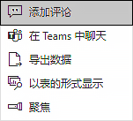

16. 尝试除 **“在 Teams 中聊天”** 之外的每个选项。

17. 在左侧的 **“页面”** 窗格中，选择 **“利润”** 页面。

	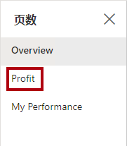

18. 请注意， **“区域”** 切片器与 **“概述”** 页面上 **“区域”** 切片器中的所选内容并不相同。

	*切片器未同步。在 **“在 Power BI Desktop 中设计报表，第 2 部分”** 实验室中，你将修改报表设计以确保它们的内容在各页面之间保持同步。*

19. 在 **“筛选器”** 窗格（位于右侧）中，展开筛选器卡片，然后应用一些筛选器。

	*你可以在 **“筛选器”** 窗格中定义超过切片器在页面上的容纳量的筛选器。*

20. 在矩阵视觉对象中，使用加号 (+) 按钮深入了解 **“财年”** 层次结构。

21. 选择 **“我的业绩”** 页面。

	

22. 在菜单栏的右上角，单击 **“视图”**，然后选择 **“全屏”**。

	

23. 通过修改切片器与页面进行交互，并对页面进行交叉筛选。

24. 窗口底部显示用于更改页面、在页面之间向后或向前导航或退出全屏模式的命令。

25. 单击左侧图标退出全屏模式。

	

### **任务 2：完成**

在此任务中，你将完成实验室。

1. 要返回到你的工作区，请在窗口网页的横幅中，单击 **“我的工作区”**。

	

2. 让 Microsoft Edge 浏览器窗口保持打开状态。

	*在 **“在 Power BI Desktop 中设计报表，第 2 部分”** 实验室中，你将使用高级功能优化报表设计。*
