---
lab:
    title: '在 Power BI Desktop 中设计报表，第 2 部分'
    module: '模块 7: 创建报表'
---

# **在 Power BI Desktop 中设计报表，第 2 部分**

**完成本实验室预计需要 45 分钟**

在本实验室中，你将使用高级设计功能优化 **“销售额分析”** 报表。

在本实验室中，你将学习如何：

- 同步切片器

- 创建钻取页面

- 应用条件格式

- 创建并使用书签

### **实验室故事**

本实验室是一个实验室系列中的诸多实验室之一，设计为从数据准备到作为报表和仪表板发布的完整故事。可以按任意顺序完成这些实验室。但是，如果你打算完成多个实验室，对于前 10 个实验室，建议你按以下顺序完成：

1. 在 Power BI Desktop 中准备数据

2. 在 Power BI Desktop 中加载数据

3. 在 Power BI Desktop 中对数据建模，第 1 部分

4. 在 Power BI Desktop 中对数据建模，第 2 部分

5. 在 Power BI Desktop 中创建 DAX 计算，第 1 部分

6. 在 Power BI Desktop 中创建 DAX 计算，第 2 部分

7. 在 Power BI Desktop 中设计报表，第 1 部分

8. **在 Power BI Desktop 中设计报表，第 2 部分**

9. 创建 Power BI 仪表板

10. 创建 Power BI 分页报表

11. 在 Power BI Desktop 中执行数据分析

## **练习 1：配置同步切片器**

在此练习中，你将同步报表页面切片器。

### 任务 1：开始 - 登录

在此任务中，你将通过登录到 Power BI 来设置实验室环境。

*重要说明：如果已登录到 Power BI，请继续完成下一个任务。*

1. 要打开 Microsoft Edge，请在任务栏上单击 Microsoft Edge 程序快捷方式。

 	

1. 在 Microsoft Edge 浏览器窗口中，导航到 **https://powerbi.com**

 	*提示：还可以使用“Microsoft Edge 收藏夹”栏上的 Power BI 服务收藏夹。*

1. 单击 **“登录”** （位于右上角）。

 	

1. 输入已向你提供的帐户详细信息。

1. 如果系统提示更新密码，请重新输入提供的密码，然后输入并确认新密码。

 	*重要说明：请确保记录新密码。*

1. 完成登录过程。

1. 如果 Microsoft Edge 提示你选择是否保持登录状态，请单击 **“是”**。

1. 在 Microsoft Edge 浏览器窗口，在 Power BI 服务的 **“导航”** 窗格中展开 **“我的工作区”**。

 	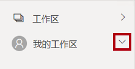

1. 让 Microsoft Edge 浏览器窗口保持打开状态。

### 任务 2：开始 - 打开报表

在此任务中，你将通过打开入门报表来设置实验室环境。

*重要说明：如果你从上一个实验室继续操作（并且已成功完成该实验室），则无需完成此任务；而是继续执行下一个任务。*

1. 要打开 Power BI Desktop，请在任务栏上单击 Microsoft Power BI Desktop 快捷方式。

	

2. 要关闭开始窗口，请单击窗口左上角的 **“X”**。

	

3. 要登录到 Power BI 服务，请单击右上角的 **“登录”**。

	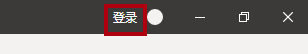

4. 使用用于登录 Power BI 服务的同一帐户完成登录过程。

5. 要打开入门 Power BI Desktop 文件，请单击 **“文件”** 功能区选项卡以打开 Backstage 视图。

6. 选择 **“打开报表”**。

	

7. 单击 **“浏览报表”**。

	

8. 在 **“打开”** 窗口，导航到 **“D:\DA100\Labs\08-design-report-in-power-bi-desktop-enhanced\Starter”** 文件夹。

9. 选择 **“Sales Analysis”** 文件。

10. 单击 **“打开”**。

	

11. 关闭可能打开的所有信息窗口。

12. 要创建该文件的副本，请单击 **“文件”** 功能区选项卡以打开 Backstage 视图。

13. 选择 **“另存为”**。

	

14. 如果系统提示应用更改，请单击 **“应用”**。

	

15. 在 **“另存为”** 窗口中，导航到 **“D:\DA100\MySolution”** 文件夹。

16. 单击 **“保存”**。

	

### **任务 3：同步切片器**

在此任务中，你将同步 **“年份”** 和 **“区域”** 切片器。

*你将继续开发在 **“在 Power BI Desktop 中设计报表，第 1 部分”** 实验室中创建的报表。*

1. 在 Power BI Desktop 中的 **“概述”** 页面上，将 **“年份”** 切片器设置为 **“2018 财年”**。

2. 转到 **“我的业绩”** 页面，注意 **“年份”** 切片器中显示的是一个不同的值。

	*当切片器不同步时，会导致数据显示错误，使报表用户感到沮丧。现在来同步报表切片器。*

3. 返回 **“概述”** 页面，然后选择 **“年份”** 切片器。

4. 在 **“视图”** 功能区选项卡中，从 **“显示窗格”** 组中单击 **“同步切片器”**。

	

5. 在 **“同步切片器”** 窗格（位于 **“可视化效果”** 窗格左侧）的第二列（表示同步）中，选中 **“概述”** 和 **“我的业绩”** 页面对应的复选框。

	

6. 在 **“概述”** 页面中，选择 **“区域”** 切片器。

7. 将该切片器同步至 **“概述”** 及 **“利润”** 页面。

	

8. 测试同步切片器，方法是选择不同的筛选器选项，然后验证同步的切片器是否按相同的选择内容进行筛选。

9. 要关闭 **“同步切片器”** 页面，请单击窗格的右上角的 **“X”**。

	

## **练习2：配置钻取**

在此练习中，你将创建一个新页面并将其配置为钻取页面。完成设计后，该页面将如下所示：

### **任务 1：创建钻取页面**

在此任务中，你将创建一个新页面并将其配置为钻取页面。

1. 添加名为 **“产品详细信息”** 的新报表页面。

	

2. 右键单击 **“产品详细信息”** 页面选项卡，然后选择 **“隐藏页面”**。

	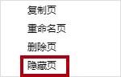

	*报表用户将无法直接进入钻取页面。他们需要从其他页面的视觉对象进行访问。在本实验室的最后一个练习中，你将了解如何钻取到页面。*

3. 在 **“可视化效果”** 窗格下的 **“钻取”** 部分中，将 **“Product | Category”** 字段添加到 **“在此处添加钻取字段”** 框。

	*实验室将使用速记表示法来引用字段。如下所示： **Product | Category**。在此示例中， **“Product”** 是表名， **“Category”** 是字段名。*

	

4. 要测试钻取页面，请在钻取筛选器卡片中选择 **“自行车”**。

	

5. 请注意报表页面左上角的箭头按钮。

	

	*将字段添加到钻取井/区域时，系统会自动添加一个按钮。通过该按钮，报表用户可以导航回在其中进行钻取的页面。*

6. 向页面添加 **“卡片”** 视觉对象，然后调整其大小和位置，使其位于按钮右侧，并填充剩余的页面宽度。

	

	

7. 将 **“Product | Category”** 字段拖入卡片视觉对象。

8. 为视觉对象配置格式选项，然后将 **“类别标签”** 属性设置为 **“关闭”**。

	

9. 将 **“背景色”** 属性设置为浅灰色。

10. 向页面添加 **“表”** 视觉对象，然后调整其大小和位置，使其位于卡片视觉对象下方，填充页面上的剩余空间。

	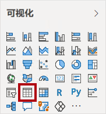

	

11. 将以下字段添加到视觉对象：

	- Product | Subcategory

	- Product | Color

	- Sales | Quantity

	- Sales | Sales

	- Sales | Profit Margin

12. 为视觉对象配置格式选项，然后在 **“网格”** 部分，将 **“文本大小”** 属性设置为 **“20pt”**。

	*钻取页面的设计即将完成。你将在下一个练习中使用条件格式来优化页面。*

## **练习 3：添加条件格式**

在此练习中，你将使用条件格式来优化钻取页面。完成设计后，该页面将如下所示：

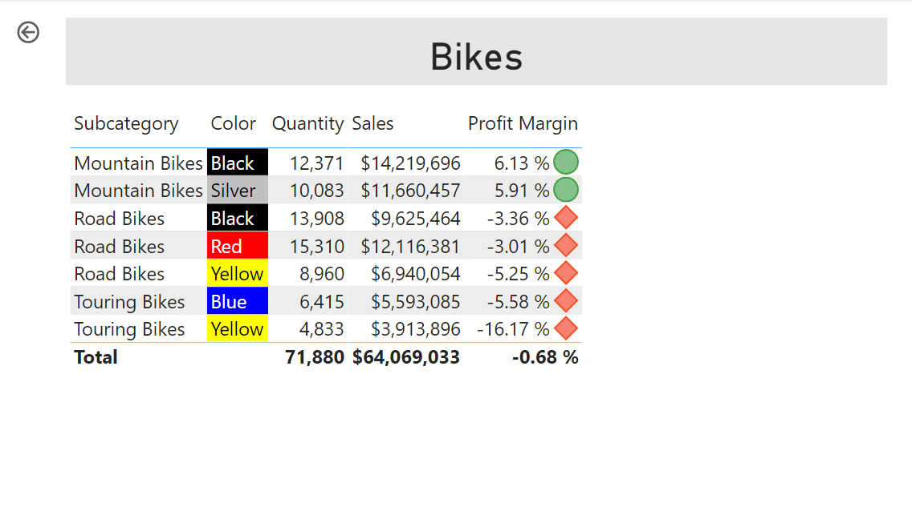

### **任务 1：添加条件格式**

在此任务中，你将使用条件格式来优化钻取页面。

1. 选择表视觉对象。

2. 在“可视化”窗格中，单击 **“Profit Margin”** 值上的向下箭头，然后选择 **“条件格式 | 图标”**。

	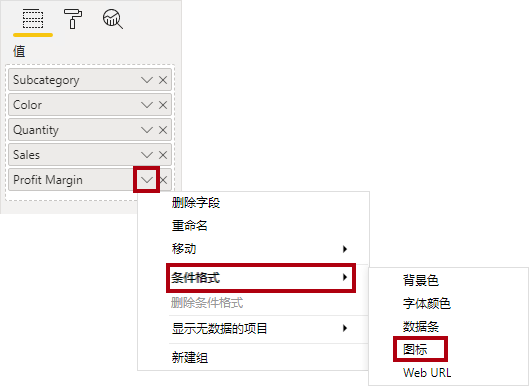

3. 在 **“图标 - 利润率”** 窗口中，在 **“图标布局”** 下拉列表中选择 **“数据右侧”**。

	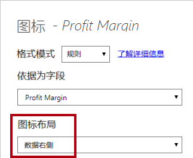

4. 要删除中间规则，请单击黄色三角形左侧的 **“X”**。

	

5. 按如下所示配置第一条规则（红色菱形）：

	- 在第二个控件中，删除值

	- 在第三个控件中，选择 **“数字”**

	- 在第五个控件中，输入 **“0”**

	- 在第六个控件中，选择 **“数字”**

6. 按如下所示配置第二条规则（绿色圆圈）：

	- 在第二个控件中，输入 **“0”**

	- 在第三个控件中，选择 **“数字”**

	- 在第五个控件中，删除值

	- 在第六个控件中，选择 **“数字”**

	

	*规则总结如下：如果利润率值小于 0，则显示红色菱形；如果该值大于或等于 0，则显示绿色圆圈。*

7. 单击 **“确定”**。

	

8. 在表视觉对象中，验证是否显示了正确的图标。

	

9. 为 **“颜色”** 字段配置背景色条件格式。

10. 在 **“背景色 - 颜色”** 窗口中，在 **“格式化依据”** 下拉列表中选择 **“字段值”**。

	

11. 在 **“基于字段”** 下拉列表中，选择 **“Product | Formatting | Background Color Format”**。

	

12. 单击 **“确定”**。

	

13. 重复前面的步骤，使用 **“Product | Formatting | Font Color Format”** 字段，为 **“颜色”** 字段配置字体颜色条件格式

	*回想一下，背景和字体颜色源自 **“在 Power BI Desktop 中准备数据”** 实验室中的 **“ColorFormats.csv”** 文件，然后与 **“在 Power BI Desktop 中加载数据”** 实验室中的 **“产品”** 查询集成。*

## **练习 4：添加书签和按钮**

在此练习中，你将通过按钮优化 **“我的业绩”** 页面，使报表用户可以选择要显示的视觉对象类型。完成设计后，该页面将如下所示：

### **任务 1：添加书签**

在此任务中，你将添加两个书签，其中一个书签显示每月销售额/目标视觉对象。

1. 转到 **“我的业绩”** 页面。

2. 在 **“视图”** 功能区选项卡中，从 **“显示窗格”** 组内，单击 **“书签”**。

	

3. 在 **“视图”** 功能区选项卡中，从 **“显示窗格”** 组内，单击 **“选择”**。

	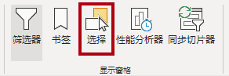

4. 要隐藏视觉对象，可在 **“选择”** 窗格中的其中一个 **“按月份显示的销售额和目标”** 项旁边，单击眼睛图标。

	

5. 在 **“书签”** 窗格中，单击 **“添加”**。

	

6. 要重命名书签，请双击该书签。

7. 如果可见图表是条形图，请将书签重命名为 **“条形图打开”**，否则将书签重命名为 **“柱形图打开”**。

8. 要编辑书签，请在 **“书签”** 窗格中，将光标悬停在书签上方，单击省略号，然后选择 **“数据”**。

	

	*禁用 **“数据”** 选项意味着书签不会使用当前筛选器状态。这一点很重要，因为在其他情况下书签将永久固定在 **“年份”** 切片器当前应用的筛选器中。*

9. 要更新书签，请再次单击省略号，然后选择 **“更新”**。

	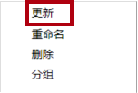

	*在以下步骤中，你将创建和配置第二个书签来显示第二个视觉对象。*

10. 在 **“选择”** 窗格中，切换两个 **“按月份显示的销售额和目标”** 项的可见性。

	*换句话说，隐藏可见的视觉对象，并显示隐藏的视觉对象。*

	

11. 创建第二个书签，并为其提供相应的名称（**“柱形图打开”** 或 **“条形图打开”**）。

	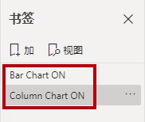

12. 配置第二个书签以忽略筛选器（禁用 **“数据”** 选项），并更新书签。

13. 要使这两个视觉对象都可见，只需在 **“选择”** 窗格中显示隐藏的视觉对象即可。

14. 调整两个视觉对象的大小和位置，使其填充多卡片视觉对象下方的页面，并使其完全相互重叠。

	*提示：要选择被覆盖的视觉对象，请在 **“选择”** 窗格选中它。*

	

15. 在 **“书签”** 窗格中，选择每个书签，并注意只有一个视觉对象可见。

	*设计的下一阶段是在页面上添加两个按钮，以便报表用户选择书签。*

### **任务 2：添加按钮**

在此任务中，你将添加两个按钮，并为每个按钮分配书签操作。

1. 在 **“插入”** 功能区中，从 **“元素”** 组内，单击 **“按钮”**，然后选择 **“空白”**。

	

2. 将按钮直接置于 **“年份”** 切片器下。

3. 选择按钮，然后在 **“可视化效果”** 窗格中，将 **“按钮文本”** 属性设置为 **“启用”**。

	

4. 展开 **“按钮文本”** 部分，然后在 **“按钮文本”** 框内，输入 **“条形图”**。

5. 展开 **“背景”** 部分，然后使用补色设置背景色。

6. 将 **“操作”** 属性设置为 **“启用”** （位于列表底部附近）。

	

7. 展开 **“操作”** 部分，然后将 **“类型”** 下拉列表设置为 **“书签”**。

8. 在 **“书签”** 下拉列表中，选择 **“条形图打开”**。

	

9. 通过复制粘贴操作创建按钮的副本，然后按如下方式配置新按钮：

	*提示：复制和粘贴的快捷方式命令为 **Ctrl+C** 和 **Ctrl+V**。*

	- 将 **“按钮文本”** 属性设置为 **“柱形图”**

	- 在 **“操作”** 部分，将 **“书签”** 下拉列表设置为 **“柱形图打开”**

	*“销售额分析”报表设计现已完成。*

### **任务 3：发布报表**

在此任务中，你将发布报表。

1. 选择 **“概述”** 页面。

2. 在 **“Year”** 切片器中，选择 **“FY2020”**。

3. 在 **“Region”** 切片器中，选择 **“全选”**。

4. 保存 Power BI Desktop 文件。

	*在将文件发布到 Power BI 服务之前，始终必须先保存该文件。*

5. 在 **“开始”** 功能区选项卡上的 **“共享”** 组中，单击 **“发布”**。

	

6. 请注意，在 **“发布到 Power BI”** 窗口中，已选择 **“我的工作区”**。

7. 要发布报表，请单击 **“选择”**。

	

8. 如果系统提示替换数据集，请单击 **“替换”**。

9. 成功发布报表后，单击 **“知道了”**。

	

10. 使 Power BI Desktop 保持打开状态。

	*在下一个练习中，你将在 Power BI 服务中浏览报表。*

## **练习 5：浏览报表**

在本练习中，你将在 Power BI 服务中浏览报表。

### **任务 1：浏览报表**

在此任务中，你将在 Power BI 服务中浏览报表。

1. 在 Microsoft Edge 浏览器窗口，在 Power BI 服务的 **“导航”** 窗格中，单击 **“销售额分析”** 报表。

2. 要测试钻取报表，请在 **“概述”** 页面的 **“各类别的数量”** 视觉对象中，右键单击 **“服装”** 栏，然后选择 **“钻取 | 产品详细信息”**。

	

3. 请注意，显示的是 **“服装”** 的 **“产品详细信息”** 页面。

4. 要返回源页面，请单击页面左上角的箭头按钮。

5. 选择 **“我的业绩”** 页面。

6. 单击每个按钮，然后注意显示了另一个视觉对象。

### **任务 2：完成**

在此任务中，你将完成实验室。

1. 要返回到你的工作区，请在窗口网页的横幅中，单击 **“我的工作区”**。

	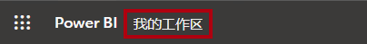

2. 让 Microsoft Edge 浏览器窗口保持打开状态。

3. 在 Power BI Desktop 中，转到 **“我的业绩”** 页面，然后在 **“筛选器”** 窗格中删除 **“销售人员”** 筛选器卡片。

	

4. 选择 **“概述”** 页面。

5. 保存 Power BI Desktop 文件，然后将报表重新发布到 Power BI。

6. 使 Power BI Desktop 保持打开状态。

	*在 **“发布和共享 Power BI 内容”** 实验室中共享报表时，该报表将强制执行行级别安全性。*
