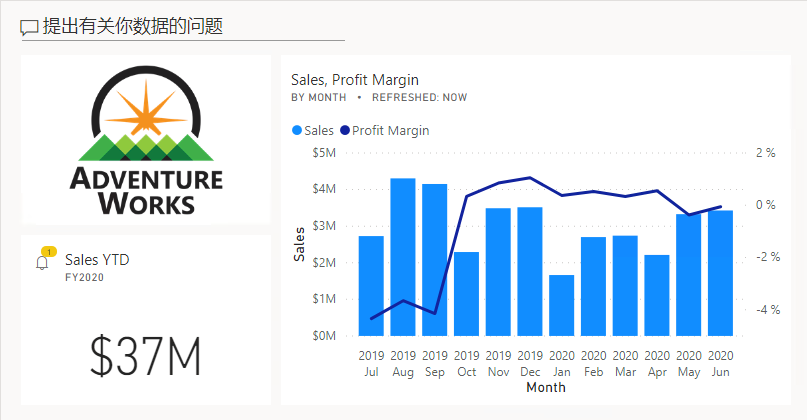
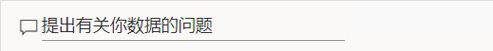
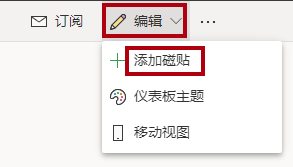
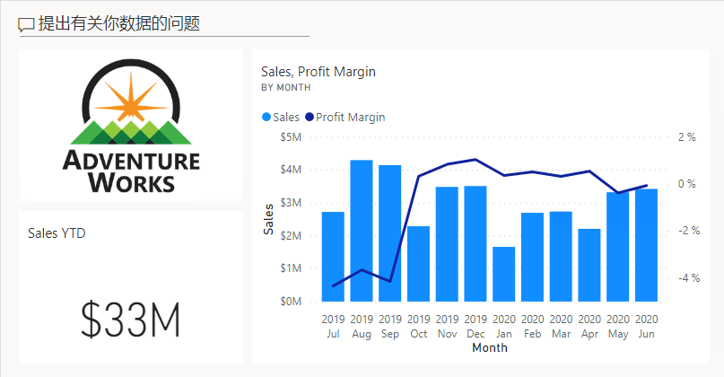
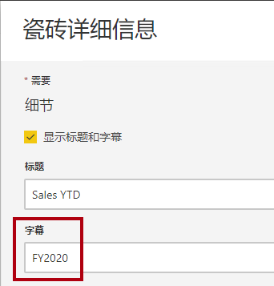
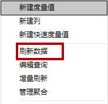

# **创建 Power BI 仪表板**

**完成本实验室预计需要 45 分钟**

在本实验室中，你将创建 **“销售额监视”** 仪表板。

在本实验室中，你将学习如何：

- 将视觉对象固定到仪表板

- 使用问答创建仪表板磁贴

- 配置仪表板磁贴警报

### **实验室故事**

本实验室是一个实验室系列中的诸多实验室之一，设计为从数据准备到作为报表和仪表板发布的完整故事。可以按任意顺序完成这些实验室。但是，如果你打算完成多个实验室，对于前 10 个实验室，建议你按以下顺序完成：

1. 在 Power BI Desktop 中准备数据

2. 在 Power BI Desktop 中加载数据

3. 在 Power BI Desktop 中对数据建模，第 1 部分

4. 在 Power BI Desktop 中对数据建模，第 2 部分

5. 在 Power BI Desktop 中创建 DAX 计算，第 1 部分

6. 在 Power BI Desktop 中创建 DAX 计算，第 2 部分

7. 在 Power BI Desktop 中设计报表，第 1 部分

8. 在 Power BI Desktop 中设计报表，第 2 部分

9. **创建 Power BI 仪表板**

10. 在 Power BI Desktop 中执行数据分析

11. 创建 Power BI 分页报表

## **练习 1：创建仪表板**

在此练习中，你将创建 **“销售额监视”** 仪表板。完成的仪表板将如下所示：

### **任务 1：开始 - 登录**

在此任务中，你将通过登录到 Power BI 来设置实验室环境。

*重要说明：如果在上一个实验室中已登录到 Power BI，请继续完成下一个任务。*

1. 要打开 Microsoft Edge，请在任务栏上单击 Microsoft Edge 程序快捷方式。

    

2. 在 Microsoft Edge 浏览器窗口中，导航到 **https://powerbi.com**

    *提示：还可以使用“Microsoft Edge 收藏夹”栏上的 Power BI 服务收藏夹。*

3. 单击 **“登录”** （位于右上角）。

    

4. 输入已向你提供的帐户详细信息。

5. 如果系统提示更新密码，请重新输入提供的密码，然后输入并确认新密码。

    *重要说明：请确保记录新密码。*

6. 完成登录过程。

7. 如果 Microsoft Edge 提示你选择是否保持登录状态，请单击 **“是”**。

8. 在 Microsoft Edge 浏览器窗口，在 Power BI 服务的 **“导航”** 窗格中展开 **“我的工作区”**。

    

9. 让 Microsoft Edge 浏览器窗口保持打开状态。

### **任务 2：开始 - 打开报表**

在此任务中，你将通过打开入门报表来设置实验室环境。

*重要说明：如果你从上一个实验室继续操作（并且已成功完成该实验室），则无需完成此任务；而是继续执行下一个任务。*

1. 要打开 Power BI Desktop，请在任务栏上单击 Microsoft Power BI Desktop 快捷方式。

    

2. 要关闭开始窗口，请单击窗口左上角的 **“X”**。

    

3. 如果 Power BI Desktop 未登录到 Power BI 服务，请单击右上角的 **“登录”**。

    

4. 使用用于登录 Power BI 服务的同一帐户完成登录过程。

5. 要打开入门 Power BI Desktop 文件，请单击 **“文件”** 功能区选项卡以打开 Backstage 视图。

6. 选择 **“打开报表”**。

    

7. 单击 **“浏览报表”**。

    

8. 在 **“打开”** 窗口，导航到 **“D:\DA100\Labs\create-power-bi-dashboard\Starter”** 文件夹。

9. 选择 **“Sales Analysis”** 文件。

10. 单击 **“打开”**。

    

11. 关闭可能打开的所有信息窗口。

12. 要创建该文件的副本，请单击 **“文件”** 功能区选项卡以打开 Backstage 视图。

13. 选择 **“另存为”**。

    

14. 如果系统提示应用更改，请单击 **“应用”**。

    

15. 在 **“另存为”** 窗口中，导航到 **“D:\DA100\MySolution”** 文件夹。

16. 单击 **“保存”**。

    

### **任务 3：开始 - 发布报表**

在此任务中，你将通过创建数据集来设置实验室环境。

*重要说明：如果你已在 **“在 Power BI Desktop 中设计报表，第 2 部分”** 实验室中发布报表，请继续完成下一个任务。*

1. 在 Microsoft Edge 浏览器窗口，在 Power BI 服务的 **“导航”** 窗格中，单击底部的 **“获取数据”**。

    

2. 在 **“文件”** 磁贴中，单击 **“获取”**。

    

3. 单击 **“本地文件”** 磁贴。

    

4. 在 **“打开”** 窗口，导航到 **“D:\DA100\Labs\design-report-in-power-bi-desktop-enhanced\Solution”** 文件夹。

5. 选择 **“Sales Analysis.pbix”** 文件，然后单击 **“打开”**。

6. 如果系统提示替换数据集，请单击 **“替换”**。

### **任务 4：创建仪表板**

在此任务中，你将创建 **“销售额监视”** 仪表板。你将固定报表中的一个视觉对象、添加基于图像数据 URI 的磁贴以及使用问答来创建磁贴。

1. 在 Microsft Edge 浏览器窗口的 Power BI 服务中，打开 **“销售额分析”** 报表。

2. 在 **“概述”** 页面中，将 **“年份”** 切片器设置为 **“2020 财年”**。

    

3. 将 **“区域”** 切片器设置为 **“全选”**。

    *将视觉对象固定到仪表板时，它们将使用当前的筛选上下文。一旦固定，就无法更改筛选上下文。对于基于时间的筛选器，最好使用相对日期切片器（或使用基于相对时间的问题的问答）。*

4. 要创建仪表板并固定视觉对象，请将光标悬停在 **“按月份显示的销售额和利润率”** （列/行）视觉对象上方。

5. 单击右上角的图钉。

    

6. 在 **“固定到仪表板”** 窗口的 **“仪表板名称”** 框中，输入 **“销售额监视”**。

    

7. 单击 **“固定”**。

    

8. 打开 **“导航”** 窗格，然后打开 **“销售额监视”** 仪表板。

    

9. 请注意，仪表板中有一个磁贴。

    

10. 要添加基于问题的磁贴，请在仪表板左上方单击 **“询问有关数据的问题”**。

    

    *可以使用问答功能来提问，然后 Power BI 将通过视觉对象进行回答。*

11. 单击“问答”框下方蓝色框中的任何建议问题。

12. 查看回答。

13. 从“问答”框中删除所有文本。

14. 在“问答”框中，输入以下内容： **本年迄今为止的销售额**

    

15. 请注意 **（空白）** 答复。

    

    *回想一下，你在 **“在 Power BI Desktop 中创建 DAX 计算，第 2 部分”** 实验室中添加了 **“本年迄今为止的销售额”** 度量值。此度量值是时间智能表达式，它需要对 **“日期”** 表进行筛选以生成结果。*

16. 在问题中加入 **“2020 财年”**。

    

17. 注意答复现在为 **3300** 万美元。

    

18. 要将答复固定到仪表板，请在右上角单击 **“固定视觉对象”**。

    

19. 当系统提示将磁贴固定到仪表板时，单击 **“固定”**。

    

20. 要返回到仪表板，请在左上角单击 **“退出问答”**。

    

21. 要添加公司日志，请在菜单栏上单击 **“编辑”**，然后选择 **“添加磁贴”**。

    

    *通过使用此方法添加仪表板磁贴，可使用媒体来修饰仪表板，包括 Web 内容、图像、格式丰富的文本框和视频（使用 YouTube 或 Vimeo 链接）。*

22. 在 **“添加磁贴”** 窗格（位于右侧）中，选择 **“图像”** 磁贴。

    

23. 单击 **“下一步”**。

    

24. 在 **“添加图像磁贴”** 窗格的 **“URL”** 框中，输入在 **“D:\DA100\Resources\AdventureWorksLogo_DataURL.txt”** 文件中找到的完整 URL。

    *可通过使用图像 URL 来嵌入图像，也可以使用可嵌入内联内容的数据 URL。*

25. 在窗格底部，单击 **“应用”**。

    

26. 要调整徽标磁贴的大小，请拖动右下角，然后将磁贴的大小调整为一个单位宽，两个单位高。

    *磁贴大小限制为矩形。只能将大小调整为矩形的倍数。*

27. 整理磁贴，让徽标显示在左上角， **“本年迄今为止的销售额”** 磁贴显示在徽标下方， **“销售额、利润率”** 磁贴显示在右侧。

    

### **任务 5：编辑磁贴详细信息**

在此任务中，你将编辑两个磁贴的详细信息。

1. 将光标悬停在 **“本年迄今为止的销售额”** 磁贴上，单击该磁贴右上角的省略号，然后选择 **“编辑详细信息”**。

    

2. 在 **“磁贴详细信息”** 窗格（位于右侧）的 **“副标题”** 框中，输入 **“2020 财年”**。

    

3. 单击**应用**。

    

4. 请注意，**“本年迄今为止的销售额”** 磁贴将显示副标题。

    

5. 编辑 **“销售额、利润率”** 磁贴的磁贴详细信息。

6. 在**磁贴详细信息**窗格的 **“功能”** 部分，选中 **“显示上次刷新时间”**。

    

7. 单击**应用**。

    

8. 请注意，该磁贴会显示上次刷新时间（在 Power BI Desktop 中加载数据模型时执行刷新）。

    *你稍后将在本实验室中模拟数据刷新，并查看刷新时间是否更新。*

### **任务 6：配置警报**

在此任务中，你将配置数据警报。

数据警报只能在仪表板磁贴上配置，尤其是显示单个数值的磁贴。

1. 将光标悬停在 **“本年迄今为止的销售额”** 磁贴上，单击“省略号”，然后选择 **“管理警报”**。

    

2. 在 **“管理警报”** 窗格（位于右侧）中，单击 **“添加预警规则”**。

    

3. 在 **“阈值”** 框中，将值替换为 **“35000000”** （3500 万）。

    

    *此配置可确保每当磁贴更新为大于 3500 万的值时，你都会收到通知。*

4. 在窗格底部，单击 **“保存并关闭”** 。

    

    *你将在下一练习中刷新数据集。通常，这应该借助计划刷新来完成，在此情况下，Power BI 将使用网关连接到 SQL Server 数据库。但是，由于课堂条件有限，因此没有使用网关。因此，你需要打开 Power BI Desktop、执行手动数据刷新，然后将文件上传到工作区。*

## **练习 2：刷新数据集**

在此练习中，你首先需要将 2020 年 6 月的销售订单数据加载到 **AdventureWorksDW2020** 数据库。然后打开 Power BI Desktop 文件，执行数据刷新，再将该文件上传到工作区。

### **任务 1：更新实验室数据库**

在此任务中，你将运行 PowerShell 脚本来更新 **AdventureWorksDW2020** 数据库中的数据。

1. 在“文件资源管理器”的 **“D:\DA100\Setup”** 文件夹中，右键单击 **“UpdateDatabase-2-AddSales.ps1”** 文件，然后选择 **“使用 PowerShell 运行”**。

    

2. 如果系统提示更改执行策略，请按 **A**。

3. 当系统提示按任意键关闭时，请再次按 **Enter**。

    * ***AdventureWorksDW2020** 数据库现在包含 2020 年 6 月的销售订单。*

### **任务 2：刷新 Power BI Desktop 文件**

在此任务中，你需要打开 Power BI Desktop **销售额分析**文件，执行数据刷新，然后将该文件上传到 **“销售额分析”** 工作区。

1. 在 Power BI Desktop 文件的 **“字段”** 窗格中，右键单击 **“销售额”** 表，然后选择 **“刷新数据”**。

    

2. 刷新完成后，保存 Power BI Desktop 文件。

3. 要将文件发布到工作区，请在 **“开始”** 功能区选项卡的 **“分享”** 组中，单击 **“发布”**。

    

4. 当系统提示替换数据集时，请单击 **“替换”**。

    

    *Power BI 服务中的数据集现在包含 2020 年 6 月的销售数据。*

5. 关闭 Power BI Desktop。

## **练习 3：查看仪表板**

在此练习中，你将查看仪表板，以查看更新的销售额以及触发的警报。

### **任务 1：查看仪表板**

在此任务中，你将查看仪表板，以查看更新的销售额以及触发的警报。

1. 在 Microsft Edge 浏览器窗口的 Power BI 服务中，查看 **“销售额监视”** 仪表板。

2. 在 **“销售额、利润率”** 磁贴的副标题中，请注意数据**现在**已刷新。

3. 还请注意，现在有一个 **2020 年 6 月** 的列。

    *如果没有看到 2020 年 6 月的数据，则可能需要按 **F5** 重新加载 Web 浏览器。*

    

    *还应触发了 **“本年迄今为止的销售额”** 磁贴上的警报。片刻之后，警报应通知你销售额现在已超出配置的阈值。*

4. 请注意， **“本年迄今为止的销售额”** 磁贴已更新为 **“3700 万美元”**。

5. 验证 **“Sales YTD”** 磁贴是否显示警报通知图标。

    *如果没有看到通知，则可能需要按 **F5** 重新加载浏览器。如果仍未看到通知，请再等待几分钟。*

    

    *警报通知显示在仪表板磁贴上，可以通过电子邮件的形式传递，也可通过推送通知的形式发送到移动应用（包括 Apple Watch）。*

6. 在网页的右上角，单击 **“通知”** 图标。

    

7. 在 **“所有通知”** 窗格中，查看警报通知的详细信息。

8. 要关闭该窗格，请单击 **“关闭”**。
