

# **创建 Power BI 分页报表**

**完成本实验室预计需要 45 分钟**

在本实验室中，你将使用 Power BI Report Builder 开发一个像素完美的分页报表布局，该布局从 **AdventureWorksDW2020** SQL Server 数据库获取数据。你将创建数据源和数据集，并配置报表参数。报表布局使数据能够呈现在多个页面上，并以 PDF 和其他格式导出。

最终报表的大致外观如下：


在本实验室中，你将学习如何：

- 使用 Power BI Report Builder

- 设计多页报表布局

- 定义数据源

- 定义数据集

- 创建报表参数

- 将报表导出为 PDF

### **实验室故事**

本实验室是一个实验室系列中的诸多实验室之一，设计为从数据准备到作为报表和仪表板发布的完整故事。可以按任意顺序完成这些实验室。但是，如果你打算完成多个实验室，对于前 10 个实验室，建议你按以下顺序完成：

1. 在 Power BI Desktop 中准备数据

2. 在 Power BI Desktop 中加载数据

3. 在 Power BI Desktop 中对数据建模，第 1 部分

4. 在 Power BI Desktop 中对数据建模，第 2 部分

5. 在 Power BI Desktop 中创建 DAX 计算，第 1 部分

6. 在 Power BI Desktop 中创建 DAX 计算，第 2 部分

7. 在 Power BI Desktop 中设计报表，第 1 部分

8. 在 Power BI Desktop 中设计报表，第 2 部分

9. 创建 Power BI 仪表板

10. **创建 Power BI 分页报表**

11. 在 Power BI Desktop 中执行数据分析

## **练习 1：入门**

在本练习中，你将打开 Power BI Report Builder 来创建并保存报表。

### **任务 1：创建报表**

在此任务中，你将打开 Power BI Report Builder 来创建并保存报表。

1. 要打开 Power BI Report Builder，请在任务栏上单击 **“Power BI Report Builder”** 快捷方式。

 	

1. 在 Power BI Report Builder 窗口中创建新报告，在 **“入门”** 窗口，单击 **“空白报告”**。

 	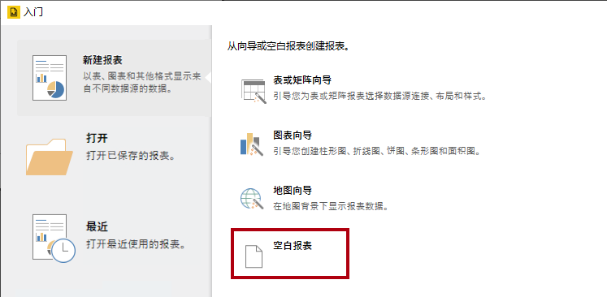

1. 要保存报表，请单击 **“文件”** 选项卡（位于左上角），然后选择 **“保存”**。

 	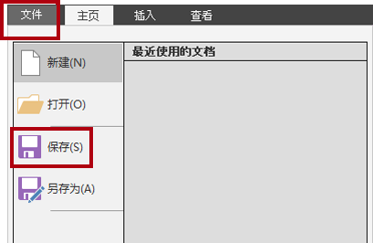

1. 在 **“另存为报表”** 窗口中，导航到 **D:\DA100\MySolution** 文件夹。

1. 在 **“名称”** 框中，输入 **“销售订单报表”**。

1. 单击 **“保存”**。

## **练习2：设计报表布局**

在此练习中，你将设计报表布局，并探索最终的报表设计。

### **任务 1：配置报表页眉**

在此任务中，你将配置报表页眉。

1. 在报表设计器中，默认报表布局由正文区域和报表页脚区域组成。

	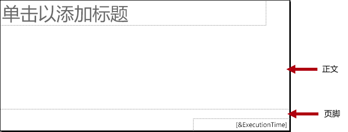

	*正文包含一个为报表标题准备的文本框，报表页脚包含一个用于说明报表执行时间的文本框。*

	*默认设计将在正文第一个呈现的页面上呈现一次报表标题。现在你将通过添加报表标题区域，并将报表标题文本框移到该区域，以此来修改报表设计。这样，报表标题将重复出现在每个页面上。另外，还将添加一个公司徽标图像。*

1. 要添加报表页眉区域，请在 **“插入”** 功能区选项卡中的 **“页眉和页脚”** 组内，单击 **“页眉”**，然后选择 **“添加页眉”**。

	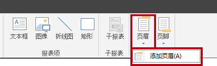

1. 在报表设计器中，可以看到报表页眉区域已添加到报表布局中。

1. 要选择正文文本框，请单击“单击以添加标题”文本框。

1. 要移动文本框，请单击四向箭头图标，然后将其拖动到页眉区域中，再将其放在报表页眉区域的最左上角。

	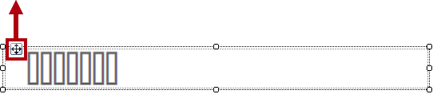

1. 要修改报表标题文本框文本，请单击文本框内部，然后输入：**销售订单报表**

	*要调整文本框大小，请先打开 **“属性”** 窗格。若要对位置属性和大小属性进行精细控制，需要使用 **“属性”** 窗格。*

1. 在 **“视图”** 功能区选项卡上，勾选 **“显示/隐藏”** 功能组内的 **“属性”**。

	

1. 要选择报表标题文本框，请首先单击文本框外部的区域，然后再次单击该文本框。

	*当文本框边框突出显示并且调整大小图柄（小圆圈）出现在边框上时，文本框即处于选中状态。*

1. 在 **“属性”** 窗格（位于右侧）中，向下滚动列表以找到 **“方位”** 组。

	

	*通过 **“方位”** 组，可为报表项设置精确的位置和大小值。*

	*请务必按照本实验室的指示输入值。需要使用像素完美布局才能在实验室结束时实现页面呈现。*

1. 在 **“方位”** 组内，展开 **“位置”** 组，并确保 **“左侧”** 和 **“顶部”** 属性均设置为 **“0in”**。

	*位置和大小均以英寸为单位，因为实验室虚拟机的区域设置设为“美国”。如果你的区域使用公制度量单位，则默认单位为厘米。*

1. 在 **“方位”** 组内，展开 **“大小”** 组，然后将 **“宽度”** 属性设置为 **4**。

	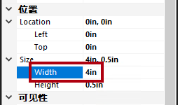

1. 要插入图像，请在 **“插入”** 功能区选项卡的 **“报表项”** 组内，单击 **“图像”**。

	

1. 要将图像添加到报表设计中，请单击报表标题文本框右侧的报表页眉区域内部。

1. 要从图像文件导入，请在 **“图像属性”** 窗口中单击 **“导入”**。

	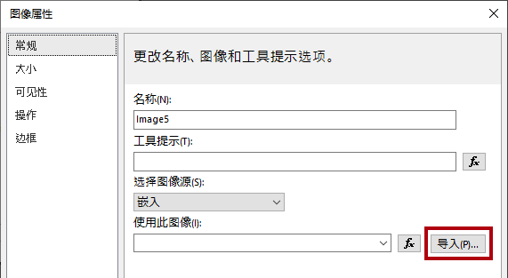

1. 在 **“打开”** 窗口中，导航到 **“D:\DA100\Resources”** 文件夹，然后选择 **“AdventureWorksLogo.jpg”** 文件。

1. 单击 **“打开”**。

1. 在 **“图像属性”** 窗口中单击 **“确定”**。

1. 在报表设计器中，可看到已添加并选择了图像。

1. 若要定位图像并调整其大小，请在**属性**窗格中配置以下属性：

	- **位置 | 位置 | 左侧**： 5

	- **位置 | 位置 | 顶部**： 0

	- **位置 | 大小 | 宽度**： 1

	- **位置 | 大小 | 高度**： 1

1. 要调整报表标题区域大小，请首先单击区域的空白部分以选择区域。

1. 在 **“属性”** 窗格中，将 **“常规 | 高度”** 属性设置为 **1**。

1. 验证报表标题区域是否包含单个文本框和图像，如下所示：

	

1. 要保存报表，请在 **“文件”** 选项卡上单击 **“保存”**。

	*提示：还可以单击左上角的磁盘图标。*

	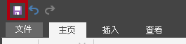

	*现在可配置报表以检索数据库查询结果。*

### **任务 2：检索数据**

在此任务中，你将创建数据源和数据集，以从 **AdventureWorksDW2020** SQL Server 数据库中检索查询结果。

1. 在 **“报表数据”** 窗格（位于左侧）中，右键单击 **“数据源”** 文件夹，然后选择 **“添加数据源”**。

	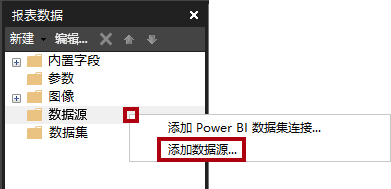

	*可以从云/本地数据库或 Power BI 数据集中检索数据。*

2. 在 **“数据源属性”** 窗口中，将 **“名称”** 框中的文本替换为 **“AdventureWorksDW2020”**。

3. 在 **“选择连接类型”** 下拉列表中，可看到已选中 **“Microsoft SQL Server”**。

4. 要生成连接字符串，请单击 **“生成”**。

	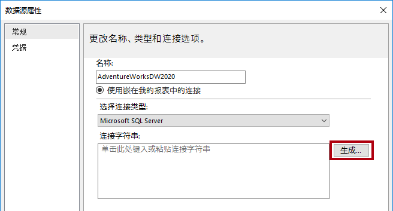

5. 在 **“连接属性”** 窗口的 **“服务器名称”** 框中，输入 **“localhost”**。

	*在各实验室中，你将使用 **localhost** 连接到 SQL Server 数据库。但在创建自己的解决方案时，不建议这样做。这是因为网关数据源无法解析 **localhost**。*

6. 在 **“选择或输入数据库名称”** 下拉列表中，选择 **“AdventureWorksDW2020”**。

7. 单击 **“确定”**。

8. 在 **“数据源属性”** 窗口中，单击 **“确定”**。

9. 在 **“报表数据”** 窗格中，注意已添加 **AdventureWorksDW2020** 数据源。

	

10. 要创建数据集，请在 **“报表数据”** 窗格中，右键单击 **AdventureWorksDW2020** 数据源，然后选择 **“添加数据集”**。

	

	*报表数据集的用途和结构与 Power BI 数据集不同。*

11. 在 **“数据集属性”** 窗口中，将 **“名称”** 框中的文本替换为 **“SalesOrder”**。

12. 要导入预定义的查询，请单击 **“导入”**。

	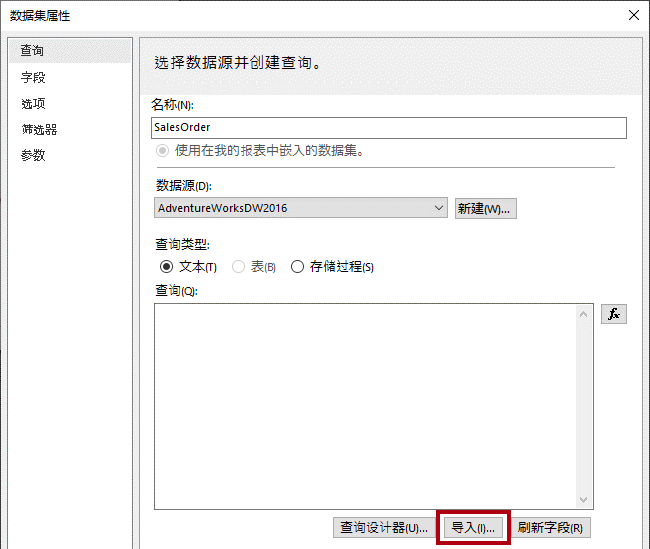

13. 在 **“导入查询”** 窗口中，导航到 **“D:\DA100\Labs\10-create-power-bi-paginated-report\Assets”** 文件夹，然后选择 **“SalesOrder.sql”** 文件。

14. 单击 **“打开”**。

15. 在 **“查询”** 框中，检查查询，并确保向下滚动到查询文本的底部。

	*你不必理解查询语句的细节。它旨在检索销售订单行详细信息。WHERE 子句包含用于将查询结果限制为单个销售订单的谓词。ORDER BY 子句可确保按行号顺序返回行。*

16. 注意 WHERE 子句中 **@SalesOrderNumber** 的用法，它代表一个查询参数。

	

	*查询参数是将在查询执行时传递的值的占位符。你将配置报表参数，以提示报表用户输入单个销售订单编号，然后该编号将传递给查询参数。*

17. 单击 **“确定”**。

18. 在 **“报表数据”** 窗格中，注意已添加了 **“销售订单”** 数据集及其字段。

	

	*这些字段用于配置报表布局中的数据区域。它们派生自数据集查询列。*

19. 保存报表。

### **任务 3：配置报表参数**

在此任务中，你将使用默认值配置报表参数。

1. 在 **“报表数据”** 窗格中，展开 **“参数”** 文件夹，以显示 **“SalesOrderNumber”** 报表参数。

	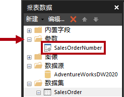

	*创建数据集时自动添加了 **SalesOrderNumber** 报表参数。这是因为数据集查询包含 **@SalesOrderNumber** 查询参数。*

2. 要编辑报表参数，请右键单击 **“SalesOrderNumber”** 报表参数，然后选择 **“参数属性”**。

	

3. 在 **“报表参数属性”** 窗口左侧，选择 **“默认值”** 页面。

	

4. 选择 **“指定值”** 选项。

	

5. 要添加默认值，请单击 **“添加”**。

6. 在 **“值”** 下拉列表中，将文本替换为 **“43659”**。

	

	*销售订单 43659 是你最初用于测试报表设计的值。*

7. 单击 **“确定”**。

8. 保存报表。

	*现在，你将通过添加描述销售订单的文本框来完成报表页眉区域的设计。*

### **任务 4：完成报表页眉布局**

在此任务中，你将通过添加文本框来完成报表页眉区域设计。

1. 要将文本框添加到报表页眉区域，请在 **“插入”** 功能区选项卡的 **“报表项”** 组内，单击 **“文本框”**。

	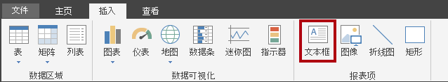

2. 单击报表标题文本框正下方的报表页眉区域内部。

3. 在文本框中输入 **“销售订单：”**，后跟一个空格。

4. 要插入占位符，请在刚输入空格后立即单击鼠标右键，然后选择 **“创建占位符”**。

	

5. 在 **“占位符属性”** 窗口中，单击 **“值”** 下拉列表右侧的 **“fx”** 按钮。

	

	*通过 **“fx”** 按钮可输入自定义表达式。此表达式将用于返回销售订单编号。*

6. 在 **“表达式”** 窗口中的 **“类别”** 列表中，选择 **“参数”**。

	

7. 在 **“值”** 列表中，双击 **“SalesOrderNumber”** 参数。

8. 在表达式框中，注意添加了对 **“SalesOrderNumber”** 报表参数的编程引用。

	

9. 单击 **“确定”**。

10. 在 **“占位符属性”** 窗口中，单击 **“确定”**。

11. 单击报表页眉区域的空白区域，然后选择新文本框。

12. 在 **“属性”** 窗格中，配置以下方位属性：

	- **位置 | 位置 | 左侧**： 0

	- **位置 | 位置 | 顶部**： 0.5

	- **位置 | 大小 | 宽度**： 4

	- **位置 | 大小 | 高度**： 0.25

13. 要格式化部分文本框文本，请在新文本框内，仅选择 **“销售订单：”** 文本。

	

14. 在 **“开始”** 功能区选项卡中，单击 **“字体”** 组中的 **“粗体”** 命令。

	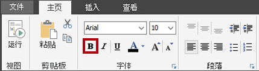

15. 将另一个文本框添加到报表页眉区域，然后输入文本 **“经销商：”**，后跟一个空格。

	*提示：另外一种添加文本框的方式是右键单击画布并选择 **“插入 | 文本框”**。*

16. 在空格后面插入一个占位符，然后设置占位符的值以使用表达式。

17. 在 **“表达式”** 窗口中，选择 **“类别”** 列表中的 **“数据集”**。

	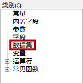

18. 使表达式的值取决于 **“First(Reseller)”** 值。

19. 在 **“属性”** 窗格中，配置以下方位属性：

	- **位置 | 位置 | 左侧**： 0

	- **位置 | 位置 | 顶部**： 0.75

	- **位置 | 大小 | 宽度**： 4

	- **位置 | 大小 | 高度**： 0.25

20. 将 **“Reseller:”** 文本格式化为粗体。

21. 在报表标题区域中添加第三个（也是最后一个）文本框，然后输入文本 **“订购日期：”** 和一个空格。

22. 在空格之后插入一个占位符，并将占位符的值设置为使用基于 **“数据集”** 类别 **“First(OrderDate)”** 值的表达式。

	

23. 要设置日期值的格式，请在 **“占位符属性”** 窗口中选择 **“数值”** 页。

	

24. 在 **“类别”** 列表中，选择 **“日期”**。

	

25. 在 **“类型”** 列表中，选择合适的日期格式类型。

26. 在 **“占位符属性”** 窗口中，单击 **“确定”**。

27. 在 **“属性”** 窗格中，配置以下方位属性：

	- **位置 | 位置 | 左侧**： 0

	- **位置 | 位置 | 顶部**： 1

	- **位置 | 大小 | 宽度**： 4

	- **位置 | 大小 | 高度**： 0.25

28. 将 **“订购日期：”** 文本的格式设置为粗体。

29. 最后，单击报表页眉区域的空白区域。

30. 在 **“属性”** 窗格中，将 **“高度”** 属性设置为 **“1.5”**。

31. 验证报表标题区域是否如下所示：

	

32. 保存报表。

33. 要预览报表，请在 **“开始”** 功能区选项卡中，单击 **“视图”** 组中的 **“运行”**。

	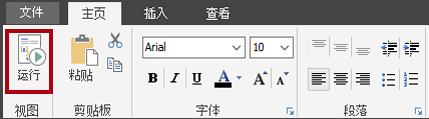

	*运行该报表会以 HTML 格式呈现报表。由于唯一的报表参数具有默认值，因此报表将自动运行。*

34. 验证呈现的报表是否如下所示：

	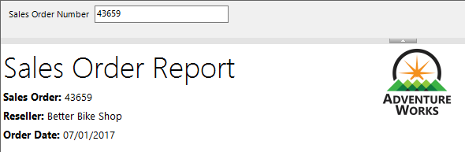

35. 要返回设计视图，请在 **“运行”** 功能区选项卡中，单击 **“视图”** 组中的 **“设计”**。

	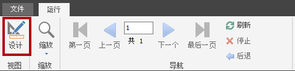

	*现在我们将向报表正文中添加一个表，以显示销售订单行的格式化布局。*

### **任务 5：添加表数据区域**

在此任务中，你需要将表数据区域添加到报表正文中。

1. 在 **“插入”** 功能区选项卡中，从 **“数据区域”** 组内，单击 **“表”**，然后选择 **“插入表”**。

	

2. 要添加表，请单击报表正文内的空白区域。

3. 在 **“属性”** 窗格中，配置以下方位属性：

	- **位置 | 位置 | 左侧**： 0

	- **位置 | 位置 | 顶部**： 0

	*该表将显示五列。默认情况下，表模板仅包含三列。*

4. 要将某个列添加到表中，请在最后一列的任何单元格内单击鼠标右键，然后选择 **“插入列 | 右侧”**。

	

5. 重复上一步，再添加一个新列。

6. 将光标悬停在第一列第二行单元格上方，以显示字段选取器图标。

	

7. 单击字段选取器图标，然后选择 **“行”** 字段。

	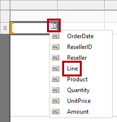

8. 请注意，现在该表的第一行（标题）包含一个文本值，详细信息行包含一个字段引用。

	

9. 按顺序向以下四列添加字段，如下所示：

	- Product

	- Quantity

	- UnitPrice

	- Amount

10. 验证表设计是否如下所示：

	

11. 保存报表。

12. 预览报表。

	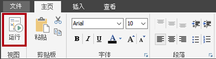

	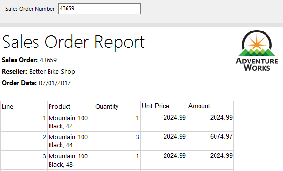

	*该表包括一个标题和 12 个销售订单行。通过格式化表布局可以进行许多改进。*

	*在下一个任务中，你将：*

	- 使用背景色和粗体样式设置表标题的格式

	- 修改列宽以删除冗余空间并防止长文本值换行

	- 将第一列的值左对齐

	- 将最后三列的值右对齐

	- 使用货币符号（美元）设置货币值格式

	- 为表添加总计行并设置其格式

### **任务 6：设置表数据区域的格式**

在此任务中，你将设置表数据区域的格式。

1. 返回设计视图。

2. 单击表中的任何单元格以显示灰色的单元格参考线。

	

	*单元格参考线可帮助你配置整行或整列。*

3. 若要格式化表标题，请单击标题行参考线。

	

	*选择行或列参考线会选中该行或列中的所有单元格。实际上，每个单元格都是一个文本框。然后，可以通过使用 **“属性”** 窗格或功能区命令，设置单个文本框（或选定的多个文本框）的格式。*

4. 在 **“属性”** 窗格（或功能区）中，配置以下属性：

	- **填充 | 背景色**： 深绿色（提示：将光标悬停在每种颜色上方可以显示颜色名称）

	- **字体 | 颜色**： 白色

	- **字体 | 字体 | 字体粗细**： 粗体

5. 选择首个列参考线。

	

6. 在 **“属性”** 窗格中，将 **“方位 | 大小 | 宽度”** 属性设置为 **0.5**。

7. 将第二列的宽度设置为 **2.5**。

8. 在按下 **Ctrl** 键时，多重选择最后三个列标题文本框（**数量**、**单价** 和**金额**）。

9. 在 **“属性”** 窗格（或功能区）中，将 **“对齐 | “文本对齐”** 属性设置为 **“右对齐”**。

10. 将 **“行”** 详细信息文本框设置为左对齐。

	

11. 在 **“开始”** 功能区选项卡的 **“数字”** 组中，将最后两个详细信息（而非标题）文本框（**“单价”** 和 **“金额”**）设置为使用货币符号设置格式。

	

12. 要将总计行添加到表中，请右键单击 **“数量”** 详细信息文本框，然后选择 **“添加总计”**。

	

13. 注意已添加了代表表页脚的新行，并且表达式将对 **“数量”** 值求和。

14. 重复上一步，为 **“金额”** 详细信息文本框添加一个总计。

15. 在表页脚行的第一个单元格中，输入 **“总计”** 一词。

16. 将页脚行中所有文本框格式化为粗体。

17. 验证表设计是否如下所示：

	

18. 要删除表后的任何尾随空格，请将光标悬停在报表正文和报表页脚区域之间的虚线上方，然后向上拖动至表的底部。

	

19. 保存报表

20. 预览报表。

21. 验证呈现的报表是否如下所示：

	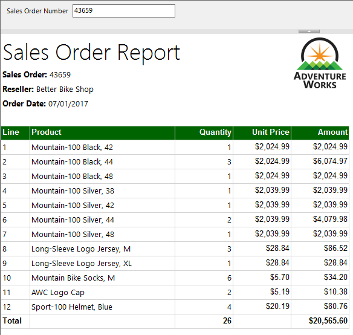

22. 在 **“销售订单编号”** 参数框中，将值替换为 **“51721”**。

	

23. 要重新运行报表，请在右侧单击 **“查看报表”**。

	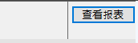

	*该销售订单具有 72 个销售订单行，因此数据将呈现在多个页面中。*

24. 若要导航到报表的第二页，请在 **“运行”** 功能区选项卡的 **“导航”** 功能组中单击 **“下一页”**。

	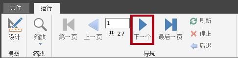

25. 可注意到第 2 页上没有显示表标题。

	*下一个任务将解决此问题。*

26. 滚动到页面底部，然后注意报表页脚仅显示执行时间。

	*在下一个任务中，你将追加页码以改进页脚文本。*

### **任务 7：完成报表设计**

在此任务中，你将通过确保多页报表正确呈现来完成报表设计。

1. 切换到设计视图。

2. 为确保表标题在所有页面上重复出现，请首先选择表的任何文本框。

3. 在 **“分组”** 窗格（位于报表设计器的底部）中，在 **“列组”** 最右端，单击向下箭头，然后选择 **“高级模式”**。

	

4. 在 **“行组”** 部分，选择第一个静态组。

	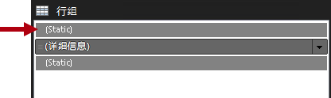

	*此操作选中了表标题行。*

5. 在 **“属性”** 窗格中，将 **“其他 | 在新页上重复”** 属性设置为 **“真”**。

	*这可以确保第一个静态组（代表表标题）在所有页面上重复出现。*

6. 在表页脚区域中，右键单击 **“执行时间”** 文本框，然后选择 **“表达式”**。

	

7. 在 **“表达式”** 窗口的表达式框中，追加一个空格，后跟 **“&amp; " | Page " &amp;”**，以生成以下内容：


	**VB Script**
	```
	=Globals!ExecutionTime & " | Page " &
	```


8. 确保最后一个 & 号后跟一个空格。

9. 在 **“类别”** 列表中，选择 **“内置字段”**。

	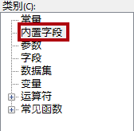

10. 要将页码值插入表达式中，请双击 **“项”** 列表中的 **“页码”**。

11. 验证完整表达式是否如下所示：

	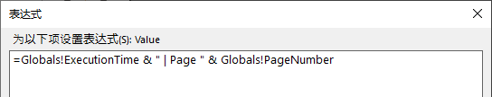

12. 单击 **“确定”**。

13. 拖动文本框的左侧，将宽度增加到报表页的宽度。

	

	*报表设计现已完成。最后，确保页面宽度设置为恰好六英寸，并删除报表参数的默认值。*

14. 若要选择报表正文，请右键单击任何表文本框，然后选择 **“选择 | 主体”**。

	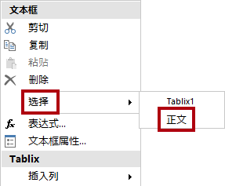

	*当表填满整个报表正文时，必须使用此方法来选择报表正文。*

15. 在 **“属性”** 窗格中，确保将 **“位置 | 大小 | 宽度”** 属性设置为 **“6”**。

	*宽度不能超过 6 英寸，这一点很重要，因为以打印格式呈现时表会分割到多个页面。*

16. 在 **“报表数据”** 窗格中，打开 **“SalesOrderNumber”** 报表参数属性。

17. 在 **“默认值”** 页面上，选择 **“无默认值”** 选项。

	

18. 单击 **“确定”**。

19. 保存报表。

### **任务 8：浏览最终报表**

在此任务中，你将以打印布局模式查看报表。

1. 预览报表。

2. 在 **“销售订单编号”** 参数框内，输入值 **“51721”**

3. 在 **“运行”** 功能区选项卡中，单击 **“打印”** 组内的 **“打印布局”**。

	

	*在打印布局模式下，可以预览按严格页面大小打印时的报表外观。*

4. 导航至第 2 页和第 3 页。

	*在本实验室中，你将不会发布报表。仅当分页报表存储在具有专用容量的工作区中，并且该容量启用了分页报表工作负载时，才能在 Power BI 服务中呈现分页报表。课程中不满足这些要求。*
