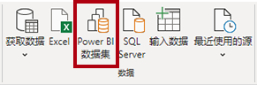
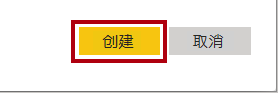
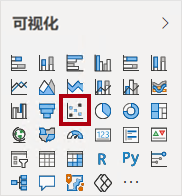
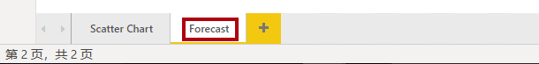
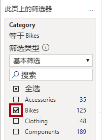
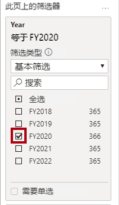
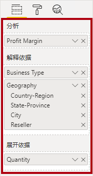
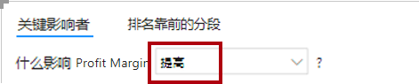

# **在 Power BI Desktop 中执行数据分析**

**完成本实验室预计需要 45 分钟**

在本实验室中，你将创建 **“销售额探索”** 报表。

在本实验室中，你将学习如何：

- 创建动画散点图

- 使用视觉对象来预测值

- 使用分解树视觉对象

- 使用关键影响视觉对象

### **实验室故事**

本实验室是一个实验室系列中的诸多实验室之一，设计为从数据准备到作为报表和仪表板发布的完整故事。可以按任意顺序完成这些实验室。但是，如果你打算完成多个实验室，对于前 10 个实验室，建议你按以下顺序完成：

1. 在 Power BI Desktop 中准备数据

2. 在 Power BI Desktop 中加载数据

3. 在 Power BI Desktop 中对数据建模，第 1 部分

4. 在 Power BI Desktop 中对数据建模，第 2 部分

5. 在 Power BI Desktop 中创建 DAX 计算，第 1 部分

6. 在 Power BI Desktop 中创建 DAX 计算，第 2 部分

7. 在 Power BI Desktop 中设计报表，第 1 部分

8. 在 Power BI Desktop 中设计报表，第 2 部分

9. 创建 Power BI 仪表板

10. 创建 Power BI 分页报表

11. **在 Power BI Desktop 中执行数据分析**

## **创建报表**

在此练习中，你将创建 **“销售额探索”** 报表。

### **任务 1：开始 - 登录**

在此任务中，你将通过登录到 Power BI 来设置实验室环境。

*重要说明：如果在上一个实验室中已登录到 Power BI，请继续完成下一个任务。*

1. 要打开 Microsoft Edge，请在任务栏上单击 Microsoft Edge 程序快捷方式。

 	

1. 在 Microsoft Edge 浏览器窗口中，导航到 **https://powerbi.com**

 	*提示：还可以使用“Microsoft Edge 收藏夹”栏上的 Power BI 服务收藏夹。*

1. 单击 **“登录”** （位于右上角）。

 	

1. 输入已向你提供的帐户详细信息。

1. 如果系统提示更新密码，请重新输入提供的密码，然后输入并确认新密码。

 	*重要说明：请确保记录新密码。*

1. 完成登录过程。

1. 如果 Microsoft Edge 提示你选择是否保持登录状态，请单击 **“是”**。

1. 在 Microsoft Edge 浏览器窗口，在 Power BI 服务的 **“导航”** 窗格中展开 **“我的工作区”**。

 	

1. 让 Microsoft Edge 浏览器窗口保持打开状态。

### **任务 2：开始 - 创建数据集**

在此任务中，你将通过创建数据集来设置实验室环境。

*重要说明：如果你已在 **“创建 Power BI 仪表板”** 实验室中发布数据集，请继续完成下一个任务。*

1. 在 Microsoft Edge 浏览器窗口，在 Power BI 服务的 **“导航”** 窗格中，单击底部的 **“获取数据”**。

	

2. 在 **“文件”** 磁贴中，单击 **“获取”**。

	

3. 单击 **“本地文件”** 磁贴。

	

4. 在 **“打开”** 窗口，导航到 **“D:\DA100\Labs\11-create-power-bi-dashboard\Solution”** 文件夹。

5. 选择 **“Sales Analysis.pbix”** 文件，然后单击 **“打开”**。

6. 如果系统提示替换数据集，请单击 **“替换”**。

### **任务 3：创建报表**

在此任务中，你将创建 **“销售额探索”** 报表。

1. 要打开 Power BI Desktop，请在任务栏上单击 Microsoft Power BI Desktop 快捷方式。

	*重要说明：如果已（在上一个实验室中）打开 Power BI Desktop，请关闭该实例。*

	

2. 要关闭开始窗口，请单击窗口左上角的 **“X”**。

	

3. 如果 Power BI Desktop 未登录到 Power BI 服务，请单击右上角的 **“登录”**。

	

4. 使用用于登录 Power BI 服务的同一帐户完成登录过程。

5. 要保存文件，请单击 **“文件”** 功能区选项卡以打开 Backstage 视图。

6. 选择 **“保存”**。

	

7. 在 **“另存为”** 窗口中，导航到 **“D:\DA100\MySolution”** 文件夹。

8. 在 **“文件名”** 框中，输入 **“销售额探索”**。

	

9. 要创建与 **“销售额分析”** 数据集的实时连接，请在 **“开始”** 功能区选项卡的 **“数据”** 组中，单击 **“Power BI 数据集”**。

	

10. 在 **“选择一个数据集以创建报表”** 窗口中，选择 **“销售额分析”** 数据集。

11. 单击 **“创建”** 。

	

12. 保存 Power BI Desktop 文件。

	*现在，你需要创建四个报表页面，你将在每个页面中使用不同的视觉对象来分析和浏览数据。*

## **创建散点图**

在此练习中，你将创建可以制作成动画的散点图。

### **任务 1：创建动画散点图**

在此任务中，你将创建可以制作成动画的散点图。

1. 将第 **1 页**重命名为 **“散点图”**。

	

2. 将 **“散点图”** 视觉对象添加到报表页面，然后调整其位置和大小，使其填满整个页面。

	

	

3. 将以下字段添加到视觉对象井/区域中：

	实验室将使用速记表示法来引用字段。如下所示： **Reseller | Business Type**。在此示例中， **“Reseller”** 是表名， **“Business Type”** 是字段名。

	- 图例： **Reseller | Business Type**

	- X 轴： **Sales | Sales** 

	- Y 轴： **Sales | Profit Margin**

	- 大小： **Sales | Quantity**

	- 播放轴： **Date | Quarter**

	

	*将字段添加到 **“播放轴”** 井/区域时，可以对图表进行动画处理。*

4. 在 **“筛选器”** 窗格中，将 **“Product | Category”** 字段拖动到 **“此页面上的筛选器”** 井/区域中。

5. 在筛选器卡片中，按 **“自行车”** 进行筛选。

	

6. 要为图表制作动画，请单击左下角的 **“播放”**。

	

7. 观看从 **“2018 财年第一季度”** 到 **“2020 财年第四季度”** 的整个动画周期。

	*通过散点图可同时了解多个度量值：在本例中为订单数量、销售收入和利润率。*

	*每个气泡代表一个经销商业务类型。气泡大小的变化反映了订单数量的增加或减少。水平移动表示销售收入的增加/减少，而垂直移动表示盈利能力的增加/减少。*

8. 动画停止时，单击其中一个气泡即可显示它在一段时间内的跟踪信息。

9. 将光标悬停在任何气泡上方，可显示一个工具提示，描述此经销商类型在此时间点的度量值。

10. 在 **“筛选器”** 窗格中，仅按 **“服装”** 筛选，注意它会产生迥然不同的结果。

11. 保存 Power BI Desktop 文件。

## **创建预测**

在此练习中，你将创建预测，以确定未来可能获得的销售收入。

### **任务 1：创建预测**

在此任务中，你将创建预测，以确定未来可能获得的销售收入。

1. 添加一个新页面，然后将该页面重命名为 **“预测”**。

	

2. 向报表页面添加一个 **“折线图”** 视觉对象，然后调整其位置和大小，使其填满整个页面。

	

	

  

3. 将以下字段添加到视觉对象井/区域中：

	- 轴： **Date | Date**

	- 值： **Sales | Sales** 

	

4. 在 **“筛选器”** 窗格中，将 **“Date | Year”** 字段拖动到 **“此页面上的筛选器”** 井/区域中。

5. 在筛选器卡片中，按两个年份进行筛选： **“FY2019”** 和 **“FY2020”**。

	

	*在时间轴上进行预测时，至少需要两个周期（两年）的数据才能生成准确且稳定的预测。*

  

6. 然后将 **“Product | Category”** 字段添加到 **“此页面上的筛选器”** 井/区域中，然后按 **“自行车”** 进行筛选。

	

7. 要添加预测，请在 **“可视化效果”** 窗格下选择 **“分析”** 窗格。

	

8. 展开 **“预测”** 部分。

	

	*如果 **“预测”** 部分不可用，可能是因为未正确配置视觉对象。只有在满足以下两个条件时才能进行预测：轴只有一个日期类型的字段，并且只有一个值字段。*

9. 单击 **“添加”**。

	

10. 配置以下预测属性：

	- 预测时长：1 个月

	- 置信区间：80%

	- 季节性：365

11. 单击**应用**。

	

12. 在折线图视觉对象中，你会发现预测在历史数据的基础上延长了一个月。

	*灰色区域表示置信度。置信度越大，预测可能会越不稳定，因此准确性就越差。*

	*当你知道周期的长度（本例中为每年）时，应输入季节性点。有时可能是每周一次 (7) 或每月一次 (30)。*

13. 在**筛选器** 窗格，仅依据 **“Clothing”** 筛选，请注意，它会产生不同的结果。

14. 保存 Power BI Desktop 文件。

## **使用分解树**

在此练习中，你将创建一个分解树，以探索经销商地理位置与利润率之间的关系。

### **任务 1：使用分解树**

在此任务中，你将创建一个分解树，以探索经销商地理位置和利润率之间的关系。

1. 添加一个新页面，然后将该页面重命名为 **“分解树”**。

	

2. 在 **“插入”** 功能区中，单击 **“AI 视觉对象”** 组内的 **“分解树”**。

	*提示：AI 视觉对象也可以在 **“可视化效果”** 窗格中找到。*

	

3. 调整该视觉对象的位置和大小，使其占据整个页面。

	

4. 将以下字段添加到视觉对象井/区域中：

	- 分析： **Sales | Profit Margin**

	- 说明依据： **Reseller | Geography** （整个层次结构）

	

5. 在 **“筛选器”** 窗格中，将 **“Date | Year”** 字段添加到 **“此页面上的筛选器”** 井，然后将筛选器设置为 **“2020 财年”**。

	

6. 在分解树视觉对象中，注意树的根： **利润率** 为 -0.94%

	

7. 单击加号图标，然后在“上下文”菜单中选择 **“高值”**。

	

8. 请注意，决策树按利润率从高到低排序显示了经销商。

9. 要删除级别，请在视觉对象顶部的 **“Reseller”** 标签旁边，单击 **“X”**。

	

10. 再次单击加号图标，然后展开到 **“国家/地区”** 级别。

11. 从 **“United States”** 扩展到 **“State-Province”** 级别。

12. 使用位于 **“State-Province”** 视觉对象底部的向下箭头，然后滚动到利润较低的州。

13. 注意 **“New York”** 州的盈利为负。

14. 从 **“New York”** 扩展到 **“Reseller”** 级别。

15. 你会发现很容易找出根本原因。

	

	***“United States”** 在 **“2020 财年”** 未产生利润。 **“New York”** 是未实现正利润的州，这是由于四类经销商为其商品支付的费用低于标准费用。*

16. 保存 Power BI Desktop 文件。

## **使用关键影响因素**

在此练习中，你将使用关键影响因素 AI 视觉对象来确定哪些经销商业务类型和地理位置会影响盈利率。

### **任务 1：使用关键影响因素**

在此任务中，你将使用关键影响因素 AI 视觉对象来确定哪些经销商业务类型和地理位置会影响盈利率。

1. 添加一个新页面，然后将该页面重命名为 **“关键影响因素”**。

	

2. 在 **“插入”** 功能区的 **“AI 视觉对象”** 组中，单击 **“关键影响因素”**。

	*提示：AI 视觉对象也可以在 **“可视化效果”** 窗格中找到。*

	

3. 调整该视觉对象的位置和大小，使其占据整个页面。

	

4. 将以下字段添加到视觉对象井中：

	- 分析： **Sales | Profit Margin**

	- 说明依据： **Reseller | Business Type** 和 **Reseller | Geography** （整个层次结构）

	- 展开依据： **Sales | Quantity**

	

5. 在视觉对象的左上方，请注意 **“关键影响因素”** 已获得焦点，并设置了特定影响因素以说明哪些影响因素利润率会增加。

	

6. 查看结果，你会发现 **Bothel** 市的利润更有可能增加。

7. 修改目标以确定影响利润率下降的因素。

	

8. 查看结果。

9. 要检测细分，请选择左上角的 **“顶层细分”**。

	

10. 请注意，现在的目标是确定利润率可能很高的细分。

11. 当视觉对象显示细分（如圆形）时，单击其中之一以显示有关细分的信息。

12. 查看细分结果。

### **任务 2：完成**

在此任务中，你将完成实验室。

1. 选择 **“散点图”** 页面。

2. 保存 Power BI Desktop 文件。

3. 要将文件发布到工作区，请在 **“开始”** 功能区选项卡的 **“分享”** 组中，单击 **“发布”**。

	

4.  关闭 Power BI Desktop。
