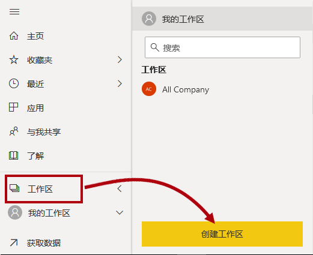
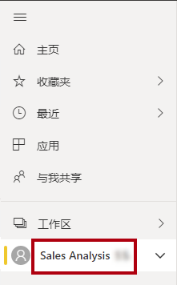



### 实验室 01A

入门

# 概述

**完成实验室预计需要 15 分钟**

在本实验室中，你将连接到教室虚拟机并设置环境。在开始本实验室之前，必须已收到一个帐户和密码。请务必使用提供的帐户来完成实验室。

在本实验室中，你将学习如何：

* 登录到 Power BI 服务

* 创建工作区

* 打开 Power BI Desktop

# 练习 1 ：入门

在本练习中，你将连接到教室虚拟机并设置环境。

### 任务 1：记录帐户详细信息

在此任务中，你将打开 **MySettings.txt** 文件，并记录帐户详细信息。

*讲师已为你提供了一个帐户，请务必使用该帐户来完成所有实验室。如果未向你提供帐户，请浏览至 https://powerbi.microsoft.com/zh-cn/documentation/powerbi-admin-signing-up-for-power-bi-with-a-new-office-365-trial，并按照步骤创建帐户，然后再继续此实验室*。

1. 要打开文件资源管理器，请单击任务栏上的文件资源管理器程序快捷方式。

    

2. 在文件资源管理器中，导航到 **“D:\DA100\Setup”** 文件夹。

3. 要打开 **MySettings.txt** 文件，请双击该文件。

4. 在 **MySettings.txt** 文件中，在标签旁边输入帐户名和密码。

    

5. 要保存 **MySettings.txt** 文件，请在 **“文件”** 菜单中选择 **“保存”** （或按 **Ctrl+S**）。

6. 保持 **MySettings.txt** 文件打开状态。

7. 将文件资源管理器保持打开状态。

### 任务 2：登录到 Power BI 服务

在此任务中，你将登录到 Power BI 服务。

1. 要打开 Edge，请在任务栏上单击 Microsoft Edge 程序快捷方式。

    

2. 在 Edge 中，导航到 **http://powerbi.com**。

    *提示：还可以在“Edge 收藏夹”栏上使用 Power BI 服务收藏夹*。

3. 单击 **“登录”** （位于右上角）。

    

4. 在 **MySettings.txt** 文件中输入帐户详细信息。

5. 提示更新密码时，请重新输入提供的密码，然后输入并确认新密码。请务必使用新密码更新 **MySettings.txt** 文件。

6. 完成登录过程。

7. 如果 Edge 提示保持登录状态，请单击 **“是”**。

8. 在 Power BI 服务的右上角，如果未启用“新外观”，请单击滑块控件将其打开。

    

9. 使“Edge”窗口保持打开状态。

  

### 任务 3：创建工作区。

在此任务中，你将创建一个工作区。还将帐户升级到 Power BI Pro。

*在本课程中开发的所有内容都将添加到此工作区中。*

1. 要创建工作区，请在 **“导航”** 窗格（位于左侧）中单击 **“工作区”**，然后单击 **“创建工作区”**。

    

2. 当提示将帐户升级到 Power BI Pro 时，请单击 **“免费试用”**。

    

    *创建和使用工作区需要 Power BI Pro 许可证。共享内容时也需要它。试用版将允许你使用 Pro 功能长达 60 天。*

3. 当系统提示开始 60 天 Pro 免费试用版时，请单击 **“开始试用”**。

    

4. 试用期延长后，请单击 **“关闭”**。

5. 重复此任务中的第一步以创建工作区。

6. 在 **“创建工作区”** 窗格（位于右侧）中的 **“工作区名称”** 框中，输入工作区的名称。

    输入的名称在租户中必须是唯一的。*我们建议将工作区命名为 **“Sales Analysis”**，并且还可以追加缩写。例如，名称可以是 **Sales Analysis AB***。

7. 要创建工作区，请在窗格底部，单击 **“保存”**。

    

8. 在 **“导航”** 窗格中，请注意工作区已打开。

    

9. 将内容发布到**实验室 03D** 中的工作区。

  

### 任务 4：打开 Power BI Desktop

在此任务中，你将打开 Power BI Desktop，然后使用帐户登录。

1. 要打开 Power BI Desktop，请在任务栏上单击 Microsoft Power BI Desktop 快捷方式。

    

2. 出现提示时，单击 **“登录”**。

    

3. 使用 **MySettings.txt** 帐户详细信息完成登录过程。

4. 在 Power BI Desktop 的右上角，确认你看到的是自己的帐户。

    

5. 保持 Power BI Desktop 打开状态。

    *你将在 **Lab 02A** 中开始开发数据模型*。

  

### 任务 5：更新实验室数据库

在此任务中，你将运行 PowerShell 脚本来更新 **AdventureWorksDW2020** 数据库中的数据。

1. 在文件资源管理器的 **D:\DA100\Setup** 文件夹中，右键单击 **“UpdateDatabase-1-UpdateAccount.ps1”** 文件，然后选择 **“使用 PowerShell 运行”**。

    

2. 在 **“Windows PowerShell”** 窗口中，当系统提示输入帐户时，请从 **MySettings.txt** 文件中粘贴帐户名。

    *提示：要粘贴到 **“Windows PowerShell”** 窗口，右键单击 **“帐户”** 提示*。

    

3. 要更新数据库，请按 **Enter**。

4. 当提示按任意键继续时，请再次按 **Enter**。

    * **AdventureWorksDW2020** 数据库已更新为使用帐户详细信息。你现在是销售人员 Michael Blythe，销售业绩通过三个销售区域的销售额来衡量：美国东北部、美国中部和美国东南部*。

    *在**实验室 03B** 中实现行级安全性时，这些事实将变得相关*。
