

### 实验室 02A

在 Power BI Desktop 中准备数据

# 概述

**完成实验室预计需要花费 45 分钟**

在本实验室中，你将开始为 Adventure Works 公司开发 Power BI Desktop 解决方案。它涉及连接到源数据、预览数据以及使用数据预览技术来了解源数据的特征和质量。

在本实验室中，你将学习如何：

* 打开 Power BI Desktop

* 设置 Power BI Desktop 选项

* 连接到源数据。

* 预览源数据

* 使用数据预览技术更好地了解数据

# 练习 1：准备数据

在本练习中，你将创建八个 Power BI Desktop 查询。六个查询将从 SQL Server 中获取数据，而两个查询将从 CSV 文件中获取数据。

### 任务 1：保存 Power BI Desktop 文件

在此任务中，你将首先保存 Power BI Desktop 文件。

1. 在 Power BI Desktop 中，单击 **“文件”** 功能区选项卡以打开后台视图。

2. 选择 **“保存”**。

	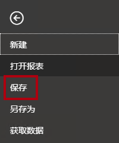

3. 在 **“另存为”** 窗口中，导航到 **“D:\DA100\MySolution”** 文件夹。

4. 在里面 **“文档名”** 框，输入 **“Sales Analysis”**。

	

5. 单击 **“保存”**。

	

	*提示：你还可以通过单击右上方的 **“保存”** 图标来保存文件*。

	

### 任务 2：设置 Power BI Desktop 选项

在此任务中，你将设置 Power BI Desktop 选项。

1. 在 Power BI Desktop 中，单击 **“文件”** 功能区选项卡以打开后台视图。

2. 选择左侧的 **“选项和设置”**，然后选择 **“选项”**。

	

3. 在 **“选项”** 窗口左侧的 **“当前文件”** 组中选择 **“数据加载”**。

	

	*当前文件的 **“数据加载”** 设置允许设置选项，这些选项确定建模时的默认行为*。

4. 在 **“关系”** 组中，取消选中已选中的两个选项。

	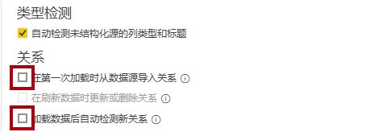

	*虽然这两个选项在开发数据模型时可能会有所帮助，但已禁用它们以支持实验室体验。在**实验室 03A**中创建关系时，你将了解为什么要添加每个关系*。

5. 单击 **“确定”**。

	

6. 保存 Power BI Desktop 文件。

### 任务 3：从 SQL Server 获取数据

在此任务中，你将基于 SQL Server 表创建查询。

1. 在 **“主页”** 功能区选项卡，在 **“数据”** 组里面，单击 **“SQL Server”**。

	

2. 在 **“SQL Server 数据库”** 窗口中，在 **“服务器”** 框，输入 **“本地主机”**。

	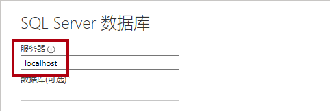

	*在实验室中，你将使用 **localhost** 连接到 SQL Server 数据库 。但在创建自己的解决方案时，不建议这样做。这是因为网关数据源无法解析 **localhost***。

3. 单击 **“确定”**。

	

4. 请注意，默认身份验证为 **“使用我当前的凭据”**。

	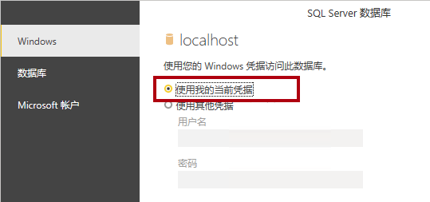

5. 单击 **“连接”**。

	

6. 当提示有关加密支持时，请单击 **“确定”**。

	

7.  在 **“导航”** 窗口左侧，展开 **AdventureWorksDW2020** 数据库。

	***AdventureWorksDW2020** 数据库基于 **AdventureWorksDW2017** 示例数据库。已对其进行修改以支持课程实验室的学习目标*。

	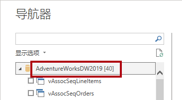

8. 选择 **“DimEmployee”** 表但不划勾。

	

9. 在右窗格中，注意表的预览。

	*预览使你可以确定列和一个行样本*。

10. 要创建查询，请检查以下六个表：

	* DimEmployee

	* DimEmployeeSalesTerritory

	* DimProduct

	* DimReseller

	* DimSalesTerritory

	* FactResellerSales

11. 要将转换应用于所选表的数据，请单击 **“转换数据”**。

	*在本实验室中，你将不会转换数据。本实验室的目的是探索和分析 **“Power Query 编辑器”** 窗口中的数据*。

	

### 任务 4：预览 SQL Server 查询

在此任务中，你将预览 SQL Server 查询的数据。首先，你将学习数据的相关信息。你还将使用列质量、列分布和列概要文件工具来了解数据并评估数据质量。

1. 在 **“Power Query 编辑器”** 窗口左侧，请注意**查询** 窗格。

	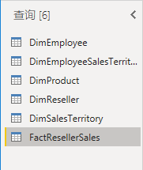

***"查询"** 窗格为每个选定的表包含一个查询*。

2. 选择第一个查询 **“DimEmployee”**。

	

	***“DimEmployee”** 表为每个员工存储一行。行的子集代表销售人员，这与你将开发的模型有关*。

3. 注意左下角状态栏的表统计信息 - 该表有 33 列和 296 行。

	

4. 在数据预览窗格中，水平滚动以查看所有列。

5. 请注意，最后五列包含**表**或**值**链接。

	*这五列代表与数据库中其他表的关系。它们可用于将表连接在一起。你将在 **“实验室 03A”** 中加入表格*。

6. 要评估列质量，请在 **“视图”** 功能区选项卡，从 **“数据预览”** 组中，勾选 **“列质量”**。

	

	*列质量使你可以轻松确定有效、错误或空值的百分比*。

7. 对于 **“Position”** 列（倒数第六列），请注意 94％ 的行为空（空白）。

	

8. 要评估列分布，请在 **“视图”** 功能区选项卡上，从 **“数据预览”** 组中，勾选 **“列分布”**。

	

9. 再次查看 **“Position”** 列，请注意有四个不同的值和一个唯一的值。

10. 在 **“EmployeeKey”** （第一） 列查看列分布 - 有 296 个不同的值和 296 个唯一值。

	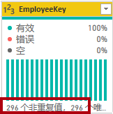

	*如果不同计数和唯一计数相同，则表示该列包含唯一值。在建模时，某些表包含唯一列很重要。它们将用于创建一对多关系，你将在实**验室 04A**中进行此操作*。

11. 在 **“查询”** 窗格中，选择 **“DimEmployeeSalesTerritory”** 查询。

	

***“DimEmployeeSalesTerritory”** 表为每位员工及其管理的销售地区存储一行。该表支持将多个地区与单个员工相关联。一些员工管理一个、两个或可能更多的区域。对数据建模时，需要定义多对多关系，这将在 **“实验室 05A”** 中进行*。

12. 在 **“查询”** 窗格中，选择 **“DimProduct”** 查询。

	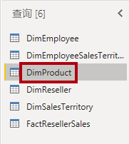

	***“DimProduct”** 表包含公司销售的每种产品的一行*。

13. 水平滚动以显示最后几列。

14. 注意 **“DimProductSubcategory”** 列。

	*在下一个实验室中向此查询添加转换时，将使用 **“DimProductSubcategory”** 列来联接表*。

15. 在 **“查询”** 窗格中，选择 **DimReseller** 查询。

	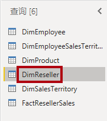

	*在 **DimReseller** 表中，每个经销商对应一行。经销商销售、分销或增值 Adventure Works' 的产品*。

16. 要查看列值，请在 **“视图”** 功能区选项卡，从 **“数据预览”** 组中，勾选 **“列分析”**。

	

17. 选择 **“BusinessType”** 列标题。

18. 请注意，“数据预览”窗格下面会打开一个新窗格。

19. 查看列统计信息和值分布。

20. 请注意数据质量问题：仓库有两个标签（**“Warehouse”** 以及拼写错误的 **“Ware House”**）。

	

21. 将光标悬停在 **“仓库”** 栏，请注意，此值有五行。

	*在下一个实验室中，你将应用转换来重新标记这五行*。

22. 在 **“查询”** 窗格中，选择 **“DimSalesTerritory”** 查询。

	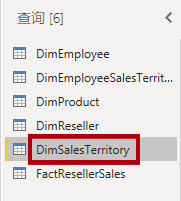

	*在 **“DimSalesTerritory”** 表中，每个销售区域占一行，包括 **“Corporate HQ”**（总部）。区域分配给国家/地区，国家/地区分配给组。在实**验室 04A**中，将创建层次结构以支持区域、国家/地区或组级别的分析*。

23. 在 **“查询”** 窗格中，选择 **“FactResellerSales”** 查询。

	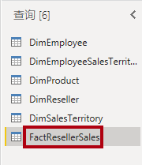

	***FactResellerSales** 表中每个销售订单行包含一行 - 一个销售订单包含一个或多个行项*。

24. 查看 **“TotalProductCost”** 列的列质量，请注意 8％ 的行为空。

	

***“TotalProductCost”** 列值缺失是存在的数据质量问题。为解决该问题，在下一个实验室中，你将通过使用产品标准成本（存储在 **“DimProduct”** 表中）来应用转换以填充缺失值*。

### 任务 5：从 CSV 文件获取数据

在此任务中，你将基于 CSV 文件创建查询。

1. 要添加新查询，请在 **“Power Query 编辑器”** 窗口的 **“主页”** 功能区选项卡上，在 **“新查询”** 组中，单击 **“新源”** 向下箭头，然后选择 **“文本/CSV”**。

	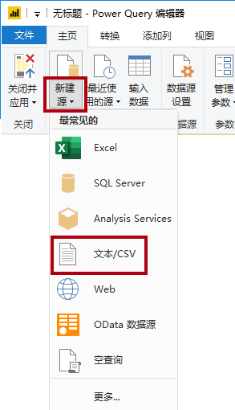

2. 在 **“打开”** 窗口中，导航到 **“D:\DA100\Data”** 文件夹，然后选择 **ResellerSalesTargets.csv** 文件。

3. 单击 **“打开”**。

4. 在 **“ResellerSalesTargets.csv”** 窗口中，注意数据预览。

5. 单击 **“确定”**。

	

6. 在 **“查询”** 窗格中，注意添加了 **“ResellerSalesTargets”** 查询。

	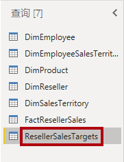

	***“ResellerSalesTargets.csv”** 文件包含每个销售员每年一行。每行记录 12 个月度销售目标（以千为单位表示）。Adventure Works 公司的业务年度从 7 月 1 日开始*。

7. 请注意，没有列包含空值。

	*如果没有每月销售目标，则会存储一个连字符*。

8. 查看列名称左侧每个列标题中的图标。

	

	*这些图标代表列数据类型。**123** 是整数，而 **ABC** 是文字*。

	*在下一个实验室中，你将应用许多变换以实现仅由三列组成的不同形状的结果：**“Date”**, **“EmployeeKey”** 以及 **“TargetAmount”***。

### 任务 6：从 CSV 文件中获取其他数据

在此任务中，你将基于其他 CSV 文件创建其他查询。

1. 使用上一个任务中的步骤基于 **D:\DA100\Data**\**ColorFormats.csv** 文件创建查询。

	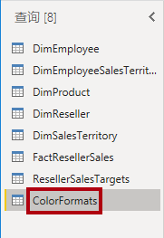

	*在 **ColorFormats.csv** 文件中，一行对应一种产品颜色。每行记录十六进制代码以格式化背景和字体颜色。在下一个实验室中，你将把这些数据与 **DimProduct** 查询数据整合*。

### 完成

在此任务中，你将完成实验室。

1. 在 **“视图”** 功能区选项卡，从 **“数据预览”** 组中，取消选中三个数据预览选项：

	* 列质量

	* 列分布

	* 列分析

	

2. 要保存 Power BI Desktop 文件，请在 **“文件”** 后台视图中选择 **“保存”**。

	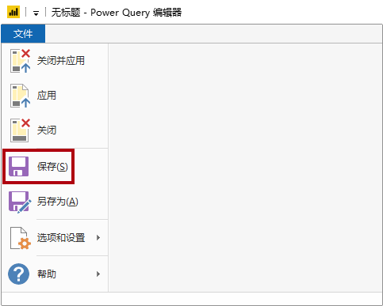

3. 当提示你应用查询时，单击 **“稍后应用”**。

	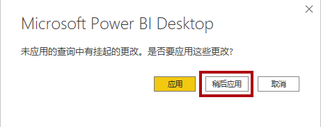

	*应用查询会将其数据加载到数据模型。你还没有准备好这样做，因为必须首先应用许多转换*。

4. 保持 Power BI Desktop 打开状态。

	*在下一个实验室中，你将对查询应用各种转换，然后应用这些查询将转换加载到数据模型*。
