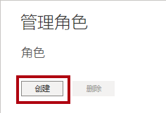
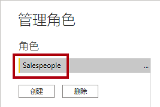
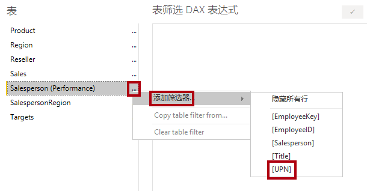
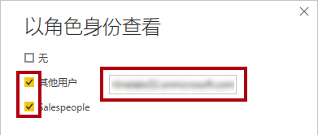



### 实验室 05A

Power BI Desktop 中的高级数据建模

# 概述

**完成实验室预计需要花费 45 分钟**

在本实验室中，你将在**销售人员**表和销**售额**表之间创建多对多关系。你还将强制执行行级安全性，以确保销售人员只能分析其指定区域的销售数据。

在本实验室中，你将学习如何：

* 配置多对多关系：

* 强制执行行级安全性

# 练习 1 ：创建多对多关系

在本练习中，你将创建**销售人员**表和销**售额**表之间的多对多关系。

如果不确定自己是否成功完成了上一个实验室，则可以打开上一个实验室的解决方案文件，该文件位于 **D:\DA100\Lab04A\Solution** 文件夹。

### 任务 1：创建多对多关系

在此任务中，你将在**销售人员**表和销**售额**表之间创建多对多关系。

1. 在 Power BI Desktop 的“报表”视图中，在 **“字段”** 窗格检查以下两个字段以创建表视觉效果：

	* 销售人员 | 销售人员

	* 销售额 | 销售

	

	*该表显示每个销售员的销售额。但是，销售人员与销售额之间存在另一种关系。有些销售人员分属一个、两个或可能更多的销售区域。*此外，可以为销售区域分配多个销售人员**。

	*从绩效管理的角度来看，需要分析销售人员的销售额（基于其分配的地区）并将其与销售目标进行比较。*在本练习中，你将创建关系以支持此分析**。

2. 请注意，Michael Blythe 已售出近 900 万美元。

3. 切换到“模型”视图。

4. 使用拖放技术创建以下两个模型关系：

	* **销售人员 | 从 EmployeeKey** 到 **SalespersonRegion | EmployeeKey**

	* **区域 | 从 SalesTerritoryKey** 到 **SalespersonRegion | SalesTerritoryKey**

	* **SalespersonRegion** 表可以视为桥接表*。

5. 切换到“报表”视图，然后注意视觉效果尚未更新 - Michael Blythe 的销售结果未更改。

6. 切换回“模型”视图，然后按照**销售人员**表中的关系筛选方向（箭头）进行操作。

	*设想一下：**销售人员**表筛选销**售额**表。*它还会筛选 **SalespersonRegion** 表，但不会继续传播**到区域**表（箭头指向错误的方向）*。

	

7. 要编**辑区域**和 **SalespersonRegion** 表之间的关系，请双击“关系”。

8. 在 **“编辑关系”** 窗口的 **“交叉筛选方向”** 下拉列表中，选择 **“双向”**。

9. 选中 **“应用双向安全筛选”** 复选框。

	*此设置将确保在执行行级安全性时应用双向筛选。你将在下一个练习中配置安全角色*。

	

10. 单击 **“确定”**。

	

11. 请注意，该关系具有双箭头。

	

12. 切换到“报表”视图，然后注意销售额没有更改。

	*现在，这个问题与以下事实有关：**销售人员**表和销**售额**表之间具有两种可能的筛选传播路径。基于“最少表数”评估，这种歧义在内部得以解决。需要明确的是，不应设计具有此类歧义的模型，这一问题在本实验室以及下一个实验室中将部分解决*。

13. 切换到“模型”视图。

14. 要通过桥接表强制实施筛选传播，请双击**销售人员**表和**售额**表之间的关系。

15. 在 **“编辑关系”** 窗口中，取消选中 **“使此关系可用”** 复选框。

	

16. 单击 **“确定”**。

	

	*筛选传播现在被迫采用唯一的可用路径*。

17. 在该关系图中，请注意，不可用关系由虚线表示。

	

18. 切换到“报表”视图，然后注意 Michael Blythe 的销售额现在已接近 2200 万美元。

	

19. 还要注意，每位销售人员的销售额（如果累加起来）将超过总数。

	*由于对区域销售结果进行了两倍、三倍等计数，因此这种观察是多对多关系。以列出的第二位销售人员 Brian Welcker 为例。  他的销售额等于总销售额。这是正确的结果，仅仅是因为他是销售总监。他的销售额是按所有地区的销售额来衡量的*。

	*虽然多对多关系现在可以使用，但现在无法分析销售人员的销售额（该关系处于不可用状态）。在下一个实验室中，你将引入一个代表销售人员进行绩效分析（所在区域）的计算表*。

20. 切换到“建模”视图，然后在关系图中选择 **“销售人员”** 表。

21. 在 **“属性”** 窗格的 **“名称”** 框中，将文本替换为 **“销售人员（绩效）”**。

	*现在，已重命名的表反映了其用途：它用于根据销售人员在指定销售区域的销售额来报告和分析其绩效*。

### 任务 2：关联目标表

在此任务中，你将创建与**目标**表的关系

1. 从销售人员（绩效）**创建关系 | EmployeeID** 列和**目标 | EmployeeID** 列。

23. 在“报表”视图中，添加 **“目标”** | 表可视范围的 **“目标”** 字段。

	扩大表的可视范围以显示所有数据。 

	

24. 现在可以可视化销售和目标，但是要小心，有两个原因。首先，在时间段上没有筛选器，因此目标还包括将来的目标值。其次，目标不是可累加的，因此不应显示总数。可以使用视觉效果格式属性禁用它们，也可以使用计算逻辑将其删除。你将在实**验室 06B** 中写入目标度量值，如果筛选了多个销售人员，则将返回 BLANK。

# 练习 2：强制执行行级安全性

在本练习中，你将强制执行行级安全性，以确保销售人员只能看到在其指定区域进行的销售。

### 任务 1：强制执行行级安全性

在此任务中，你将强制执行行级安全性，以确保销售人员只能看到在其指定区域进行的销售。

1. 切换到“数据”视图。

	

26. 在 **“字段”** 窗格中，选择 **“销售人员（绩效）”** 表。

27. 查看数据，注意已为 Michael Blythe (EmployeeKey 281) 分配了 Power BI 帐户 (**“UPN”** 列)。

	*回想一下，Michael Blythe 被分配到三个销售区域：美国东北部、美国中部和美国东南部*。

28. 切换到“报表”视图。

29. 在 **“建模”** 功能区选项卡，在 **“安全”** 组内部，单击 **“管理角色”**。

	

30. 在 **“管理角色”** 窗口中，单击 **“创建”**。

	

31. 在框中，将所选文本替换为角色名称：**“销售人员”**，然后按 **Enter**。

	

32. 要分配筛选器，在**销售员（绩效）**表中，单击省略号“(…)”字符，然后选择 **“添加筛选器”** | **[UPN]**.

	

33. 在 **“表筛选器 DAX 表达式”** 框中，通过将 **“Value”** 替换为 **“USERNAME()”** 来修改表达式。

	

	*USERNAME() 是一个数据分析表达式 (DAX) 函数，用于检索经过身份验证的用户。这意味着**销售人员（绩效）**表将按查询模型的用户的用户主体名称 (UPN) 进行筛选*。

34. 单击 **“保存”**。

	

35. 要测试安全角色，在 **“建模”** 功能区选项卡，在 **“安全”** 组内部，单击 **“查看方式”**。

	

36. 在 **“以角色身份查看”** 窗口中，选中 **“其他用户”** 项，然后在相应的框中输入帐户名称。

	*提示：可以从 **MySettings.txt** 文件*中复制它。

37. 选中 **“销售人员”** 角色。

	

	此配置支持使用**销售人员**角色并借助帐户名模拟用户。

38. 单击 **“确定”**。

	

39. 请注意，报表页面上方的黄色横幅描述了测试安全性上下文。

	

40. 在表视觉效果中，请注意，只列出了销售人员 **Michael Blythe**。

	

41. 要停止测试，请在黄色横幅的右侧单击 **“停止查看”**。

	

	*将 Power BI Desktop 文件发布到 Power BI 服务时，会有一个发布后任务，即将安全主体映射到**销售人员**角色。将在**实验室 06B**中进行此操作*。

### 完成

在此任务中，你将完成实验室。

1. 保存 Power BI Desktop 文件。

43. 保持 Power BI Desktop 打开状态。

	*在下一个实验室中，将使用 DAX 通过计算来增强数据模型*。
