

### 实验室 06A

在 Power BI Desktop 中使用 DAX，第 1 部分

# 概述

**完成实验室预计需要花费 45 分钟**

在这次实验中，将使用数据分析表达式（DAX）创建计算表、计算列和简单度量值。

在本实验室中，你将学习如何：

* 创建计算表

* 创建计算列

* 创建度量

# 练习 1：创建计算表

在本练习中，你将创建两个计算表。首先是 **“Salesperson”** 表，使其与 **“Sales”** 表直接关联。第二个是 **“Date”** 表。

如果不确定自己是否成功完成了上一个实验室，可以打开上一个实验室的解决方案文件，该文件位于 **D:\DA100\Lab05A\Solution** 文件夹。

### 任务 1：创建 Salesperson 表

在这次任务中，将创建 **Salesperson** 表(与 **Sales**直接关系）。

1. 在 Power BI Desktop 中的“报表”视图中，**“建模”** 功能区的 **“计算”** 组内，单击 **“新建表”**。

	

2. 在公式栏中（在创建或编辑计算时会在功能区的正下方打开）中键入 **“Salesperson =”**， 按 **Shift+Enter**，输入 **“Salesperson (Performance)”**，然后按 **Enter**。

	

	*为了方便起见，该实验中的所有 DAX 定义都可以从以下文件复制：**D:\DA100\Lab06A\Assets\Snippets.txt***。

	*创建计算表的方法是：首先输入表名，然后输入等号 (=)，然后是返回表的 DAX 公式。 表名称不能存在于数据模型中*。

	*公式栏支持输入有效的 DAX 公式。 它包括自动完成、IntelliSense 和颜色编码等功能，使你能快速而准确地输入公式*。

	*该表定义创建了 **Salesperson (Performance)** 表的副本。它仅复制数据，而不会复制可见性、格式等属性*。

	*提示：尤其在公式又长又复杂的情况下，推荐输入“空格”（即回车和制表符）来以直观且易于阅读的格式布局公式。要输入回车，请按 **Shift+Enter**。 “空白”是可选的*。

3. 在 **“字段”** 窗格中，请注意表格图标是蓝色阴影（表示已计算的表格）。

	

	*通过使用返回表的 DAX 公式定义计算表。重要的是要了解计算表会增加数据模型的大小，因为它们会具体化并存储值。刷新公式依赖性时，都会重新计算，就像在新数据（未来）日期值加载到表中时，此数据模型中的情况一样*。

	*与基于 Power Query 的表不同，计算表不能用于从外部数据源加载数据。他们只能根据已加载到数据模型中的内容来转换数据*。

4. 切换到模型视图。

5. 请注意 **“Salesperson”** 表可用（注意，它可能在视图中隐藏了，可水平滚动来找到它）。

6. 创建从 **“Salesperson”** | **“EmployeeKey”** 列到 **“Sales”** | **“EmployeeKey”** 列的关系。

7. 右键单击 **“Salesperson (Performance)”** 和 **“Sales”** 表之间的非活动关系，然后选择 **“删除”**。

	

8. 当提示确认删除时，单击 **“删除”**。

	

9. 在“Salesperson”表中，多选以下列，然后将其隐藏：

	* EmployeeID

	* EmployeeKey

	* UPN

10. 在图中，选择 **“Salesperson”** 表。

11. 在 **“属性”** 窗格中的 **“描述”** 框内输入：**与销售相关的销售人员**

	*回想用户将光标悬停在表或字段上时作为工具提示出现在 **“字段”** 窗格上的说明*。

12. 在 **“Salesperson (Performance)”** 表中，将说明设置为：**与区域相关的销售人员**

	*现在，数据模型可以在分析销售人员时提供其他选择。**“Salesperson”** 表可以用来分析销售员的销售，而 **“Salesperson (Performance)”** 表用来分析分配给销售员的销售区域中进行的销售*。

### 任务 2：创建 Date 表

在本任务中，将创建 **Date** 表。

1. 切换到“数据”视图。

	

2. 在 **“主页”** 功能区选项卡的 **“计算”** 组内，单击 **“新建表”**。

	

3. 在公式栏中，输入以下内容：


	**DAX**

	```
	Date =  
	CALENDARAUTO(6)
	```

	

	*CALENDARAUTO() 函数返回一个由日期值组成的单列表。“auto”行为会扫描所有数据模型日期列，以确定存储在数据模型中最早和最晚的日期值。然后，它为该范围内的每个日期创建一行，并向任一方向扩展范围，以确保存储整年的数据*。

	*此函数可使用一个可选参数，该参数是一年的最后一个月份号。省略时，值为 12，表示十二月份是一年中的最后一个月。在这种情况下，输入 6，表示六月份是一年中的最后一个月*。

4. 注意日期值列。

	*如果该列未出现，请在 **“字段”** 窗格中选择另一个表，然后选择 **“Date”** 表*。

	

	*日期是以美国区域设置（例如，月/日/年）格式显示的*。

5. 注意位于状态栏左下角的表统计信息，确认已生成 1826 行数据，代表了整整五年的数据。

	

### 任务 3：创建计算列

在这次任务中，将添加其他列以启用不同时间段的筛选和分组。还将创建一个计算列以控制其他列的排序顺序。

1. 在 **“表工具”** 上下文功能区的 **“计算”** 组内，单击 **“新建列”**。

	

2. 在编辑栏中键入以下命令，然后按 **Enter**：


	**DAX**

	```
	Year =

	"FY" & YEAR('Date'[Date]) + IF(MONTH('Date'[Date]) > 6, 1)
	```

	*首先输入列名，然后输入等号 (=)，再输入返回单值结果的 DAX 公式，即可创建计算列。列名不能已经存在于表中*。

	*该公式使用日期的年份值，但当月份在 6 月之后时，将在年份值上加一个。这就是 Adventure Works 会计年度的计算方式*。

3. 验证新列已添加。

	

4. 使用片段文件定义为 **“Date”** 表创建两个计算列：

	* Quarter

	* Month

	

5. 要验证计算，请切换到“报表”视图。

6. 要创建新的报表页面，请单击左下角的“加号”图标。

	

7. 要向新的报表页面添加“矩阵”视觉对象，请在 **“可视化”** 窗格中，选择“矩阵”视觉对象类型。

	*提示：可将光标悬停在每个图标上，描述视觉对象类型的工具提示就会显示出来*。

	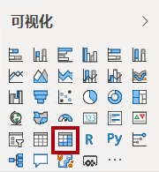

8. 在 **“字段”** 窗格中，从 **“Date”** 表内，将 **“Year”** 字段拖入 **“行”** 井中。

	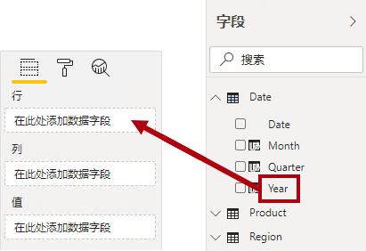

9. 将 **“Month”** 字段拖入 **“Year”** 字段正下方的 **“行”** 井。

	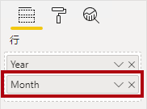

10. 在矩阵视觉对象的右上角，单击“叉状双箭头”图标（它将全年向下扩展一级）。

	

11. 请注意，年份展开到月份，而月份是按字母顺序而不是按时间顺序排序的。

	

	*默认情况下，文本值按字母顺序排序，数字从最小到最大排序，日期从最早到最新排序*。

12. 要自定义 **“Month”** 字段排序顺序，请切换到数据视图。

13. 将 **“MonthKey”** 列添加到 **“Date”** 表。


	**DAX**

	```
	MonthKey =

	(YEAR('Date'[Date]) * 100) + MONTH('Date'[Date]) + MONTH ( [Date] ))
	```

	*此公式为每个年/月组合计算一个数值*。

14. 在“数据”视图中，验证新列是否包含数值（例如，2017 年 7 月为“201707”等）。

	

15. 切换回“报表”视图。

16. 在**“字段”**窗格中，请确保选中 **“Month”** 字段（选中时将显示深灰色背景）。

17. 在 **“列工具”** 上下文功能区的 **“排序”** 组内，单击 **“按列排序”**，然后选择 **“MonthKey”**。

	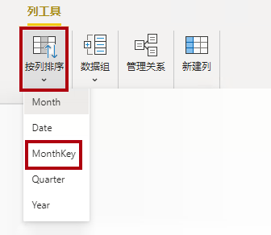

18. 在矩阵视觉对象中，请注意，现在已按时间顺序对月份进行了排序。

	

### 任务 4：完成“Date”表

在此任务中，将通过隐藏列并创建层次结构的方法，完成 **“Date”** 表的设计。然后，将创建 **“SalesTargets”** 表和 **“Targets”** 表的关系。

1. 切换到模型视图。

2. 在 **“Date”** 表中，隐藏 **“MonthKey”** 列。

3. 在 **“Date”** 表里，创建一个名为 **“Fiscal”** 的层次结构，包括以下三个级别：

	* Year

	* Quarter

	* Month

	

4. 创建以下两个模型关系：

	* **“Date | Date”** 到 **“Sales | OrderDate”**

	* **“Date | Date”** 到 **“Targets | TargetMonth”**

5. 隐藏以下两列：

	* Sales | OrderDate

	* Targets | TargetMonth

### 任务 5：标记“Date”表

在此任务中，你会将 **“Date”** 表标记为日期表。

1. 切换到“报表”视图。

2. 在 **“字段”** 窗格中，选择 **“Date”** 表（非字段）。

3. 在 **“表工具”** 上下文功能区中的 **“日历”** 组内，单击 **“标记为日期表”**，然后选择 **“标记为日期表”**。

	

4. 在**标记为日期表**窗口中的 **“日期列”** 下拉列表，选择 **“日期”**。

	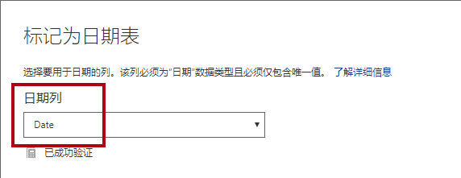

5. 单击 **“确定”**。

	

6. 保存 Power BI Desktop 文件。

	* Power BI Desktop 现在可以理解成该表定义了日期（时间）。依赖时间智能计算时，这一点很重要。将在实**验室 06B** 中进行时间智能计算*。

	*请注意，当数据源中没有日期表时，这种用于日期表的设计方法是合适的。如果有权访问数据仓库，应该从其日期维度表中加载日期数据，而不是在数据模型中“重新定义”日期逻辑*。

# 练习 2：创建度量

在本练习中，你将创建并格式化几种度量。

### 任务 1：创建简单的度量

在这次任务中，你将创建简单度量。简单的度量汇总单个列或表。

1. 在报告视图中第 **2 页**的 **“字段”** 窗格，拖动 **“Sales” | “Unit Price”** 字段到矩阵视觉对象内。

	

	*回想在 **“实验室 05A”** 中，依据 **“平均”** 将 **“Unit Price”** 列汇总。你在“矩阵”视觉对象中看到的结果是每月平均单价*。

2. 在视觉对象“字段”窗格（位于 **“可视化”** 窗格之下）的 **“值”** 井， 注意 **“Unit Price”** 已列出。

	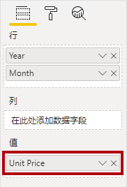

3. 单击 **“Unit Price”** 的向下箭头，然后注意可用的菜单选项。

	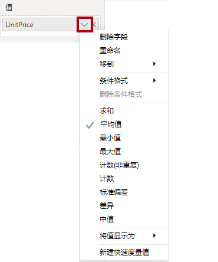

	*可见的数字列使报表作者可以在报表设计时决定如何汇总（或不汇总）列。这可能导致不适当的报表。但是某些数据建模人员不喜欢碰运气，他们选择隐藏这些列，而不是公开由度量值定义的聚合逻辑。这就是在本实验室中将要采用的方法*。

4. 要创建度量值，请在 **“字段”** 窗格中，右键单击 **“Sales”** 表，然后选择 **“新建度量值”**。

	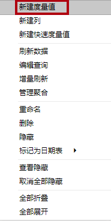

5. 在公式栏中，添加以下度量值定义：


	**DAX**

	```
	Avg Price = AVERAGE(Sales[Unit Price])
	```

6. 将 **“Avg Price”** 度量添加到矩阵视觉对象。

7. 请注意，它生成与 **“Unit Price”** 列相同的结果（但格式不同）。

8. 在 **“值”** 井中，打开 **“Avg Price”** 字段的上下文菜单 ，请注意，无法更改聚合技术。

	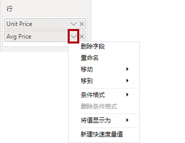

9. 使用片段文件定义为 **“Sales”** 表创建以下五个度量：

	* Median Price

	* Min Price

	* Max Price

	* Orders

	* Order Lines

	*用于**订单**度量值的 DISTINCTCOUNT() 函数将仅对订单计数一次（忽略重复项）。用于**订单行**度量值的 COUNTROWS() 函数对表进行操作。在这种情况下，订单数通过对不同 **SalesOrderNumber** 列值进行计数来计算，而订单行数只是表行的数量（每行是一行订单）*。

10. 切换到“模型”视图，然后选择四个价格度量值：**“Avg Price”**,**“Max Price”**,**“Median Price”** 和 **“Min Price”**。

11. 要选择多个度量值，请配置以下要求：

	* 将格式设置为两位小数

	* 分配给名为 **“Pricing”** 的显示文件夹

	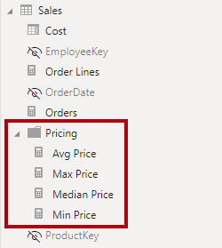

12. 隐藏 **Unit Price** 列。

	* **Unit Price** 列现在对所有报表作者不可用。他们必须使用你添加到模型中的度量值。这种设计方法可确保报表作者不会对价格进行不当汇总，例如，将它们相加*。

13. 多选 **“Orders”** 和 **“Order Lines”** 度量值并配置以下要求：

	* 使用千位分隔符设置格式

	* 分配给名为 **“Counts”** 的显示文件夹

	

14. 在报表视图中，在矩阵视觉对象的 **“值”** 井中，对于 **“Unit Price ”** 字段，单击“X”将其删除。

	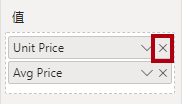

15. 增加“矩阵”视觉对象的大小以填充页面的宽度和高度。

16. 在“矩阵”视觉对象中添加以下五个新度量值：

	* Median Price

	* Min Price

	* Max Price

	* Orders

	* Order Lines

17. 验证结果是否合理以及格式是否正确。 

	

### 任务 2：创建其他度量

在此任务中，将创建使用更复杂表达式的其他度量值。

1. 在报表视图中，选择 **“第 1 页”**。

	

2. 查看表视觉对象，注意 **“Target”** 列的总计。

	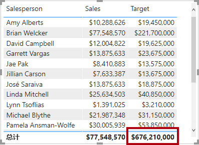

	*将目标值相加是没有意义的，因为销售人员的目标是根据每个销售人员的销售区域分配来设定的。  仅在筛选单个销售人员时才显示目标值。你现在将实现度量值来做到这一点*。

3. 在表视觉对象中，删除 **“Target”** 字段。

	

4. 将“ **Target”** | **“Target”** 列重命名为 **“Targets”** | **“TargetAmount”**。

	*提示：有多种方法在“报表”视图中重命名该列：在 **“字段”** 窗格中，可以右键单击列，然后选择 **“重命名”**，或者双击列，或按 **F2***。

	*你即将创建名为 **“Target”** 的度量值。同一表中不可能包含相同名称的列和度量值*。

5. 在**Target**表中创建以下度量值：


	**DAX**

	```
	Target =

	IF(

	HASONEVALUE('Salesperson (Performance)'[Salesperson]),

	SUM(Targets[TargetAmount])
	
	)
	```

	*HASONEVALUE() 函数测试在 **“Salesperson”** 列中是否筛选了单个值。如果为 true，则表达式返回目标金额的总和（仅针对该销售人员）。如果为 false，则返回 BLANK*。

6. 将**Target**度量值的格式设置为小数点后零位。

	*提示：你可以使用 **“度量工具”** 上下文功能区*。

7. 隐藏 **TargetAmount** 列。

8. 将 **“Target”** 度量添加到表视觉对象。

9. 请注意，**Target** 列总计现在为 BLANK。

	

10. 使用代码段文件定义为 **Targets** 表创建以下两个度量：

	* Variance

	* Variance Margin

11. 将 **“Variance”** 度量的格式设置为小数点后零位。

12. 将 **“Variance Margin”** 度量值的格式设置为保留小数点后两位的百分比。

13. 将 **“Variance”** 和 **“Variance Margin”** 度量添加到表视觉对象。

14. 加宽表视觉对象以便显示所有值。

	

	*虽然看起来所有销售人员均未达到目标，但请记住，尚未通过特定时间段对度量值进行筛选。你将在实**验室 07A** 中生成按用户选择的时间段筛选的销售业绩报表*。

15. 在 **“字段”** 窗格的右上角，折叠然后展开以打开窗格。

	

	*折叠并重新打开窗格会重置内容*。

16. 请注意，**Targets** 表现在显示在列表的顶部。

	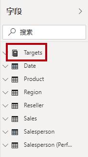

	*只包含可见度量的表会自动列在列表顶部*。

### 完成

在此任务中，你将完成实验室。

1. 保存 Power BI Desktop 文件。

2. 保持 Power BI Desktop 打开状态。

	*在下一个实验室中，将使用 DAX 通过更高级的计算来增强数据模型*。
