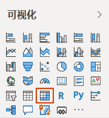
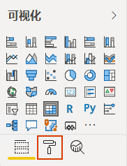
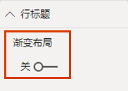
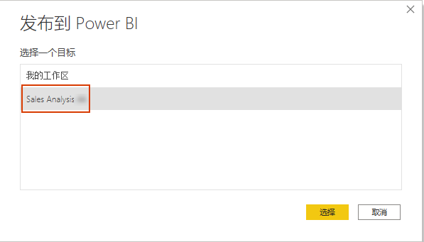
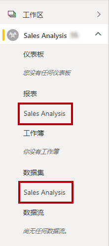
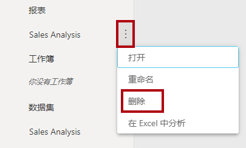



### 实验室 06B

在 Power BI Desktop 中使用 DAX，第 2 部分

# 概述

**完成实验室预计需要花费 45 分钟**

在本实验室中，你将使用涉及筛选器上下文操作的 DAX 表达式创建度量值。

在本实验室中，你将学习如何：

* 使用 CALCULATE() 函数操作筛选器上下文

* 使用时间智能函数

# 练习 1 ：使用筛选器上下文

在本练习中，你将使用涉及筛选器上下文操作的 DAX 表达式创建度量。

如果不确定自己是否成功完成了上一个实验室，可以打开上一个实验室的解决方案文件，该文件位于 **“D:\DA100\Lab06A\Solution”** 文件夹。

### 任务 1：创建矩阵视觉对象

在此任务中，你将创建一个矩阵视觉对象，以支持测试新指标。

1. 在 Power BI Desktop 中的报表视图中，创建一个新的报表页面。

	

2. 在第 **3 页上**，添加一个矩阵视觉对象。

	

3. 调整矩阵视觉对象的大小以填满整个页面。

4. 若要配置矩阵视觉对象的字段，请将**字段**窗格中的 **“区域 | 区域”** 层次结构拖放到视觉对象内。

5. 还要添加 **“Sales | Sales”** 字段也是如此。

6. 若要展开整个层次结构，请单击两次矩阵视觉对象右上方的双叉箭头图标。

	

	*回想一下： **“区域”** 层次结构包含 **“组”**, **“国家/地区”** 和 **“区域”** 等层次*。

7. 若要格式化视觉对象，请选择 **“可视化效果”** 窗格下方的 **“格式化”** 窗格。

	

8. 在 **“搜索”** 框中，输入 **“阶梯式”**。

9. 将 **“渐变布局”** 属性设置为 **“关”**。

	

10. 验证并确认矩阵视觉对象具有四个列标题。

	

	*Adventure Works 将销售区域分为组、国家/地区和区域。除美国外，所有国家/地区都只有一个区域以该国家/地区命名。由于美国的销售区域如此之大，该国分为五个区域*。

	*在本练习中，你将创建几个度量，然后将其添加到矩阵视觉对象中进行测试*。

### 任务 2：处理筛选器上下文

在此任务中，你将使用 DAX 表达式创建多个度量值，这些度量值使用 CALCULATE() 函数来操纵筛选器上下文。

1. 基于以下表达式向 **“Sales”** 表添加一个度量：

	*为了方便起见，本实验室中的所有 DAX 定义都可以从 **D:\DA100\Lab06B\Assets\Snippets.txt** 文件中复制*。


	**DAX**

	```
	Sales All Region =
	CALCULATE(SUM(Sales[Sales]), REMOVEFILTERS(Region))
	```

	*CALCULATE() 函数是一个功能强大的函数，用于处理筛选器上下文。第一个参数接收表达式或度量（度量只是一个命名表达式）。后续参数允许修改筛选上下文*。

	*REMOVEFILTERS() 函数删除活动的筛选器。它可以不接收任何参数，也可以接收一个表、一个列或多个列作为参数*。

	*在此公式中，度量值在修改过的筛选器上下文中对 **Sales** 列进行求和，这将删除应用于 **Region** 表的所有筛选器*。

2. 将 **Sales All Region** 度量值添加到矩阵视觉对象。

	

3. 请注意 **“所有区域的销售额”** 度量计算每个区域、国家/地区（小计）和组（小计）的所有区域销售总额。

	*该度量尚未产生有用的结果。将某个组、国家/地区或区域的销售额除以该值，便得出一个有用的比值，称为“占总计的百分比”*。

4. 务必选中 **“字段”** 窗格中的 **“所有区域的销售额”** 度量值，然后将公式栏中的度量值名称和公式替换为以下公式：

	*提示：若要替换现有公式，请先复制该片段。然后，单击公式栏内部并按 **Ctrl+A** 选择所有文本。然后，按 **Ctrl+V** 粘贴该片段以覆盖所选文本。然后按 **Enter***。


	**DAX**

	```
	Sales % All Region =
	DIVIDE(
       SUM(Sales[Sales]),
       CALCULATE(
            SUM(Sales[Sales]),
            REMOVEFILTERS(Region)
       )
	)
	```   
	*已重命名度量，以准确反映更新后的公式。**DIVIDE()** 函数将 **Sales** 度量值（未被筛选器上下文修改）除以修改后的上下文中的 **Sales** 度量值，该度量值删除应用于**区域**表的所有筛选器*。

5. 请注意，矩阵视觉对象中的度量已被重命名，并且每个组、国家/地区和区域现在都对应了不同的值。

6. 将 **“Sales % All Region”** 度量格式化为一个百分比，保留两位小数。

7. 在矩阵视觉对象中，查看 **“Sales % All Region”** 度量值。

	

8. 基于以下表达式将另一个度量值添加至 **“Sales”** 表，并格式化为百分比：


	**DAX**

	```
	Sales % Country =
	DIVIDE(
       SUM(Sales[Sales]),
       CALCULATE(
           SUM(Sales[Sales]),
           REMOVEFILTERS(Region[Region])
       )
	)
	```

9. 请注意，**“Sales % Country”** 度量值公式与 **“Sales % All Region”** 度量值公式略有不同。

	*不同之处在于，分母在修改筛选器上下文时删除的是 **“Region”** 表中 **“Region”** 列上的筛选器，而不是删除 **“Region”** 表中所有列上的筛选器。这意味着将保留应用于 Group 或 Country 列的所有筛选器。它将取得一个代表国家/地区销售额百分比的结果*。

10. 将 **“Sales % Country”** 度量值添加到矩阵视觉对象。

11. 请注意，仅 United States 区域得出的值不是 100%。

	

	*回想一下，只有美国有多个区域。所有其他国家/地区都只有一个区域，这解释了为什么它们对应的值都是 100%*。

12. 为了提高该度量值在视觉对象中的可读性，可以用如下改进版公式覆盖 **“Sales % Country”** 度量值。


	**DAX**

	```
	Sales % Country =
	IF(
        ISINSCOPE(Region[Region]),
    	DIVIDE(
        	SUM(Sales[Sales]),
        	CALCULATE(
                SUM(Sales[Sales]),
                REMOVEFILTERS(Region[Region)
            )
        ) 
	)
	```

	*ISINSCOPE() 函数嵌入 IF() 函数中，用于测试“region”列所在的层次是否属于一个由多个层次组成的层次结构。当其结果为 true 时，将对 DIVIDE() 函数进行求值。缺少 false 部分意味着返回值为空值，此时区域列不在范围内*。

13. 注意，**“Sales % Country”** 度量现在只会在某一区域在范围内时才返回值。

	

14. 基于以下表达式将另一个度量值添加至 **“Sales”** 表，并格式化为百分比：


	**DAX**

	```
	Sales % Group =
	DIVIDE(
        SUM(Sales[Sales]),
        CALCULATE(
             SUM(Sales[Sales]),
             REMOVEFILTERS(
                 Region[Region],
                 Region[Country]
             )
        )
	)
	```

	*为了得出销售额占组的百分比，可以应用两个筛选器来有效地删除两列上的筛选器*。

15. 将 **“Sales % Group”** 度量添加到矩阵视觉对象。

16. 为了提高该度量在视觉对象中的可读性，可以用如下改进版公式覆盖 **“Sales % Group”** 度量。


	**DAX**

	```
	Sales % Group =
	IF(
        ISINSCOPE(Region[Region])
             || ISINSCOPE(Region[Country]),
        DIVIDE(
            SUM(Sales[Sales]),
            CALCULATE(
                SUM(Sales[Sales]),
                REMOVEFILTERS(
                     Region[Region],
                     Region[Country]
                )
            )
        )
	)
	```

17. 注意，**“Sales % Group”** 度量值现在只在区域或国家/地区在范围内时才返回值。

18. 在“模型”视图中，将三个新的度量值放入名为 **“比率”** 的显示文件夹中。

	

19. 保存 Power BI Desktop 文件。

	*添加到 **Sales** 表中的度量值修改了筛选上下文，以实现分层导航。请注意，若要通过计算得出小计，通常需要从筛选器上下文中删除一些列，而要得出总计，则必须删除所有列*。

# 练习 2：使用时间智能

在本练习中，你将创建年初至今 (YTD) 销售额度量和销售额同比增长 (YoY) 度量。

### 任务 1：创建 YTD 度量值

在此任务中，你将创建一个销售额 YTD 度量值。

1. 在报表视图中的第 **2 页**上，注意显示了各种度量的矩阵视觉对象，这些度量在行上按年和月分组。

21. 向 **“Sales”** 表添加一个度量，基于以下表达式，并格式化为零位小数：


	**DAX**

	```
	Sales YTD =  
	TOTALYTD(SUM(Sales[Sales] 'Date'[Date], "6-30")
	```

	*TOTALYTD() 函数会对给定的日期列进行表达式求值，本例中是对 **“Sales”** 列求和。日期列必须属于标记为日期表的日期表，就像你在实**验室 06A** 中所标记的那样。该函数还可以接收表示一年的最后一个日期的第三个可选参数。如果没有此日期，则表示 12 月 31 日是该年的最后一个日期。对于 Adventure Works 来说，六月是每年的最后一个月，因此最后一个日期为“6-30”*。

22. 将 **“销售额”** 字段和 **“本年累计销售额”** 度量添加到矩阵视觉对象。

23. 注意当年销售额值的累积。

	

	*TOTALYTD() 函数执行筛选操作，特别是时间筛选操作。例如，为了计算 2017 年 9 月（会计年度的第三个月）的本年累计销售额，会删除 **“Date”** 表上的所有筛选器，并用新的日期筛选器替换，该筛选器从年初（2017 年 7 月 1 日）开始，一直延伸到上下文日期期间的最后一个日期（2017 年 9 月 30 日）*。

	*请注意，DAX 中提供了许多时间智能函数，以支持常用的时间筛选操作*。

### 任务 2：创建同比增长度量

在此任务中将创建一个销售额同比增长度量。

1. 向 **“Sales”** 表添加一个额外度量值，基于以下表达式：


	**DAX**

	```
	Sales YoY Growth =
	VAR SalesPriorYear =
    	CALCULATE(
        	SUM(Sales[Sales]),
        	PARALLELPERIOD(
            	'Date'[Date],
            	-12,
           	 MONTH
       	    )
        )
	RETURN
        SalesPriorYear
	```
	* **“Sales YoY Growth”** 度量公式声明了一个变量。变量可用于简化公式逻辑，当需要在公式中多次对表达式求值时（同比增长逻辑就是这种情况），变量将更有效。变量由唯一名称进行声明，而度量值表达式必须在 **RETURN** 关键字之后输出*。

	* **“SalesPriorYear”** 变量分配有一个表达式，该表达式在一个修改过的上下文中计算“Sales”列的总和，该上下文使用 PARALLELPERIOD() 函数将筛选器上下文中的每个日期倒推 12 个月*。

25. 将 **“Sales YoY Growth”** 度量值添加到“矩阵”视觉对象。

26. 请注意，新指标会为前 12 个月返回空值（在 2017 会计年度之前没有销售记录）。

27. 注意，**2017 年 7 月的** **“销售额同比增长” **度量值为 **2016 年 1 月的** **“Sales”** 值。

	

	*测试了公式的难点部分后，现在可以使用最终公式来覆盖度量，从而计算增长结果*。

28. 若要完成度量值，请使用此公式覆盖 **“销售额同比增长”** 度量值，将其格式化为百分比，并保留两位小数：


	**DAX**

	```
	Sales YoY Growth =
	VAR SalesPriorYear =
    	CALCULATE(
        	  SUM(Sales[Sales]),
        	  PARALLELPERIOD(
              'Date'[Date],
              -12,
              MONTH
            )
	)
	RETURN
       DIVIDE(
           (SUM(Sales[Sales]) - SalesPriorYear),
           SalesPriorYear
       )
	```

29. 在公式中的 **RETURN** 子句中，请注意对该变量引用了两次。

30. 验证并确认 **2018 年 7** 月的同比增长是 **392.83%**。

	

	*这意味着 2018 年 7 月的销售额（2,411,559 美元）比上一年的销售额（489,328 美元）增长了近 400%（几乎 4 倍）*。

31. 在“模型”视图中，将两个新度量值放入名为 **“Time Intelligence”** 的显示文件夹。

	

32. 保存 Power BI Desktop 文件。

	*DAX 包含许多时间智能函数，可轻松实现常见业务场景的时间筛选操作*。

	*此练习完成了数据模型的开发。在下一个练习中，将把 Power BI Desktop 文件发布到工作区，准备在下一个实验室中创建报表*。

# 练习 3：发布 Power BI Desktop 文件

在本练习中，你将把 Power BI Desktop 文件发布到 Power BI。

### 任务 1：发布文件

在此任务中，你将把 Power BI Desktop 文件发布到 Power BI。

1. 保存 Power BI Desktop 文件。

	*如果不确定自己是否已成功完成此实验室，则应发布在 **“D:\DA100\Lab06B\Solution”** 文件夹中找到的 Power BI Desktop 文件。在这种情况下，请关闭当前的 Power BI Desktop 文件，然后打开解决方案文件。先执行一次数据刷新（使用功能区上的 **“刷新”** 命令），然后按照本任务中的说明继续操作*。

34. 若要发布文件，请在 **“主页”** 功能区选项卡上 **“分享”** 功能组内单击 **“发布”**。

	

35. 在 **“发布到 Power BI”** 窗口中，选择 **“销售分析”** 工作区。

	*务必将其发布到你在实**验室 01A**中创建的工作区，而不是“我的工作区”*。

	

36. 单击 **“选择”**。

	

37. 成功发布文件后，单击 **“知道了”**。

	

38. 关闭 Power BI Desktop。

39. 在 Edge 中，依次打开 Power BI 服务和 **“导航”** 窗格（位于左侧），查看 **“销售分析”** 工作区的内容。

	

	*发布添加了一个报表和一个数据集。如果没看到它们，请按 **F5** 重新加载浏览器，然后再次展开工作区*。

	*数据模型已发布为数据集。用于测试模型计算的报表已添加为报表。此报表不是必需的，因此现在需要将其删除*。

40. 将光标悬停在 **“销售分析”** 报表上，单击垂直省略号（…），然后选择 **“删除”**。

	

41. 当提示确认删除时，单击 **“删除”**。

	

	*在下一个实验室中，你将基于已发布的数据集创建报表*。

### 完成

在此任务中，你将完成实验室。

1. 使 Edge 浏览器窗口保持打开状态。
