

### 实验室 09A

“在 Power BI Desktop 中设计报表”第 2 部分

# 概述

**完成实验室预计需要花费 45 分钟**

在本实验室中，你将使用高级设计功能改进 **“销售报表”**。

在本实验室中，你将学习如何：

* 同步切片器

* 创建钻取页面

* 应用条件格式

* 创建并使用书签

# 练习 1：配置同步切片器

在本练习中，你将同步报表页面切片器。

### 任务 1：同步切片器

在此任务中，你将同步 **“Year”** 和 **“Region”** 切片器。

*你将继续开发在实**验室 08A** 中开始设计的报表*。

1. 在 Power BI Desktop 中，在 **“销售报表”** 文件的 **“概述”** 页面上，将 **“Year”** 切片器设置为 **“FY2018”**。

2. 前往 **“我的绩效”** 页面，然后注意 **“年”** 切片器是一个不同的值。

	*当切片器不同步时，会导致数据表述错误并报表用户遭受挫折。现在将同步报表切片器*。

3. 转到**概述**页面，然后选择 **“Year”** 切片器。

4. 在 **“视图”** 功能区选项卡中，从 **“显示窗格”** 组内，单击 **“同步切片器”**。

	

5. 在**同步切片器**窗格（**可视化**窗格左侧）内，在第二列（即同步列）中，选中**概述**和我**的业绩**页面的复选框。

	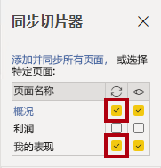

6. 在**概述**页面中，选择 **“区域”** 切片器。

7. 将该切片器同步至 **“概述”** 及 **“利润”** 页面。

	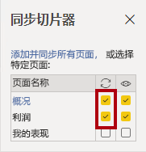

8. 可通过选择不同的筛选器选项，然后验证同步的切片器是否使用相同选项进行筛选来测试同步切片器。

9. 要关闭 **“同步切片器”** 页面，请单击窗格的右上角的 **X**。

	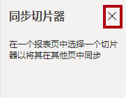

# 练习 2：配置钻取

在本练习中，你将创建新页面并将其配置为钻取页面。完成设计后，页面将如下所示：  

### 任务 1：创建钻取页面

在此任务中，你将创建新页面并将其配置为钻取页面。

1. 添加名为 **“产品详细信息”** 的新报表页面。

	

2. 右键单击 **“Product Details”** 页面选项卡，然后选择 **“隐藏页面”**。

	

	*报表用户将无法直接进入钻取页面。他们需要从其他页面的视觉对象进行访问。你将在本实验室的最后练习中学习如何钻取到该页面*。

3. 在**可视化**窗格下，在 **“钻取”** 部分，将 **“Product”** | **“Category”** 字段添加到 **“在此处添加钻取字段”** 框。

	

4. 要测试钻取页面，请在钻取筛选器卡片中选择 **“自行车”**。

	

5. 在报表页面的左上角，请注意箭头按钮。

	

	*该按钮已自动添加。它可以使报表用户导航回到他们所钻取的页面*。

6. 向页面添加 **“卡片”** 视觉对象，然后调整大小和位置，使其位于按钮右侧，并填充页面剩余宽度。

	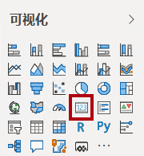

	

7. 将 **“Product | Category”** 字段拖入卡片视觉对象。

8. 为视觉对象配置格式选项，然后将 **“类别标签”** 属性设置为 **“关闭”**。

	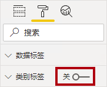

9. 将 **“背景颜色”** 属性设置为浅灰色。

10. 向页面添加 **“表”** 视觉对象，然后调整大小和位置，使其位于卡片视觉对象下方，并填充页面上的剩余空间。

	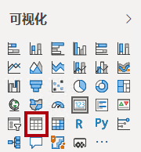

	

11. 将以下字段添加到视觉对象：

	* Product | Subcategory

	* Product | Color

	* Sales | Quantity

	* Sales | Sales

	* Sales | Profit Margin

12. 为视觉对象配置格式选项，然后在 **“网格”** 部分，将 **“文本大小”** 属性设置为 **“20pt”**。

	*钻取页面的设计几乎已完成。在下一个练习中，你将定义条件格式*。

# 练习 3：添加条件格式

在本练习中，你将使用条件格式来改进钻取页面。完成设计后，页面将如下所示：  

### 任务 1：添加条件格式

在此任务中，你将使用条件格式来改进钻取页面。

1. 选择表视觉对象。

2. 在视觉对象字段窗格中，对于 **“Profit Margin”** 字段，单击向下箭头，然后选择 **“条件格式”** | **“图标”**。

	

3. 在 **“图标 - 利润率”** 窗口中，在 **“图标布局”** 下拉列表中选择 **“数据右侧”**。

	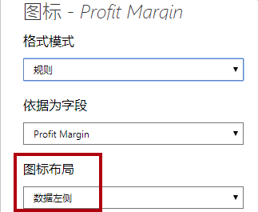

4. 要删除中间规则，请在黄色三角形的左侧单击 **“X”**。

	

5. 如下配置第一条规则（红色菱形）：

	* 在第二个控件中，删除该值

	* 在第三个控件中，选择 **“数字”**

	* 在第五个控件中，输入 **“0”**

	* 在第六个控件中，选择 **“数字”**

6. 按如下所示配置第二条规则（绿色圆圈）：

	* 在第二个控件中，输入 **“0”**

	* 在第三个控件中，选择 **“数字”**

	* 在第五个控件中，删除该值

	* 在第六个控件中，选择 **“数字”**

	

	*规则如下：如果利润率值小于 0，则显示红色菱形；或者如果利润率值大于或等于 0，则显示绿色圆圈*。

7. 单击 **“确定”**。

	

8. 在“表”视觉对象中，验证是否显示了正确的图标。

	

9. 为 **“Color”** 字段配置背景颜色条件格式。

10. 在 **“背景颜色 - 颜色”** 窗口中，在 **“格式化依据”** 下拉列表中选择 **“字段值”**。

	

11. 在 **“基于字段”** 下拉列表中，选择 **“Product | 格式 | 背景色格式”**。

	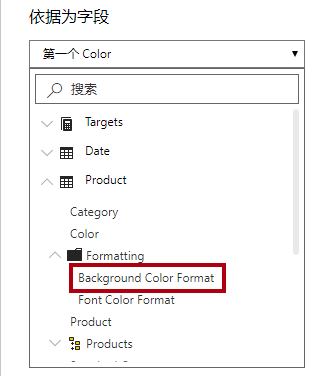

12. 单击 **“确定”**。

	

13. 重复前面的步骤为 **“Color”** 字段配置字体颜色条件格式，可使用 **“Product | 格式 | 字体颜色格式”** 字段进行配置

	*请记住，背景和字体颜色源自实 **验室 02A** 中的 **ColorFormats.csv** 文件 ，然后与实**验室 03A** 中的 **“Product”** 查询集成*。

# 练习 4：添加书签和按钮

在本练习中，你将通过按钮改进 **“我的业绩”** 页面，使报表用户可以选择要显示的视觉对象类型。完成设计后，页面将如下所示：  

### 任务 1：添加书签

在此任务中，你将添加两个书签，一个书签显示每个月销售额/目标销售额视觉对象。

1. 转到 **“我的业绩”** 页面。

2. 在 **“视图”** 功能区选项卡中，从 **“显示窗格”** 组内，单击 **“书签”**。

	

3. 在 **“视图”** 功能区选项卡中，从 **“显示窗格”** 组内，单击 **“选择”**。

	

4. 在**选择**窗格中的 **“Sales and Target by Month”** 其中一项的旁边，可单击眼睛图标隐藏视觉对象。

	

5. 在**书签**窗格中，单击 **“添加”**。

	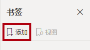

6. 要重命名书签，请双击书签。

7. 如果可见图表是条形图，请将书签重命名为 **“条形图打开”**，否则将书签重命名为 **“柱形图打开”**。

8. 在 **“选择”** 窗格中，切换显示两个 **“月销售额和目标”** 项。

	*换句话说，隐藏可见的视觉对象，并使隐藏的视觉对象可见*。

	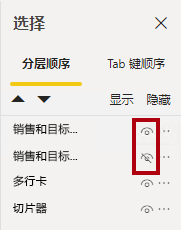

9. 创建第二个书签，并适当命名（ **“柱形图打开”** 或 **“条形图打开”**）。

	

10. 在 **“选择”** 窗格中，要使两个视觉对象都可见，只需显示隐藏的视觉对象即可。

11. 调整两个视觉对象的大小和位置，使其填充“多行卡”视觉对象下方的页面，并且彼此完全重叠。

	*提示：要选择隐藏的视觉对象，请在“选择”窗格中进行**选择***。

	

12. 在 **“书签”** 窗格中，选择每个书签，请注意只有一个视觉对象可见。

	*设计的下一阶段是在页面上添加两个按钮，以便报表用户选择书签*。

### 任务 2：添加按钮

在此任务中，你将添加两个按钮，并为每个按钮分配书签操作。

1. 在 **“插入”** 功能区中，从 **“元素”** 组内，单击 **“按钮”**，然后选择 **“空白”**。

	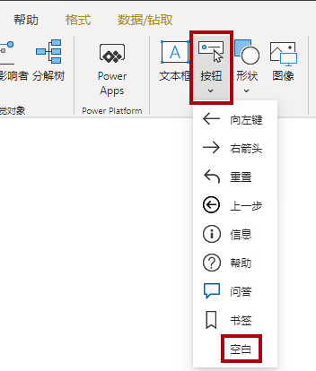

2. 将按钮重新置于 **“Year”** 切片器下。

3. 选择按钮，然后在 **“可视化”** 窗格中，将 **“按钮文本”** 属性设置为 **“打开”**。

	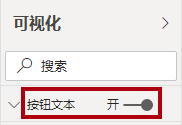

4. 展开 **“按钮文本”** 部分，然后在 **“按钮文本”** 框内，输入 **“条形图”**。

5. 使用合适的颜色设置格式化背景颜色。

6. 将 **“操作”** 属性设置为 **“开”** （位于列表底部附近）。

	

7. 展开 **“操作”** 部分，然后将 **“类型”** 下拉列表设置为 **“书签”**。

8. 在 **“书签”** 下拉列表中，选择 **“条形图打开”**。

	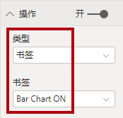

9. 通过使用复制和粘贴来创建按钮的副本，然后按如下方式配置新按钮：

	* 将 **“按钮文本”** 属性设置为 **“柱形图”**

	* 在 **“操作”** 部分，将 **“书签”** 下拉列表设置为 **“柱形图打开”**

### 任务 3：发布报表

在此任务中，你将发布报表。

1. 选择 **“总览”** 页面。

2. 在 **“Year”** 切片器中，选择 **“FY2020”**。

3. 在 **“Region”** 切片器中，选择 **“全选”**。

4. 保存 Power BI Desktop 文件。

5. 将报表发布到 **“销售分析”** 工作区。

6. 当系统提示替换报表时，单击 **“替换”**。

	

7. 保持 Power BI Desktop 打开状态。

	*在下一个练习中，你将在 Power BI 服务中浏览报表*。

# 练习 5：浏览报表

在本练习中，将在 Power BI 服务中浏览 **“销售报表”**。

### 任务 1：浏览报表

在此任务中，你将在 Power BI 服务中浏览 **“Sales Report”**。

1. 在基于 Edge 中的 Power BI 服务中，打开 **“Sales Report”** 报表。

2. 要测试钻取报表，请在 **“各类别数量”** 视觉对象中右键单击 **“Clothing”** 栏，然后选择 **“钻取”** | **“产品详情”**。

	

3. 请注意 **“产品详细信息”** 页面适用于 **“服装”**。

4. 要返回源页面，请单击左上角的箭头按钮。

5. 选择 **“我的业绩”** 页面。

6. 单击每个按钮，然后会发现显示了不同的视觉对象。

### 完成

在此任务中，你将完成实验室。

1. 要返回工作区，请在 Breadcrumb 结尾中单击你的工作区名称。

	

2. 使 Edge 浏览器窗口保持打开状态。

3. 在 Power BI Desktop 中，前往 **“我的绩效”** 页面，然后在 **“字段”** 窗格中，删除 **“销售员”** 筛选器卡片。

	

4. 选择 **“总览”** 页面。

5. 保存 Power BI Desktop 文件，然后重新发布到 **“Sales Analysis”** 工作区。

6. 关闭 Power BI Desktop。

	*当在实 **验室 12A** 中共享报表时，该报表将强制执行行级安全性*。
