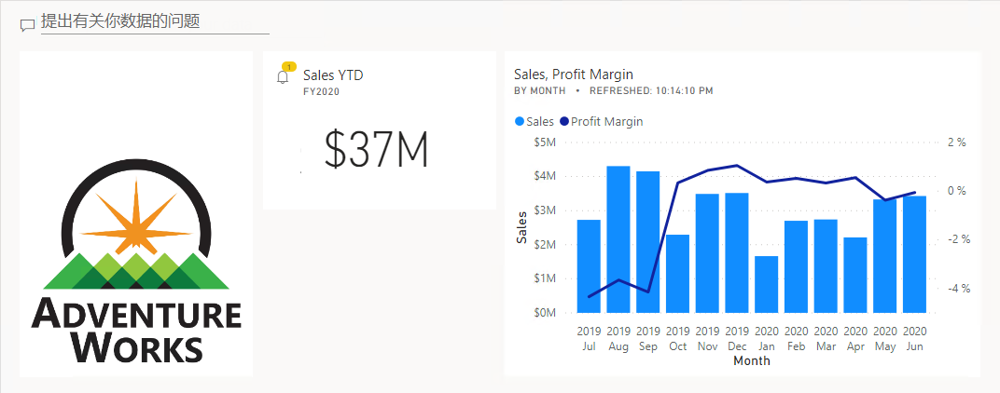
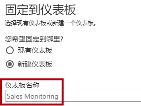
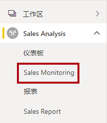
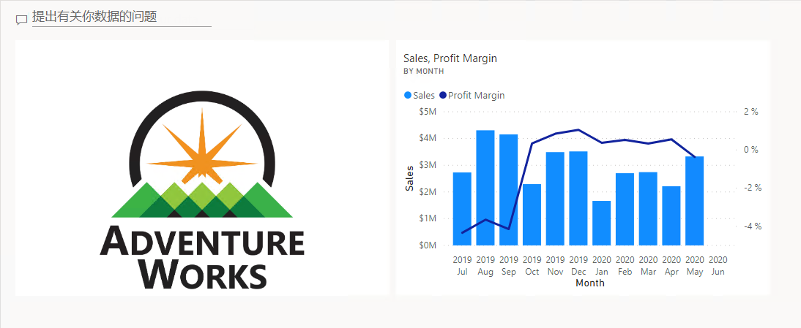
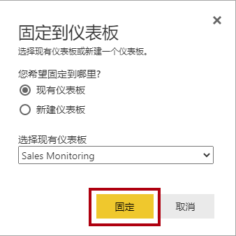
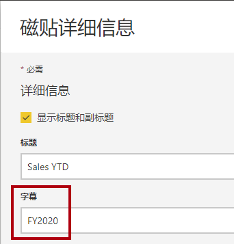
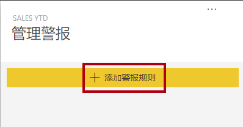
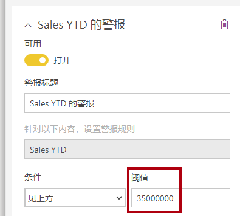
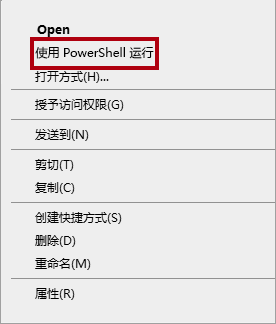



### 实验室 10A

创建 Power BI 仪表板

# 概述

**完成实验室预计需要花费 45 分钟**

在本实验室中，将创建 **“销售监视”** 仪表板。

在本实验室中，你将学习如何：

* 将视觉对象固定到仪表板

* 使用问答创建仪表板磁贴

* 配置仪表板磁贴警报

# 练习 1 ：创建仪表板

在本练习中，将创建 **“销售监视”** 仪表板。完成后的仪表板应该如下所示：  

### 任务 1：创建仪表板

在此任务中，将创建 **“Sales Monitoring”** 仪表板。

1. 在 Edge 的 Power BI 服务中，打开 **Sales Report** 报表。

2. 若要创建仪表板并固定徽标图像，请将光标悬停在 Adventure Works 徽标上。

3. 在右上角，单击“图钉”。

	

4. 在**固定到仪表板**窗口的 **“仪表板名称”** 框中，输入 **“Sales Monitoring”**。

	

5. 单击 **“固定”**。

	

6. 将 **“Year”** 切片器设置为 **“FY2020”**。

	

7. 将 **“区域”** 切片器设置为 **“全选”**。

	*将视觉对象固定到仪表板时，它们将使用当前的筛选上下文。一旦固定，就无法更改筛选上下文。对于基于时间的筛选器，最好使用相对日期切片器（或使用基于时间的相对问题进行问答）*。

8. 将 **Sales and Profit Margin by Month** （列/行）视觉对象固定到 **“Sales Monitoring”** 仪表板。

9. 打开 **“导航”** 窗格，然后打开 **“销售监视”** 仪表板。

	

10. 请注意，仪表板有两个磁贴。

	

11. 要调整徽标磁贴的大小，请拖动右下角，然后将磁贴的大小调整为一个单位宽和两个单位高。

	*磁贴大小限制为矩形。*只能将大小调整为矩形的倍数*。

12. 要添加基于问题的磁贴，请在仪表板左上方单击 **“询问有关数据的问题”**。

	

13. 可以使用问答功能来提问，然后 Power BI 将以视觉对象进行响应。

14. 单击“问答”框下方灰色框中的任何建议问题。

15. 查看响应。

16. 从“问答”框中删除所有文本。

17. 在“问答”框中，输入以下内容：**本年迄今为止的销售额**

	

18. 请注意 **（空白）** 的响应。

	

	*记得已在实**验室 06B** 中添加**本年迄今为止的销售额**度量值 。此度量值是时间智能表达式，需要 **“日期”** 表进行筛选才能生成结果*。

19. 通**过在 2020 财年**对问题进行扩展。

	

20. 注意答复现在为 **3300 万美元**。

	

21. 要将响应固定到仪表板，请在右上角单击 **“固定视觉对象”**。

	

22. 当提示将磁贴固定到仪表板时，单击 **“固定”**。

	

	*可能有一个 bug，即只允许固定到新的仪表板。这是因为 Power BI 会话已还原为“我的工作区”。如果发生这种情况，请勿固定到新的仪表板。返回到销**售分析**工作区，再次打开仪表板，然后重新创建问答问题*。

23. 要返回到仪表板，请在左上角单击 **“退出问答”**。

	

### 任务 2：编辑磁贴详细信息

在此任务中，将编辑两个磁贴的详细信息。

1. 将光标悬停在 **“Sales YTD”** 磁贴上，然后在该磁贴的右上角单击省略号，然后选择 **“编辑详细信息”**。

	

2. 在 **“磁贴详细信息”** 窗格（位于右侧）的 **“字幕”** 框中，输入 **“FY2020”**。

	

3. 在窗格底部，单击 **“应用”**。

	

4. 请注意，**“Sales YTD”** 磁贴将显示字幕。

	

5. 编辑 **“销售额、利润率”** 磁贴的磁贴详细信息。

6. 在**磁贴详细信息**窗格的 **“功能”** 部分，选中 **“显示上次刷新时间”**。

	

7. 单击 **“应用”**。

	

8. 请注意，该磁贴描述了上次刷新时间（在 Power BI Desktop 中刷新数据模型时执行的时间）。

在本实验室的后面，将模拟数据刷新，并注意刷新时间会更新。

### 任务 3：配置警报

在此任务中，你将配置数据警报。

1. 将光标悬停在 **“本年迄今为止的销售额”** 磁贴上，单击“省略号”，然后选择 **“管理警报”**。

	

2. 在 **管理警报**窗格（位于右侧）中，单击 **“添加预警规则”**。

	

3. 在 **“阈值”** 框中，将值替换为 **“35000000”** （3500 万）。

	

	*此配置可确保每当磁贴更新到 3500 万以上的值时会通知你*。

4. 在窗格底部，单击 **“保存并关闭”**。

	

	*在下一个练习中，将刷新数据集。通常，这应该借助计划刷新来完成，并且 Power BI 可使用网关连接到 SQL Server 数据库。但是，由于教室设置的限制，没有网关。因此，需要打开 Power BI Desktop，执行手动数据刷新，然后上传文件*。

# 练习 2：刷新数据集

在本练习中，我们首先将 2020 年 6 月的销售订单数据加载到 **AdventureWorksDW2020** 数据库，然后将课堂伙伴的帐户添加到数据库中。接着打开 Power BI Desktop 文件，执行数据刷新，然后将该文件上传到 **Sales Analysis** 工作区。

### 任务 1：更新实验室数据库

在此任务中，你将运行 PowerShell 脚本来更新 **AdventureWorksDW2020** 数据库中的数据。

1. 在文件资源管理器的 **“D:\DA100\Setup”** 文件夹中，右键单击 **UpdateDatabase-2-AddSales.ps1** 文件，然后选择 **“使用 PowerShell 运行”**。

	

	37.当提示按任意键继续时，请再次按 **Enter**。

	 * **AdventureWorksDW2020** 数据库现在包括 2020 年 6 月的销售订单*。

2. 在 **“D:\DA100\Setup”** 文件夹中，右键单击 **UpdateDatabase-3-AddPartnerAccount.ps1** 文件，然后选择 **“使用 PowerShell 运行”**。

3. 出现提示时，请输入课堂伙伴的帐户名，然后按 **Enter**。

	*只需要输入其帐户名（@ 符号前面的所有字符）。选择坐在你身边的人，两人一组共同完成实**验室 12A**，其中涵盖共享 Power BI 内容*。

	*他们的帐户名已添加，因此可以测试行级安全性。你的合作伙伴现在是 Pamela Ansam-Wolfe, 其销售业绩由两个销售区域的销售额来衡量：美国西北部和美国西南部*。

### 任务 2：刷新 Power BI Desktop 文件

在此任务中，打开 Sales Analysis Power BI Desktop 文件，执行数据刷新，然后将该文件上传到销**售分析**工作区。

1. 打开存储在 **“D:\DA100\MySolution”** 文件夹中的 **Sales Analysis** Power BI Desktop 文件。

	*在实 **验室 06B** 中发布文件时，如果不确定自己是否已成功完成实验室，则建议上传解决方案文件。如果上传了解决方案文件，现在请务必再次打开该解决方案文件。*它位于 **“D:\DA100\Lab06B\Solution”** 文件夹*。

2. 在 **“主页”** 功能区的 **“查询”** 组内，单击 **“刷新”**。

	

3. 刷新完成后，保存 Power BI Desktop 文件。

4. 将文件发布到你的 **“销售分析”** 工作区。

5. 当提示替换数据集时，请单击 **“替换”**。

	

	*Power BI 服务中的数据集现在具有 2020 年 6 月的销售数据*。

6. 关闭 Power BI Desktop。

7. 在基于 Edge 的 Power BI 服务中，在 **“Sales Analysis”** 工作区，请注意 **“Sales Analysis”** 报表也已发布。

	此报表用于测试在实**验室 05A** 和实**验室 06A** 中开发的模型。

8. 删除 **“销售分析”** 报表（不是数据集）。

# 练习 3：查看仪表板

在本练习中，将查看仪表板，以注意更新的销售情况，以及警报已触发。 

### 任务 1：查看仪表板

在此任务中，你将查看仪表板，以注意更新的销售额，以及警报已触发。 

1. 在基于 Edge 的 Power BI 服务中，打开 **“Sales Monitoring”** 仪表板。

2. 在 **“Sales, Profit Margin”** 磁贴的小标题中，请注意数据现在已刷**新**。

3. 还请注意，现在有一个 **2020 年 6 月** 的列。

	

	* **“本年迄今为止的销售额”** 磁贴上的警报也应该触发了。片刻之后，警报应通知你销售额现在已超过配置的阈值*。

4. 请注意，**“Sales YTD”** 磁贴已更新为 **“$37M”**。

5. 验证 **“Sales YTD”** 磁贴是否显示警报通知图标。

	*如果没有看到通知，则可能需要按 **F5** 重新加载浏览器。如果仍未看到通知，请再等几分钟*。

	

	*警报通知显示在仪表板磁贴上，可以通过电子邮件和推送通知发送到包括 Apple Watch8 在内的移动应用*。
