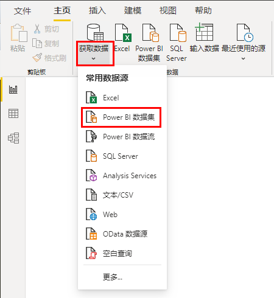
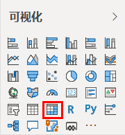
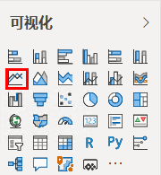
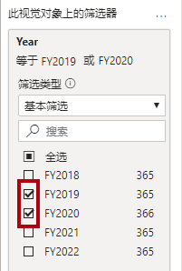
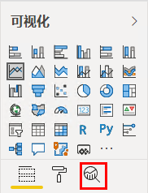
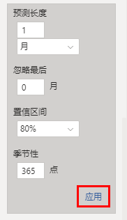
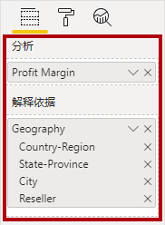
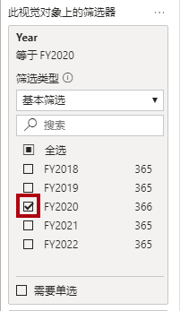
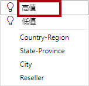
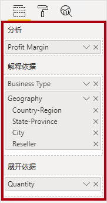



### 实验室 11A

Power BI Desktop 中的数据分析

# 概述

**完成实验室预计需要花费 45 分钟**

在本实验室中，你将创建 **Sales Exploration** 报表。

在本实验室中，你将学习如何：

* 创建动画散点图

* 使用视觉对象来预测值

* 使用分解树视觉对象

* 使用关键影响视觉对象

# 练习 1 ：创建报表

在本练习中将创建 **Sales Exploration** 报表。

### 任务 1：创建报表

在本任务中，你将创建 **Sales Exploration** 报表。

1. 打开 Power BI Desktop，然后关闭欢迎屏幕。

	

2. 将文件保存到 **“D:\DA100\MySolution”** 文件夹，并命名为 **“Sales Exploration”**。

	

3. 创建与 **Sales Analysis** 数据集的实时连接。

	*提示：使用 **“主页”** 功能区选项卡上的 **“获取数据”** 命令，然后选择 **“Power BI 数据集”***。

	

	*现在创建四个报表页面，在每个页面中使用不同的视觉对象来分析和探索数据*。

# 练习 2：创建散点图

在本练习中，你将创建可以制作成动画的散点图。

### 任务 1：创建动画散点图

在本任务中，你将创建可以制作成动画的散点图。

1. 将 **“第 1 页”** 重命名为 **“散点图”**。

	

2. 将 **“散点图”** 视觉对象添加到报表页，然后调整其位置和大小，以使其填满整个页面。

	

	

3. 将以下字段添加到视觉对象井中：

	* 图例：**Reseller | Business Type**

	* X 轴：**Sales | Sales** 

	* Y 轴：**Sales | Profit Margin**

	* 大小：**Sales | Quantity**

	* 播放轴：**Date | Quarter**

	

	*在 **“播放轴”** 井中添加字段时，可将图表制作成动画*。

4. 在 **“筛选器”** 窗格中，将 **“Product”** | **“Category”** 字段添加到 **“此页上的筛选器”** 井中。

5. 在筛选器卡片中，按 **“Bikes”** 筛选。

	

6. 要为图表制作动画，请单击左下角的 **“播放”**。

	

7. 观看从 **“2018 财年第一季度”** 到 **“2020 财年第四季度”** 的整个动画周期。

	*使用散点图，可以同时了解度量值：在此案例中，度量值为订单数量、销售收入和利润率*。

	*每个气泡代表一个经销商业务类型。气泡大小的变化反映了订单数量的增加或减少。水平运动代表销售收入的增加或减少，垂直运动代表收益率的增加或减少*。

8. 动画停止时，单击其中一个气泡即可显示它在一段时间内的跟踪信息。

9. 将光标悬停在任何气泡上方，可显示一个工具提示，描述此经销商类型在此时间点的度量值。

10. 在 **“筛选器”** 窗格中，仅按 **“Clothing”** 筛选，注意它会产生迥然不同的结果。

11. 保存 Power BI Desktop 文件。

# 练习 3：创建预测

在本练习中，你将创建预测，以确定未来可能的销售收入。

### 任务 1：创建预测

在本任务中将创建预测，以确定未来可能的销售收入。

1. 添加新页面，然后将此页面重命名为 **“预测”**。

	

2. 在报表页面中添加一个 **“折线图”** 视觉对象，然后重新调整其位置和大小，以将其填满整个页面。

	

	

3. 将以下字段添加到视觉对象井中：

	* 轴：**Date | Date**

	* 值：**Sales | Sales** 

	

4. 在 **“筛选器”** 窗格中，添加 **“Date”** | **“Year”** 字段添加到 **“此页上的筛选器”** 井中。

5. 在筛选器卡片中，按两个年度筛选：**“FY2019”** 和 **“FY2020”**。

	

	*对一段时间进行预测时，至少需要两个周期（年度）的数据才能生成准确、稳定的预测*。

6. 然后将 **“Product”** | **“Category”** 字段添加到 **“此页上的筛选器”** 井中，然后按 **“Bikes”** 筛选。

	

7. 要添加预测，请在 **“可视化”** 窗格下，选择 **“分析”** 窗格。

	

8. 展开 **“预测”** 部分。

	

	*如果 **“预测”** 部分不可用，可能是因为未正确配置视觉对象。只有在满足两个条件时才能进行预测：轴只有一个类型字段（即“Date”），并且只有一个值字段*。

9. 单击 **“添加”**。

	

10. 配置以下预测属性：

	* 预测长度：1 个月

	* 置信区间：80%

	* 季节性：365

11. 单击 **“应用”**。

	

12. 在线形视觉对象中，请注意，预测已超出历史记录数据一个月。

	*灰色区域表示置信度。置信度越大，预测可能会越不稳定（因此准确性就越差）*。

	*当你知道周期的长度（在这种情况下为年度）时，应输入季节性点。有时可能是每周 (7) 或每月 (30)*。

13. 在 **“筛选器”** 窗格，仅依据 **“Clothing”** 筛选，请注意，它会产生不同的结果。

14. 保存 Power BI Desktop 文件。

# 练习 4：使用分解树

在本练习中，你将创建分解树，以探索经销商地理位置与利润率之间的关系。

### 任务 1：使用分解树

在此任务中，你将创建一个分解树，以探索经销商地理位置和利润率之间的关系。

1. 添加一个新页面，然后将该页面重命名为 **“分解树”**。

	

2. 在 **“插入”** 功能区中，单击 **“AI 视觉对象”** 组内的 **“分解树”**。

	*提示： AI 视觉对象也在**可视化**窗格提供*。

	

3. 重新定位视觉对象并调整其大小，以使其占据整个页面。

	

4. 将以下字段添加到视觉对象井中：

	* 分析：**Sales | Profit Margin**

	* 说明：**Reseller | Geography** （整个层次结构）

	

5. 在 **“筛选器”** 窗格中，添加 **“Date | Year”** 字段至 **“此页上的筛选器”** 井，然后将筛选器设置为 **“FY2020”**。

	

6. 在分解树视觉对象中，注意树的根：**利润率**为 -0.94％

	

7. 单击加号图标，然后在“上下文”菜单中选择 **“高值”**。

	

8. 注意，决策树显示了从最高到最低利润率排序的经销商。

9. 要删除级别，请在视觉对象顶部的 **“Reseller”** 标签旁边，单击 **“X”**。

	

10. 再次单击加号图标，然后展开到 **“Country-Region”** 级别。

11. 从 **“United States”** 扩展到 **“State-Province”** 级别。

12. 使用位于 **“State-Province”** 视觉对象底部的向下箭头，然后滚动到利润较低的州。

13. 注意 **“New York”** 州的盈利为负。

14. 从 **“New York”** 扩展到 **“Reseller”** 级别。

15. 注意，很容易找出根本原因。

	

	 ***“美国”** 在 **“2020 财年”** 不产生利润 。**“New York”** 是一个未获得正利润的州，这是由于四家经销商支付的商品价格低于标准费用*。

16. 保存 Power BI Desktop 文件。

# 练习 5：使用关键影响因素

在本练习中，你将使用“关键影响因素”AI 视觉对象来确定哪些经销商业务类型和地理位置会影响盈利能力。

### 任务 1：使用关键影响因素

在此任务中，你将使用关键影响因素 AI 视觉对象来确定哪些经销商业务类型和地理位置因素会影响盈利能力。

1. 添加一个新页面，然后将该页面重命名为 **“关键影响因素”**。

	

2. 在 **“插入”** 功能区，从 **“AI 视觉对象”** 组里面，单击 **“关键影响者”**。

	*提示： AI 视觉对象也在**可视化**窗格提供*。

	

3. 重新定位视觉对象并调整其大小，以使其占据整个页面。

	

4. 将以下字段添加到视觉对象井中：

	* 分析： **Sales | Profit Margin**

	* 说明：**Reseller | Business Type** 和 **Reseller |  Geography** （整个层次结构）

	* 展开依据：**Sales | Quantity**

	

5. 在视觉对象的左上方，请注意 **“关键影响者”** 已成为重点，并设置了特定影响以了解哪个地方的利润率会增加。

	

6. 查看结果，即 **“Bothel”** 城更有可能增加。

7. 修改目标以确定影响利润率下降的因素。

	

8. 查看结果。

9. 要检测细分，请选择左上角的 **“顶层细分”**。

	

10. 注意，现在的目标是确定利润率可能很高的细分。

11. 当视觉对象显示细分（如圆形）时，单击其中之一以显示有关细分的信息。

12. 查看细分结果

### 完成

在此任务中，你将完成实验室。

1. 保存 Power BI Desktop 文件。

2. 选择 **“散点图”** 页面。

3. 将文件发布到你的 **“销售分析”** 工作区。

4. 关闭 Power BI Desktop。
