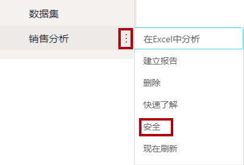
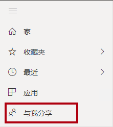
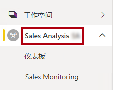
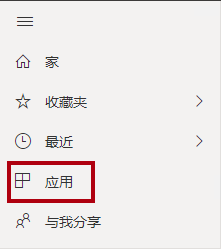
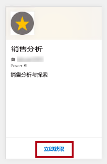
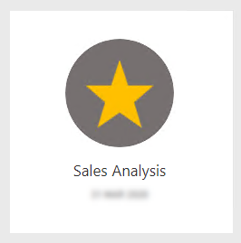
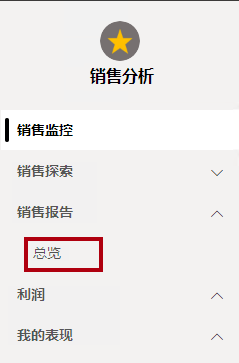
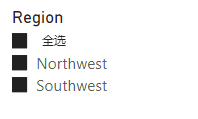



### 实验室 12A

发布和共享 Power BI 内容

# 概述

**完成实验室预计需要花费 45 分钟**

在本实验室中，你将与一名课堂合作伙伴合作探究共享 Power BI 内容的三种核心方法。

在本实验室中，你将学习如何：

* 将安全主体映射到数据集角色

* 共享仪表板

* 发布应用

# 练习 1 ：配置数据集安全性

在此练习中，你将把课堂合作伙伴的帐户分配给你的数据集的 **“销售人员”** 角色。

### 任务 1：配置数据集安全性

在此任务中，你将把课堂合作伙伴的帐户分配给数据集的 **“销售人员”** 角色。

1. 在 Edge 中 Power BI 服务的 **“导航”** 窗格中，将光标悬停在 **“销售分析”** 数据集上，单击垂直省略号 (…)，然后选择 **“安全”**。

	

2. 在 **“行级别安全性”** 页面左侧，请注意 **“销售人员”** 角色已选择。

3. 在 **“成员”** 框中，开始输入课堂合作伙伴的帐户名，并在列出后选择它。

	*添加个人帐户非常耗时，需要大量维护。注意， Adventure Works 公司可能会有一个安全组，其中包含所有销售人员的帐户。该安全组将是映射到角色的唯一安全主体*。

4. 单击 **“添加”**。

	

5. 单击页面底部的 **“保存”**。

	

	*课堂伙伴的帐户现已映射到 **“Salespeople”** 角色。回想一下，他们的帐户是为销售员 Pamela Ansam-Wolfe 设定，其销售业绩按这两个销售区域的销售额来衡量：美国西北部和美国西南部*。

# 练习 2：共享仪表板

在此练习中，你将与课堂伙伴分享你的 **“销售监视”** 仪表板（他们也将与你分享他们的仪表板）。

### 任务 1：共享仪表板

在此任务中，每人将共享一个仪表板，然后打开共享给你的共享仪表板。

*与课堂合作伙伴一起，在你们的每台计算机上一起完成所有任务步骤*。

1. 打开 **“销售监视”** 仪表板。

2. 单击菜单栏上的 **“共享”**。

	

3. 在 **“共享仪表板”** 窗格 (位于右侧) 中的 **“允许访问”** 框中，开始键入课堂伙伴的帐户名称，并在列出后选择它。

4. 查看可用选项，但不要更改。

5. 单击窗格底部的 **“共享”**。

	

### 任务 2：使用其他表打开共享仪表板

在此任务中，将各自打开与自己共享的仪表板。

1. 在 **“导航”** 窗格中，单击 **“与我共享的内容”**。

	

2. 可以看到 **“销售监视”** 仪表板已列出。

	

3. 若要打开仪表板，请单击 **“销售监视”** 仪表板。

4. 可以看到仪表板 **“本年累计销售额”** 磁贴值是 **“1300 万美元”**。

	

	***“本年累计销售额”** 磁贴仅显示美国西北部和美国西南部区域的值*。

	*内容所有者可以轻松实现和管理仪表板（和报表）共享。Power BI 为接收人提供只读体验。如果所有者启用了再共享，接收人就能与其他人共享内容*。

	*此方法适用于临时共享要求。如需共享许多 Power BI 项，那么发布应用是一个更好的选择。*在下一个练习中，你将把“销售分析”工作区发布为应用**。

# 练习 3：发布应用

在本练习中，你将发布 **“销售分析”** 工作区的内容，然后“获取”课堂合作伙伴发布的应用。

### 任务 1：发布应用

在此任务中，你将发布 **“销售分析”** 工作区的内容，然后“获取”课堂合作伙伴发布的应用。

1. 在 **“导航”** 窗格中，打开 **“销售分析”** 工作区。

2. 在 **“导航”** 窗格中，单击工作区的名称。

	

3. 单击右上角的 **“发布应用”**。

	

4. 请注意，发布应用的进程需要在这三个选项卡中进行配置：**“安装”**, **“导航”** 和 **“权限”**。

	

5. 在 **“说明”** 框输入：**销售分析与浏览**

	

6. 对于 **“应用徽标”**，单击 **“上传”**。

	图片 91](Linked_image_Files/PowerBI_Lab12A_image13.png)

7. 在 **“打开”** 窗口，导航到 **“D:\DA100\Lab12A\Assets\Icons”** 文件夹。

8. 选择一个 JPG 文件，然后单击 **“打开”**。

9. 对于 **“应用主题颜色”**，选择任意颜色。

10. 选择 **“导航”** 选项卡。

	

11. 在 **“导航”** 部分，注意将要发布的工作区内容。

	*可设置工作区内容的顺序，还可添加分区和链接。分区是内容的单级分组（类似于文件夹）。链接是指向任何有效网页的链接。你不会在本实验室中修改导航设置*。

12. 选择 **“权限”** 选项卡。

	

13. 在 **“特定个人或组”** 框内，开始输入课堂伙伴的帐户名，并在列出后选择它。

	*如果租户管理员对 **“整个组织”** 选项进行了限制，则该选项可能处于禁用状态。在这种情况下，**“自动安装此应用”** 选项也将处于禁用状态。如果启用，此应用可推送给所有用户。你将在下一个任务中学习如何“获取”应用*。

14. 在右下角，单击 **“发布应用”**。

	

15. 当提示发布应用时，单击 **“发布”**。

	

16. 当通知该应用已成功发布时，单击 **“关闭”**。

	

### 任务 2：获取应用

在此任务中，你将“获取”应用，并浏览应用内容。

1. 在 **“导航”** 窗格中单击 **“应用”**。

	

2. 在页面中间，单击 **“获取应用”**。

	

3. 在 AppSource 窗口中，对于你的课堂合作伙伴发布的 **“销售分析”** 应用，单击 **“立即获取”** 链接。

	

4. 添加应用后，单击应用磁贴即可打开应用。

	

5. 打开应用后，查看导航窗格（位于左侧）。

6. 请注意，导航窗格中的第一项已打开。

7. 在导航窗格中，展开 **“销售报表”**，然后选择**概述**页。

 	

8. 注意 **“Region”** 切片器仅显示两个区域，这两个区域都是分配给 Pamela Ansam-Wolfe 的区域。

	

9. 选择 **“我的业绩”** 页面。

10. 请注意，该页面显示了 Pamela Ansam-Wolfe 的销售和目标。

11. 打开 **Sales Exploration** 报表，然后与每个页面上的视觉对象进行交互。
